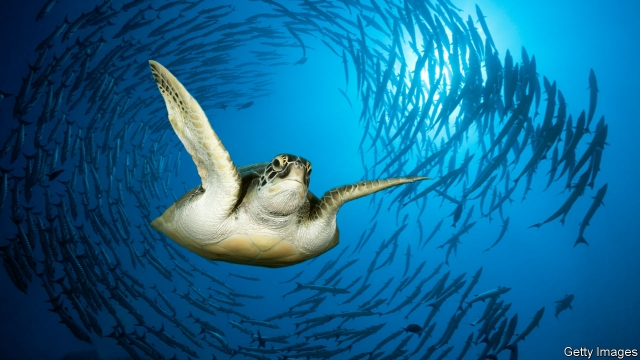

###### Extinction

# A new report confirms that life on Earth is in trouble 

##### A million species may be at risk 

 

> May 9th 2019 

A  MILLION SPECIES of animals and plants are threatened with extinction. Three-quarters of the world’s land and two-thirds of its marine environments have been “significantly altered” by human action. Urban areas have doubled in size in just the past 30 years. More than 85% of wetlands have been lost. More than 90% of ocean fish stocks are being harvested at or above sustainable levels. These are among claims made in a report published on May 6th by the Intergovernmental Science-Policy Platform on Biodiversity and Ecosystem Services, a big international quango. 

The report, based on 15,000 research papers, makes grim reading. More than 40% of amphibians are threatened with extinction, as are a third of marine mammals, a third of sharks and a third of corals (a novel idea for the protection of which is described in the next story). Even 10% of the world’s insects are on the brink. 

A cynic might suggest that 1m is a suspiciously headline-grabbing figure. It is, indeed, only a little short of the number of animal and plant species (around 950,000 and 200,000 respectively) currently recognised and described by science. And its accuracy depends on many assumptions. But it is probably not a bad guess. 

A consensus is emerging of there being some 8m species of animals and plants (the report ignores bacteria, fungi and unicellular creatures like Amoeba). Using figures from the International Union for Conservation of Nature (IUCN), which publishes an annual Red List of Threatened Species, the report’s authors looked at the proportion of threatened species in well-studied groups of organisms and extrapolated. 

In those groups, the IUCN reckons around a quarter of species are at risk of extinction. Many of the best-studied groups, however, are vertebrate animals, while most animals are invertebrates. Extrapolating from vertebrates to invertebrates is risky. The authors therefore made an exception for insects, the most speciose group (5.5m of the 8m purported species). For these they suggest 10% might be threatened with extinction—a figure in line with one derived by combining data on habitat degradation with the known relationship between habitat area and species numbers. This suggests 9% of terrestrial animals (most of which are insects) are threatened with extinction. Add the figures up and a bit over 1m is what you get. Depressing. 

