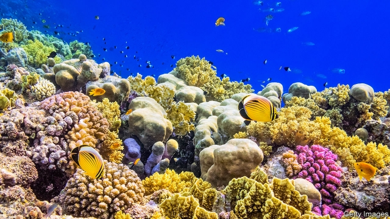

###### Protecting coral reefs

# An idea to save coral reefs from climate change takes a step forward 

##### Transplanting heat-resistant strains may help reefs 

 

> May 9th 2019 

BLEACHING IS BAD for coral. It happens when heat-stressed polyps, the sessile animals that construct coral reefs, eject the photosynthetic algae which usually reside within them. These algae are symbionts, providing nutrients to their hosts in return for shelter, so losing them is harmful to polyps and often results in their death. The higher temperatures brought about by global warming have therefore led to worries that more frequent episodes of bleaching might result in the loss of entire reefs. 

Some of these symbiotic arrangements between alga and animal are, however, more heat-sensitive than others. It might therefore be possible to save reefs by seeding them with heat-resistant symbioses. As temperatures rose, these biological partnerships would spread and the reef they had been transplanted to would survive. Two researchers studying this idea are Megan Morikawa and Stephen Palumbi of Stanford University, in California. And they have just published a paper in the Proceedings of the National Academy of Sciences which suggests that it might work. 

Dr Morikawa and Dr Palumbi started by collecting 20 representatives of each of four types of coral from a lagoon off the coast of American Samoa. They picked the lagoon in question because it was small and shallow, and thus had limited water circulation. This meant it often experienced temperature spikes, so any corals living within it would be expected to be adapted to endure such spikes. Laboratory tests proved those expectations correct. 

The researchers then picked a second reef, 3km from the original lagoon, which had similar mean temperatures over the year but experienced lower daily temperature fluctuations. They seeded this with 400 fragments derived from their collected samples and a further 400 that were not heat-resistant, to act as controls. The original plan had been to let these transplanted corals grow for a while in their new environment and then bring them back to base for testing. Nature, however, intervened. Eight months after the seeding, soaring temperatures caused extensive bleaching on the reef. 

Their hands thus forced, Dr Morikawa and Dr Palumbi put on their scuba gear and went diving to see how their transplants had fared. They found that those from resistant colonies were between a half and a third as likely to have become bleached as were the controls. Moreover, when they returned to the parent corals in the shallow lagoon and looked at the health of these after the bleaching event, they found that the experience of the parents tended to match that of their offspring. The eight months of acclimatisation and growth the transplants had undergone had not, in other words, eliminated the heat tolerance they inherited from their parent colonies. 

Though eight months is not that long, this result is encouraging. Dr Morikawa and Dr Palumbi now plan an extended study in Palau. If that proves successful, then the idea of saving reefs by seeding them with heat-resistant strains will have received a significant boost. 

