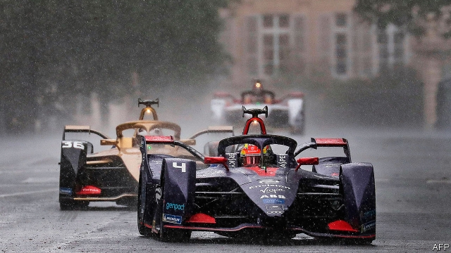

###### Formula E

# Electric racing cars are catching up fast with petrol-driven ones 

##### That will improve street-legal e-cars, too 

 

> May 9th 2019 

FANS OF “STAR WARS” will never, in reality, be able to watch the Boonta Eve Classic Podrace on Tatooine. But they might find a pretty good substitute on the streets of Monaco, Berlin and New York over the next few months. The fifth Fédération Internationale de l’Automobile Formula E Championship, a class of motorsport that admits only electric-powered cars, has a lot of the hallmarks of podracing—and not only because the cars, with their high-pitched, almost insect-like drones, sound eerily similar to the intergalactic racers portrayed in “The Phantom Menace”. Blade-like points at the front and a huge wing at the back give them speed. Add sufficient power to these aerodynamics and you have something capable of reaching 280kph. That is pretty nifty, even by the standards of established Formula 1 racing. 

The most recent ePrix of the season took place at the end of April, in a hailstorm. The circuit was the streets around Les Invalides, Louis XIV’s monumental home for retired and injured soldiers in Paris. There were, as with fictional podracing, a fair few crashes and smashes before Robin Frijns, of the Envision Virgin Racing team, took his place on the winner’s podium. 

Formula E was conceived of originally as a means of demonstrating that electric motors are not, as many greens portray them, merely a worthy but slightly dull face of environmentalism. Actually, they are as exciting a means of propulsion as internal-combustion engines, if not better. That goal has been abundantly achieved, for Formula E is now the fastest-growing form of car racing. 

Formula E cars are powered by an electric motor supplied by a lithium-ion battery that provides a quarter of a megawatt of power (335 horsepower, to petrolheads). They can accelerate from zero to 100kph in 2.8 seconds—as fast as an F1 car can manage (and also, some drivers privately admit, as fast as a human being can easily cope with). And, like their street-legal electric cousins, they are good at conserving energy, for when the driver takes his foot off the accelerator, the motor acts as a generator, braking the vehicle by turning its kinetic energy into electricity and thus recharging the battery at the same time. 

Crucially, those batteries are getting better. Drivers in last year’s Formula E Championship had to stop halfway through each 45-minute-long race to change cars. This year’s entrants are all powered by a battery, made by McLaren Applied Technologies, a British firm, that offers twice the energy storage, and thus twice the range, of the pile previously employed. Batteries with longer lifespans make electric cars more suitable for long-distance travel—an important point for many private car owners who, even though most of the journeys they make are already within the range of a single charge, do not want to risk getting caught out chargeless and miles from home. 

Formula E still has some way to go before it can take on the two-hour race durations of its fossil-fuel-powered big brother, F1. But it is racing along fast. 

