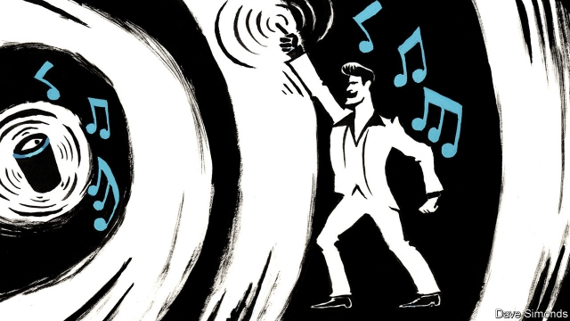

###### Intelligent machinery

# Household electronics are undergoing a sensory makeover 

##### Speaker see. Speaker do 

 

> May 9th 2019 

SMART SPEAKERS, like Amazon Echo, Google Home and Apple HomePod, are spreading rapidly, and it is now common to hear people asking such assistants to provide weather forecasts or traffic updates, or to play audiobooks or music from streaming services. But because a smart speaker can act only on what it hears, it has little understanding of objects and people in its vicinity, or what those people might be up to. Having such awareness might improve its performance—and might also let users communicate with these digital servants by deed as well as word. Several groups of researchers are therefore working on ways to extend smart speakers’ sensory ranges. 

One such effort is led by Chris Harrison and Gierad Laput of Carnegie Mellon University, in Pittsburgh, Pennsylvania. On May 6th, at a conference in Glasgow, Dr Harrison and Mr Laput unveiled their proposal, which they call SurfaceSight, to give smart speakers vision as well as hearing. Their chosen tool is lidar, a system that works, like radar, by bouncing a beam of electromagnetic waves off its surroundings and measuring how quickly those waves return. That information, run through appropriate software, builds up an image of what the beam is pointing at. If, as many radars do, a lidar then revolves, it can sweep the beam around to create a 360° picture of its surroundings. 

Dr Harrison and Mr Laput have fitted such a system to an Amazon Echo speaker, permitting it to sense and identify nearby household objects and to recognise hand gestures—and, having been told what those gestures are intended to convey, to respond to them. At the moment, the lidar they use sweeps a six-millimetre-deep beam around the speaker’s base. It is thus able to see only things within that slice of space. This is a restriction on its effectiveness, but a deliberate one. The two researchers are sensitive to suggestions their system might be used to spy on its owner. Although widening its field of view would undoubtedly increase its utility, giving it tunnel vision of this sort helps overcome such suspicions. 

Even with this restriction in place, however, the system’s machine-learning software can be trained to recognise objects as diverse as saucepans, cereal boxes, screwdrivers, bunches of carrots and smartphones. It can also be trained to respond to this information in useful ways. One experimental app, for example, employs it to recognise utensils and ingredients laid out on a preparation surface and to check everything needed is available to cook a particular dish. Another app recognises the owner’s smartphone and connects it automatically, via Bluetooth, to that individual’s music collection. 

Gesture recognition is similarly useful. When running the music app, a user might swap between tracks by swiping his fingers over the surface the lidar is scanning. The user of a teleconferencing app might similarly advance through a PowerPoint presentation. And, though SurfaceSight’s laser beam cannot recognise particular people, it can be trained to sense how many of them are standing beside the surface it sits on—and which way they are facing. This means it could cajole those it deemed not to be paying attention to the aforementioned presentation (that is, those not facing inward) to follow things more avidly. Nor is the technology limited to smart speakers. It can, for example, be employed to control a thermostat. 

Dr Harrison and Mr Laput are not alone in making surfaces active. Swan Solutions of Houston, Texas, sells Knocki, an accelerometer which can be fixed to a surface to detect the vibrations made by someone knocking on that surface. Different devices—lamps or a television, say, as well as a smart speaker—can then be activated by anyone making the appropriate pre-arranged number of knocks. 

Other firms, too, are attempting to build devices that are more aware of their surroundings—for example, by boosting their ability to recognise sounds. Audio Analytic, a British maker of sound-recognition technology, has developed and filed a patent on what it calls “brand sonification”. In this, distinctive noises characteristic of the use of a certain product, such as the pop made when removing the lid from a tube of potato crisps or the hiss of opening a can of drink, are recognised by a smart speaker—prompting it, perhaps, to offer discounts on related products. 

That is technologically clever. How far Audio Analytic has thought this one through, though, is unclear. Being spied on by a smart speaker sounds bad enough. Being pestered by one might be worse. 

