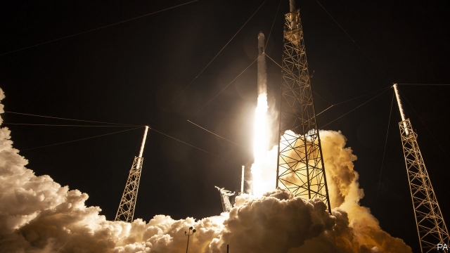

###### Satellite internet

# SpaceX will launch dozens of “Starlink” satellites 

##### The prototypes will test the firm’s plans for planet-wide internet access 

 

> May 9th 2019 

ON MAY 6TH SpaceX, a private rocketry firm founded by Elon Musk, an internet entrepreneur, celebrated its 17th birthday. Despite being old enough to drive, the firm is still occasionally described as a startup. In reality, its ability to slash the cost of rocketry has given it a bulging order book and made it a pillar of the satellite-launch market. 

But Mr Musk has not lost his appetite for adventure. On May 15th, assuming the weather holds, the firm will launch one of its Falcon rockets with an unusual payload. Instead of carrying another company’s satellites, it will be packed full of dozens of small satellites of SpaceX’s own design. They are prototypes for a project called Starlink, the intention of which is to deploy thousands of satellites in orbits close to Earth to provide internet access anywhere and everywhere on the surface of the planet—including to the estimated 3.5bn people who currently lack regular, high-quality connectivity. 

Communication satellites are not a new idea. But most existing ones orbit far above Earth’s surface, in so-called geostationary orbits at a height of about 36,000km. That is the magic altitude at which a satellite orbits as fast as Earth rotates, and thus appears to hang fixed in the sky when seen from the ground. Starlink satellites, by contrast, will fly in three sets of orbits at roughly 340km, 550km and 1,200km. 

That will make things complicated. For one thing, Starlink will need a lot of satellites. The firm has said the system should be able to begin commercial service with around 800 of them. But applications filed with the Federal Communication Commission, an American regulator, suggest the firm may eventually be planning nearly 12,000. That is more than twice as many satellites as are currently in orbit (5,101 according to the United Nations Office for Outer Space Affairs), and almost half as many again as the total number of objects—8,539—sent into orbit since the dawn of the Space Age. 

Low orbits mean that antennas on the ground must be able to track different satellites rapidly as they appear over the horizon and then vanish again. SpaceX has lodged plans for a million such ground stations. The satellites, meanwhile, must be able to hand customers off quickly to one another. (They are designed to communicate with each other via lasers.) Both of these things will be tricky. Flying low has benefits, though. The strength of a radio signal falls with the square of its distance, which means that communicating with Starlink will use a fraction of the energy needed to talk to high-flying geostationary comsats. And flying low reduces signal latency. The speed of light means that talking via a geostationary satellite imposes a delay of around half of a second. 

For some applications, such as voice calls, low latency is nice. For others, such as remote manipulation of machinery, it is vital. Mark Handley, a computer scientist at University College, London, who has done modelling studies of how Starlink might work, thinks financial traders could be one lucrative market. Since light moves faster in a vacuum than through glass, SpaceX’s network might provide quicker connections than the fibre-optic cables that currently carry most internet traffic, opening up new possibilities for arbitrage. At the same time, SpaceX is working on huge rockets that, if and when they fly, could help drive launch costs down even further. 

It is not the only firm with ambitions to beam the internet from the sky. OneWeb, a company founded in 2012 and now part-owned by Airbus, a European aerospace firm, and SoftBank, a Japanese conglomerate, wants to do something similar. OneWeb launched six satellites in February, and expects that its finished constellation will contain about 900 of them. Amazon, Samsung, Boeing and others have toyed with similar plans, though they exist mostly on paper for now. 

Whether any of this will actually happen is, of course, the biggest question of all. The idea is not new, says Jonathan McDowell, an astronomer and satellite-watcher at the Harvard-Smithsonian Centre for Astrophysics, in Massachusetts. In the 1990s three firms—Iridium, Globalstar and Teledesic—tried something similar, albeit with fewer satellites. The satellites worked, but were expensive and slow, with limited capacity. And clunky hardware was needed on the ground to connect with them. The dotcom bust in 2000, says Dr McDowell, brought an end to their dreams of truly global internet access. Second time lucky? 

