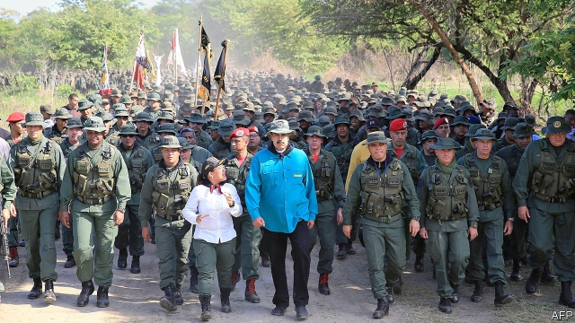

###### Running out of options

# Can diplomacy dislodge the Maduro dictatorship? 

##### After Juan Guaidó’s uprising failed, it is Venezuela’s best hope 

 

> May 9th 2019 

THESE ARE times of turmoil in Venezuela but in some parts of Caracas that is well hidden. At the leafy Country Club in the east of the capital, two men along with their caddie were playing golf on May 7th across the road from an elegant white stucco mansion. There was no visible security outside the house, the residence of the Spanish ambassador. And no clue that inside was Leopoldo López, formerly Venezuela’s best-known political prisoner, who has been a “guest” of Spain since he escaped from his captors in the early hours of April 30th, the day it briefly appeared the dictatorship of Nicolás Maduro might fall. 

An air of normality is precisely what Mr Maduro is attempting to cultivate, as he hopes to continue doing what he is oddly good at—staying in power. Before dawn on April 30th Juan Guaidó, Venezuela’s rival young president, had launched what he billed as the final push to end this “usurpation” (on the basis that Mr Maduro rigged the presidential election in 2018). With him was Mr López, walking freely in public for the first time since he was imprisoned in 2014, and a few dozen national guardsmen. Mr Guaidó is backed by more than 50 countries including the United States; the plan was to unseat Mr Maduro via a mass defection of the armed forces. 

It failed. The army stayed loyal and by sunset, after a day of protests in which at least two demonstrators were killed, the national guard defectors had all sought refuge in the Brazilian embassy, where their uniforms were later seen drying on the lawn. Mr López and his family were settling in for what could be a long stay at their Country Club address. 

But Mr Maduro knows his troubles are far from over. On May 2nd, up uncharacteristically early, he was at a military base in Caracas surrounded by soldiers. “Loyal forever. Treason never,” he asked the troops to repeat after him. They did. Then followed a speech by his defence minister, General Padrino López. “They try to buy us…as if we are mercenaries,” said the soldier. The TV cameras caught a trace of fear crossing Mr Maduro’s face. It appeared to be the first time he had heard the confession. Had his defence minister really been in contact with the opposition in an effort to depose him, as President Donald Trump’s national security adviser, John Bolton, claimed on the day the uprising failed? 

Some speculate that General Padrino is a skilled double agent: that he went along with the talks to smoke out opponents. But others are not so sure. Perhaps he and Maikel Moreno, the mercurial head of the puppet Supreme Court, and General Iván Hernández Dala, the head of military intelligence, were genuinely seeking to oust Mr Maduro, working with Venezuelan businessmen who want US sanctions on them lifted. One senior official certainly did defect: General Manuel Cristopher Figuera, the head of Sebin, the state security service. His decision to flip is what enabled Mr López to go free. 

The spy chief, now believed to have left Venezuela (perhaps for Puerto Rico), could count on support within the once-feared state security apparatus he ran. For months there have been rumours of discontent inside Sebin. In a speech in Washington, DC, on May 7th, vice-president Mike Pence announced that the United States was lifting sanctions against General Figuera, and dangled similar relief from individual sanctions as an incentive to other officials to turn against Mr Maduro. 

Mr Pence carried sticks as well as carrots. He threatened to hold all the members of Venezuela’s Supreme Court accountable for their actions if they failed to uphold the rule of law. That puppet court, meanwhile, launched a criminal investigation for insurrection against six opposition legislators, who were stripped of their parliamentary immunity by the regime’s National Constituent Assembly. Mr Pence warned that the safety of Mr Guaidó and his family was a priority for America. On May 8th Mr Guaidó’s deputy in the elected National Assembly, Edgar Zambrano, was arrested. 

The frustration for the United States is that neither its sticks nor carrots seem likely to persuade Mr Maduro to leave. “We’re really running out of options,” says Moises Rendon of CSIS, a think-tank in Washington, DC. One option the administration refuses to rule out if all else fails is the use of force, though any military intervention would carry huge risks. A more appealing possibility for now might be to work on the foreign countries that help to prop up Mr Maduro, notably Russia and Cuba. 

Last week President Donald Trump discussed Venezuela with President Vladimir Putin. Mr Trump claimed afterwards that Mr Putin “is not looking at all to get involved in Venezuela”. That was not the impression in Moscow two days later, when Russia’s foreign minister, Sergei Lavrov, met Mr Maduro’s foreign minister and criticised “irresponsible” efforts to topple the regime. Still, the pace of diplomacy could quicken. Mike Pompeo, America’s secretary of state, saw Mr Lavrov in Helsinki this week and they are due to hold talks in the Black Sea city of Sochi on May 14th. 

As for Cuba, it is facing a tightened American embargo as punishment for its support for Mr Maduro. Yet Mr Pompeo raised eyebrows when he said in a television interview on May 5th that America was “working with the Cubans” to bring about change in Venezuela. Overtures to Cuba seem to be multiplying. The Lima Group, made up mostly of Latin American nations, said in a statement that it would “take the steps necessary for Cuba to participate in the search for a solution to the crisis in Venezuela”. It also wants to co-ordinate with a European Union-led international contact group. 

All this must add to Mr Maduro’s sense of insecurity. The public effort to oust him failed, but it showed that some in the ruling clique and its foes are trying to find common ground, even if this amounts to little more than providing an escape route. “There is a clear conviction among regime officials that Maduro should go and that a transition is unavoidable,” says Colette Capriles, a Caracas-based political scientist with close links to the opposition. 

But Mr Maduro can take comfort in the fact that he is not the only one who has been weakened by the abortive uprising and its aftermath. Mr Guaidó is now facing open mutterings of doubt in Caracas about his leadership. He botched his big shove. His call for protests at all military bases on May 5th produced only lacklustre attendance. “We have been promised ‘this is the day’ once too often,” says Annabel Hernández, an artist. 

