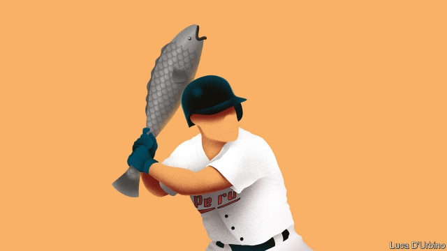

###### Selling fish, catching flies

# Peru’s government wants its citizens to take up baseball 

##### Venezuelan refugees are among those bringing the sport to Lima 

 

> May 9th 2019 

VILLA MARíA DEL TRIUNFO, a poor district in Lima, Peru’s capital, is best known for its sprawling wholesale fish market. Trucks from the city’s 13,000 ceviche restaurants queue up before doors open at 4am for the best seafood. Soon, however, the fishermen may have to contend with a different sort of catch. The neighbourhood is now home to a baseball stadium, built for the Pan-American games, which Peru is due to host in July for the first time. The government is hoping that the games will kindle a love for sport still obscure in Peru: there are also venues for archery, field hockey and water polo. 

Residents seem bemused. Jessica Vilca, who runs a small ceviche restaurant across the street from the baseball park, looks forward to extra business but is mystified by baseball and the other sports that will be played in the Andrés Avelino Cáceres sports complex. “I never heard of it until they said they would build the stadium here. The only sport we know is football,” she says. 

The new stadium seats fewer than 2,000 people and has bright green artificial turf. A three-metre-high fence challenges batters to clear it. Peru is fielding a baseball team for the first time in the 68-year history of the Pan-American games. That alone will give the sport a boost in the country, says Kenny Rodríguez, the team’s manager. “We are realistic about our chances, but we think we can be the surprise of these games,” said Mr Rodríguez, a Cuban-born pitcher who played for several seasons in the Toronto Blue Jays’ farm system (which trains young players). 

His first challenge is fielding a team capable of defeating the seven other baseball teams that qualified for the games, including two powerhouses, Cuba and the Dominican Republic. Peru has no professional league; players for the five teams in Lima’s first division are amateurs, who practise after hours. “My guys are working or practising up to 20 hours a day,” says Mr Rodríguez. He had planned to choose his 24-man roster after a playing trip to Cuba in April, but some players could not get time off from work or school. 

Just finding a place to play has been hard. The team was twice evicted from the national sports complex, temporarily to make space for building materials used in a transportation project and then for good last year, when a running track was built. 

But now the team has a permanent home. And there are signs that baseball is gaining a purchase in Peru and other Latin American countries where it had been a niche sport. Argentina too has a relatively new league, which Mr Rodríguez says is helping to spread the sport. Colombia, the Dominican Republic and Puerto Rico have professional leagues. 

The exodus from impoverished Venezuela, which does have a strong baseball tradition, is bringing talent. Seven players on the Peruvian team were born in Venezuela. They include Jesús Vargas, a pitcher with an 86-mile-an-hour fastball, who came to Peru two years ago. “Everyone in Venezuela plays baseball, but here it is only a hobby,” he says. “I think we can change this if we do well.” Mr Rodríguez hopes that a professional team will take up residence at the stadium after the games are over. If that boosts custom at Ms Vilca’s cevichería, she may become a fan. 

