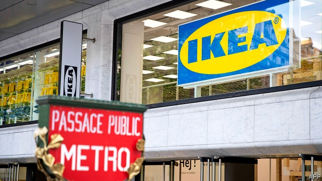

###### A fragile centre holds in South Africa

# Business this week 

 

> May 9th 2019 

American and Chinese negotiators wrestled over a trade deal. Donald Trump’s threat, backed by senior American officials, to increase tariffs on Chinese goods if an agreement was not reached rattled stockmarkets; prices have bounced back this year in part on renewed optimism about trade. Meanwhile, data showed that Chinese exports fell unexpectedly in April; exports to America were 13% lower than the same month in 2018. See article. 

Mr Trump tweeted that Stephen Moore had withdrawn from consideration for a seat at the Federal Reserve. Mr Trump’s choice of Mr Moore, a tax-slashing warrior, had raised concerns, even among Republicans, that he was trying to plant political supporters in the central bank. Mr Moore was also in hot water for a number of disparaging remarks about women he made in the past.  

The Danish press reported that Thomas Borgen, the former chief executive of Danske Bank, had been charged in relation to the suspected money-laundering of up to €200bn ($224bn) through Danske’s operations in Estonia. Mr Borgen resigned last year. He is the first person connected to the case to be indicted, reportedly for a failure of oversight. 

A former banker at Goldman Sachs pleaded not guilty at a court in New York to involvement in the embezzlement of $2.7bn from Malaysia’s 1MDB development fund. Roger Ng returned to America to face the charge; he has also been indicted in Malaysia. His former manager is awaiting sentence after pleading guilty to participating in the scheme, which channelled money from 1MDB bond sales to Malaysian officials. Goldman has said it expects to receive a hefty fine once the investigation is over. 

Anheuser-Busch InBev confirmed that it was considering listing its Asia operations in Hong Kong. The brewer would use the proceeds to pay down some of the enormous debt pile it amassed during a spree of takeovers. See article. 

Siemens also said it would restructure itself. The German conglomerate plans to spin off its struggling power and gas unit, combined with its windpower assets, in a stockmarket flotation. It hopes that by cutting the cord now it will avoid the same fate that befell General Electric. Siemens wants to focus on the more promising endeavour of connecting factories and cities to the internet. 

The operator of Britain’s power grid reported that the country went a whole week without using coal to generate electricity, the first time that has happened since the first coal-fired power station was opened in 1882. Britain gets most of its power now from gas, nuclear and wind sources. 

The problems mounted at Kraft Heinz. Under a subpoena from the Securities and Exchange Commission for its accounting practices, the food company said it would have to restate earnings for three years after uncovering mistakes in its procurement procedures. Kraft Heinz also disclosed that the SEC has expanded the scope of its inquiry and is scrutinising a $15bn write-down that was announced in February. 

Facebook said that London would be the base for staff working on its new mobile-payments service, which will be available later this year on WhatsApp. The social-media company chose London because of the availability of fintech workers from countries where WhatsApp is widely used, such as India. Despite having 1.5bn users worldwide, the messaging app currently employs only 400 people. 

 ikea opened its first store in central Paris, part of a plan to place more of its retail space in urban areas. The store is IKEA’s first in a city centre to offer a full range of items (rather than just kitchen-planning), a concept that it intends to repeat in other cities around the world. The Paris store is about four times smaller than the vast suburban warehouses that IKEA’s customers are used to; it will also eventually rent furniture to ever more cost- conscious buyers. 

Lyft released its first quarterly earnings report since floating on the stockmarket. The ride-hailing company reported revenues of $776m for the first three months of the year, up by 95% compared with the same quarter last year. But its costs ballooned as it invested heavily in new aspects of its business, such as scooter rentals. Lyft’s underlying operating loss narrowed slightly to $216m (its overall net loss of $1.1bn included a charge for stock-based compensation). Worried about the lack of profits, investors sent its share price down by 11% in a day. See article. 

Ahead of its eagerly awaited IPO, Uber had to navigate a one-day strike by drivers in America, Britain and Australia (the action was joined by drivers from Lyft). The workers sought publicity for their claim to better pay and conditions. They urged passengers not to use their apps, likening it to crossing a digital picket line. 

