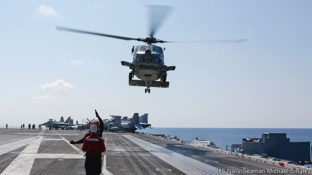
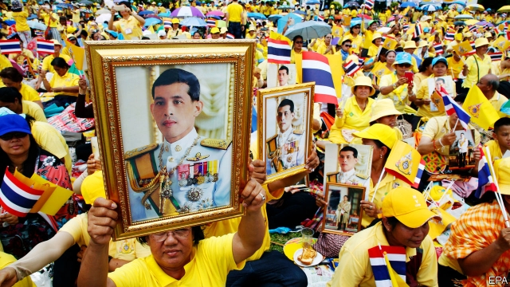

###### A fragile centre holds in South Africa

# Politics this week 

 

> May 9th 2019 

America sent an aircraft-carrier group to the Middle East in response to “troubling and escalatory” signs that Iran might attack American forces in the region. Iran, meanwhile, said it would no longer abide by all of the terms of the nuclear deal it signed with America and other world powers in 2015. America withdrew from that deal last year and reimposed sanctions, aiming to cut off Iranian oil exports; it announced new sanctions this week, targeting iron, steel, copper and aluminium, which account for around 10% of Iran’s exports. See article. 

Palestinian militants in Gaza fired hundreds of rockets into southern Israel, killing four Israelis. Israel responded by pounding Gaza with air strikes, killing 27 Palestinians. It was the deadliest fighting since 2014. A truce was finally brokered by Egypt. See article. 

South Africans voted in a general election that was held 25 years after the end of apartheid. Polls suggest that the African National Congress, which has ruled since 1994, would win again, although with its smallest-ever majority. 

The World Health Organisation is to increase the number of vaccinations it administers in an effort to contain the spread of the Ebola virus in the Democratic Republic of Congo. 

Brazil’s president, Jair Bolsonaro, cancelled a trip to New York after some groups and the mayor, Bill de Blasio, criticised his racist and homophobic remarks and hostility towards greenery. Mr Bolsonaro was due to receive a person-of-the year award from the Brazilian-American Chamber of Commerce. Several sponsors had pulled out of the event. 

The United States revoked sanctions it had placed on Christopher Figuera, the head of Venezuela’s intelligence service, who recently turned against the regime led by Nicolás Maduro and fled the country. The Trump administration said this was an incentive for other senior Venezuelan officials who have been sanctioned to support Juan Guaidó, the opposition leader, in his effort to oust Mr Maduro. See article. 

Laurentino Cortizo, the centre-left’s candidate, was declared the winner in Panama’s unexpectedly close presidential election. He campaigned mostly on tackling corruption. 

Donald Trump invoked executive privilege in his fight with Democrats in Congress, who want the administration to release the unredacted version of the Mueller report. That didn’t stop the House Judiciary Committee from holding William Barr, the attorney-general, in contempt. With relations souring between the two branches of government, Americas’s treasury secretary, Steven Mnuchin, earlier refused to release Mr Trump’s tax returns to Democrats, arguing that the “unprecedented” request was being made under an obscure law. See article. 

A federal court found that Ohio’s congressional districts had been drawn to favour the Republicans and ordered that they be remade for the 2020 election. It is the second recent ruling to strike down partisan gerrymandering, after a similar case in Michigan. 

The sultan of Brunei responded to critics of the harsh Islamic penal code he recently promulgated by suggesting that its most controversial punishment, death by stoning for sex outside marriage, would not in practice be carried out. But the law remains on the books, and he made no commitment regarding other gruesome punishments, such as amputation for theft. 

 

King Vajiralongkorn of Thailand was crowned in an elaborate three-day sequence of ceremonies. Shortly afterwards, the Election Commission announced the official results of the election held in March. It altered the formula for allocating seats, thereby depriving the opposition coalition of a majority in the lower house of parliament. See article. 

Officials in Pakistan confirmed that Asia Bibi, a Christian woman whose death sentence on trumped-up charges of insulting the Prophet Muhammad was overturned in October, had been allowed to leave the country. The quashing of Ms Bibi’s blasphemy sentence by the supreme court had prompted protests from Islamic hardliners. She was remanded in custody until January, when a legal challenge to her acquittal was rejected.  

The government of Myanmar pardoned some 6,000 prisoners to mark Burmese New Year, including two journalists working for Reuters who had been sentenced to seven years’ imprisonment after revealing details of a massacre of Muslim civilians by the army. See article. 

North Korea tested a series of short-range missiles. Although this did not break the country’s self-imposed moratorium on tests of long-range missiles and nuclear weapons, it was interpreted as a signal that the North was chafing at the slow progress of arms-control talks with America. 

Turkey’s electoral board succumbed to weeks of pressure from the ruling party and annulled an election in March for the mayor of Istanbul, narrowly won by the opposition candidate, Ekrem Imamoglu. Mr Imamoglu has been removed from office and replaced by an appointed mayor. A fresh election has been called for June 23rd. Many observers saw this as a deadly blow to Turkish democracy. See article. 

Denmark called an election for June 5th. The Social Democrats are expected to take back power from the centre-right, largely because their leader has echoed hawkish policies on migration, for instance agreeing that the police should be allowed to strip asylum-seekers of jewellery and cash. 

Britain’s Conservative Party suffered huge losses in local elections. The drubbing, losing 44 councils and 1,334 seats, was the heaviest since 1995. Small anti-Brexit parties were the beneficiaries, as Labour failed to capitalise. Tory MPs called for the prime minister to resign. Theresa May, however, compared herself to Liverpool, a football team that made a spectacular comeback in a game against Barcelona this week, overturning a 3-0 deficit. Mrs May’s Brexit deal is also 3-0 down, after thumping defeats in the House of Commons; but her team has been scoring own goals for years. See article. 

