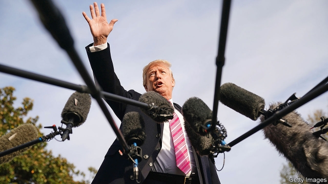

###### Trump v Congress, part 8

# Donald Trump’s war on oversight 

##### What’s happening now could reshape the relationship between Congress and the presidency 

 

> May 9th 2019 

JAMES WILSON—the one who signed the Declaration of Independence and took one of the Supreme Court’s first six seats, rather than the Scottish hatmaker who founded The Economist—believed that “the House of Representatives [shall] form the grand inquest of the state. They shall diligently inquire into grievances.” Many years later Woodrow Wilson, then a young scholar of government, wrote that for a legislature “vigilant oversight” is “quite as important as legislation”. Many Supreme Court decisions have affirmed that Congress enjoys vast investigative and oversight powers to check the executive branch. 

Partisanship influences how those powers are used. A Democratic Congress investigated Richard Nixon. During the Clinton administration, the Republican-led House issued more than 1,000 subpoenas and held hearings on the Clintons’ Christmas-card list. Presidents have rebuffed requests, but none has done what Donald Trump has: declare “We’re fighting all the subpoenas”, sue to block them and instruct officials to ignore them. He seems to feel that partisanship renders oversight illegitimate. That view is dangerous. 

Congressional oversight power is not limitless. In 1954 the House Un-American Activities Committee convicted John Watkins, a union organiser, of contempt of Congress for refusing to testify about people who had left the Communist Party (he was candid about his own past). The Supreme Court sided with Watkins, holding that Congress cannot “expose the private affairs of individuals without justification”, and that “no inquiry is an end in itself; it must be related to, and in furtherance of, a legitimate task of Congress.” 

Steven Mnuchin, the treasury secretary, hinted at this exception when, on May 6th, he declined to release six years of Mr Trump’s personal tax returns to Richard Neal, who chairs the House Ways and Means Committee. A law passed in 1924 states that America’s Internal Revenue Service (IRS) “shall furnish…any return or return information” to that committee, when “specified by written request”. Mr Neal wrote requesting them; Mr Mnuchin “determined that the committee’s request lacks a legitimate legislative purpose.” 

Mr Neal says that his committee must examine whether the IRS has properly audited Mr Trump. Some may find that justification thin, but the Supreme Court ruled that congressional investigations enjoy a presumption of legitimacy. A recent report from the non-partisan Congressional Research Service noted the privacy concerns inherent in releasing Mr Trump’s tax returns (which would probably leak), but those are counterbalanced by what the Supreme Court has called the “indispensable ‘informing function of Congress’”. A federal court will weigh this dispute. 

The courts are adjudicating others, too. On April 29th Mr Trump, along with three of his children and several of his business entities, sued Deutsche Bank and Capital One, another bank, to stop their compliance with “congressional subpoenas that have no legitimate or lawful purpose.” That came a week after Mr Trump and several of his businesses sued Elijah Cummings, who chairs the House Oversight Committee, to block Mazars, an accounting firm, from complying with Mr Cummings’s subpoena for records. Mr Trump argues that these subpoenas “have no legitimate or lawful purpose” and “were issued to harass” him. 

Many presidents feel that way. They have the right to keep some things secret, just as Congress has the right to investigate. Those rights often conflict when Democrats control one branch of government and Republicans the other. “What’s different here,” says Margaret Taylor of the Brookings Institution, “is the full frontal stiff-arm of the House’s oversight efforts.” 

That makes reaching an accommodation hard. As one former counsel to a Republican president explains, “It’s not uncommon for a president to say, ‘No way, no how, am I going to share that information with Congress—they just want to hurt me.’ Often from that point you can manoeuvre to a point of agreement. [But] the current situation doesn’t seem to have any of the hallmarks of compromise.” 

Nor is this battle only taking place in the courts. On May 7th the White House blocked Don McGahn, a former White House counsel, from surrendering documents subpoenaed by the House Judiciary Committee because of concerns about executive privilege. Mr McGahn complied with the White House, but as a former rather than current official, his compliance was voluntary. One day later, the White House also claimed executive privilege over the unredacted version of Robert Mueller’s report, after the House Judiciary Committee voted to hold William Barr, the attorney-general, in contempt for failing to deliver it to Congress in response to a subpoena. 

These claims may not survive in court. Judges rejected both George W. Bush’s claim that executive privilege blocks aides from appearing before Congress (though it may prevent them from answering specific questions), and Barack Obama’s protest over information that had already been revealed. But court challenges take time, which helps Mr Trump. He can portray them as motivated by partisan spite, while running down the clock until after the next election, when the subpoenas expire, or at least until public attention moves on. 

What if Mr Trump faces no consequences for ignoring congressional subpoenas—an action that formed the basis for the third article of impeachment against Nixon? A private citizen who ignores a subpoena can be jailed. But though some Democrats have mooted dusting off Congress’s power to detain contemnors, that is unlikely to happen soon. 

Since Watergate, presidents have felt obliged to at least appear to comply with Congress’s oversight power, even as they negotiated the most favourable possible terms. Mr Trump feels no such pressure. If he succeeds, the age-old system of checks and balances will break down. When the president’s party controls Congress, it will line up behind him; when it does not, he can just ignore its toothless demands. As the former Republican White House counsel says, “The next president and the next one after that and so on would have an additional precedent to say ‘Subpoenas? Contempt? That’s just a vote. That’s just a political act. Nothing for me to worry about’.” 

