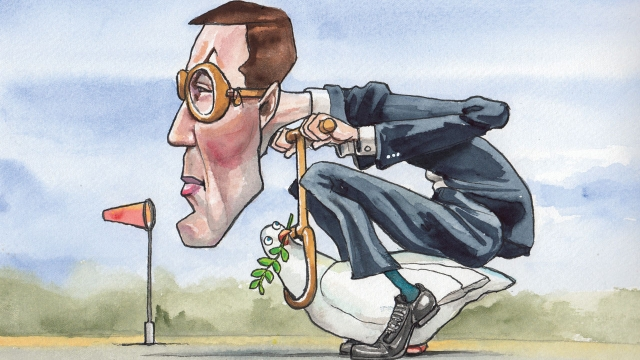

###### Lexington

# Jared Kushner’s peace plan is supposedly imminent 

##### At the moment it is stirring more fear than hope 

 

> May 9th 2019 

TWO AND a half years after Jared Kushner began work on the “deal of the century”, in his father-in-law’s phrase, the administration’s Middle East peace plan is complete. At a recent event of the Washington Institute for Near East Policy (WINEP) Mr Kushner exuded confidence as he answered questions about his proposals, which are rumoured to be scheduled for release next month. While tight-lipped on the details, he confirmed that they are designed to deal with two overriding concerns: Israel’s need for security and the Palestinians’ for economic development. Contrary to speculation that the plan will bypass thornier issues—including the core question of Palestinian sovereignty—Mr Kushner described it as a comprehensive and “in-depth operational document”. Best of all, in his telling, it represents a novel approach. After three decades of failed peace proposals by pointy-headed experts, whom Mr Kushner disdains, he describes his plan as an effort to “change the paradigm” of Middle East peace diplomacy. “People will be surprised with what’s in it.” 

His audience, including many of said pointy-heads, responded with curiosity, scepticism and a heroic effort to remain open-minded. No one outside the Trump family thinks Mr Kushner can bring peace to the Middle East; neither the Israelis nor the Palestinians seem ready for it. Yet his pitch deserves a fair hearing. Past efforts to solve the Israeli-Palestinian conflict followed a similar course, long on negotiating principles, short on detail. He therefore promises to do the opposite: to avoid applying labels to divisive issues, such as the status of a Palestinian state, or quasi-state, and instead lay out possible compromises and mutual benefits. “You can’t say ‘two-state’; I realised that means different things to different people,” he said. “Let’s just not say it, let’s just work on the details of what this means.” Fresh thinking is clearly warranted and the bar for success low. If Mr Kushner’s plan provided a useful reference for future negotiations it could be worthwhile. Yet there are also reasons to worry about the damage it might do. 

Coming at an especially combustible time in the Middle East, including recent fighting in Gaza and a renewed Iranian nuclear threat, the plan is liable to have the sorts of second-order effects previous administrations tried to game out, but which Mr Kushner appears uninterested in. Mahmoud Abbas, president of the Palestinian Authority, has already vowed to reject it in protest at the administration’s pro-Israel bias—seen, for example, in its recognition of Jerusalem as Israel’s capital. Some fear this rejection could be used by his Israeli counterpart, Binyamin Netanyahu, as a pretext to annex areas of the West Bank, as he has sworn to do. That would be a serious setback for peace. It could even jeopardise Mr Abbas’s administration. WINEP’s director, Robert Satloff, fears it would also have negative regional ramifications, by emboldening Iran, for example. He therefore wants Donald Trump to keep the plan under wraps. 

Such worries could prove to be overblown. The administration’s rough treatment of the Palestinians is consistent with Mr Trump’s tactic of applying maximum pressure in any negotiation. Having lowered Mr Abbas’s expectations of his plan, Mr Kushner might conceivably intend to disarm him with an unexpectedly generous proposal for Palestinian statehood. His cosiness with Mr Netanyahu, conversely, could allow him to wring significant compromises from the Israelis. But don’t bet on this. Mr Kushner’s regional diplomacy, including his faltering efforts to get Arab support for his plan, has not been ingenious. He is unlikely to turn the screws on Mr Netanyahu, a close family friend. And the vainglorious Palestinians would anyway be unlikely to recalibrate their demands in response to American rudeness. 

Given how slim the chances of success are, it is tempting to wonder why the administration is bothering with this at all. Mr Trump launched Mr Kushner on his quest in the exuberant aftermath of his election, aware that his predecessor had failed to fix the Middle East, but with little understanding of how hard that would be. Now mired in scandal—and a negotiation with China that is far more central to his presidency—he might consider Mr Kushner’s plan a fruitless distraction. Some suspect the president will indeed shelve it. Yet that may underestimate the degree to which the administration’s foreign policy is fuelled by emotion. On trade with China, peace talk with North Korea and war talk with Iran, its policies are defined as much by a resentful, audacious style as by their muddled aims. Mr Kushner, by the same token, appears to be motivated in part by the prospect of thumbing it to his doubters, with their dreary talk of history and risk. His obsession with the novelty of his approach points to this: “If we fail, we don’t want to fail the way it’s been done in the past,” he says. 

Mr Trump’s foreign policy tends also to reflect whatever the president considers to be in his short-term political interest. His reliance on evangelical Christians, who support Israeli expansionism, therefore presents an additional uncertainty. It is not impossible to imagine him blessing Mr Netanyahu’s threatened land grab as a means to please his base. That danger should warn Mr Abbas against rejecting Mr Kushner’s proposals too precipitously. The Palestinian leader should also be aware that the chances of America’s next president reverting to the traditional Middle East peace template are not high. With the rise of Iran and Saudi Arabia, Israeli-Palestinian peace no longer seems so important to the stability of the Middle East, which, given the rise of China, no longer seems so crucial to the world. Much as the Palestinians may lament Mr Kushner’s personal and Mr Trump’s political attachments to Israel, those ties may be all that is keeping America as engaged with the Israeli-Palestinian dispute as it is. However unsatisfactory he may find the administration’s looming proposals, Mr Abbas should therefore not count on receiving better ones soon. 

