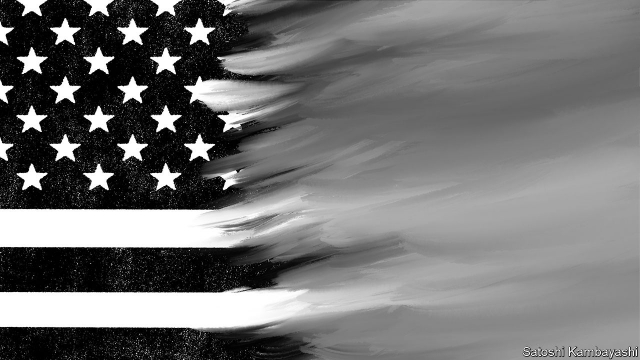
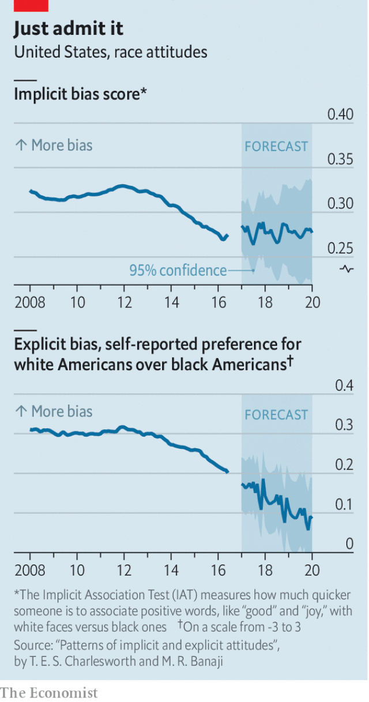

###### Everyone’s a little less racist

# Race plays an ever-more important role in voting 

##### Meanwhile, racial prejudice is declining 

 

> May 9th 2019 

MORE THAN a decade after America elected its first black president, fears of worsening racial tensions are palpable. A poll in February from the Pew Research Centre, a think-tank, found that 58% of Americans think race relations are “generally bad” and 45% believe it has become more acceptable to express racist views since Donald Trump was elected president. Some have used these data to assert that racists have been emboldened by Mr Trump’s victory and are perpetrating hate crimes against their neighbours at higher rates than before, a picture that seems to be confirmed by attacks on synagogues, or by marching white supremacists. This is misleading, however. Over the past ten years, racial biases have become less pronounced in America. It is possible that its citizens are more tolerant today than they have ever been before. 

America has faced two major barriers to racial equality, one of them legal, with slavery and racial discrimination at its core, and the other psychological. The first of these walls was mostly knocked down with the passage of the Civil Rights Act of 1964, which prevents employment discrimination on the basis of race, though struggles against racism remained long after. A harder-to-solve barrier to fairness is the prevalence of bias against non-whites. 

Researchers call known attitudes—such as agreeing with the statement “I think black people are lazier than whites”—explicit biases, and hidden beliefs—such as unintentionally associating African-Americans with fear or evil more often than whites—implicit biases. Both kinds are a problem. Scholars have found that implicit biases impede impartiality in the education system, for example, and can cause police officers to stop black drivers for no good reason much more often than white ones. 

Tessa Charlesworth and Mahzarin Banaji, psychologists at Harvard University, recently published an analysis of 4.4m results from an online test of Americans’ biases. The test, called an implicit-association test (IAT), scores biases based on how quickly a person associates black and white faces with nouns like “good” and “bad” or “joyful” and “evil”. If someone is quicker to categorise one race positively or the other negatively, they are said to be biased. The authors found that implicit biases based on race have decreased by approximately 17% in a decade. They also found that explicit biases have declined by an even-larger 37%. 

 

Exactly why this should have happened remains a puzzle. Ms Charlesworth suggests that the media and public discussions play a large role. Pundits frequently discuss efforts to change racial biases, and “the more times we talk about trying to change an attitude, the more likely we are to succeed in actually doing so.” 

Declining racial bias has produced a host of changes. Housing patterns show some of the clearest signs of thawing attitudes. Whites are steadily moving into predominantly black neighbourhoods in search of lower house prices. The share of non-whites in suburban and rural areas is increasing too. Pew’s data show that the share of Republican-aligned Americans who say the country needs to do more to ensure equal rights for blacks and whites climbed from 30% in 2009 to 36% in 2017. That shift is even more pronounced in the Democratic Party. Over the same period the share of Democrats who said the same increased from 57% to 81%, a change linked to the greater importance of anti-racism for Democrats now compared with before Barack Obama’s election. 

As noticeable as they have become, feelings about white identity have actually mellowed on some measures. John Sides, a political scientist and co-author of a book on identity and the 2016 election, notes that the share of respondents to the American National Election Studies (ANES), a survey from the University of Michigan, who strongly identify as white and perceive discrimination against whites fell between 2012 and 2016. 

Yet while all this progress has been going on, American politics has become more polarised on racial lines, rather than less. As high-school-educated whites have abandoned the Democratic Party, racial identity has melded with political preferences. In reaction to Mr Obama’s election, and threatened by the rising status of non-whites, a significant share of Americans have embraced the politics of solidarity with other whites. A good predictor of support for Donald Trump in 2016 was whether or not a voter agreed with whether it was extremely or very important “for whites to work together to change laws that are unfair to whites,” a sentiment shared by 33% of Trump voters, according to the ANES. 

This does not mean that support for the president is motivated by simple racism, as his opponents frequently imply. Those who say they identify more with whites do not always prefer white to black Americans. In her recent book, “White Identity Politics”, Ashley Jardina, a political scientist, finds that 9% of white Americans are unabashed racists. A much larger group of whites, 30-40% of the total, feel a strong attachment to their whiteness and yet do not express racial bias. 

At least one route exists to reducing the importance of race in politics. The combination of Mr Obama leaving office and Mr Trump’s racist remarks on the campaign trail made race salient in 2016. If other issues come to the fore in 2020, then racial issues could have less impact on voters’ decisions than they did in 2016, says Mr Sides. America has become politically polarised along racial lines. America has not become more racist. 

