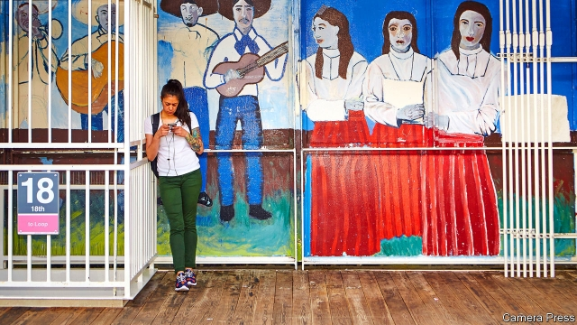

###### After a tipping point

# The Mexican-American population is shrinking 

##### A stand-off at the southern border has distracted attention from a much bigger change 

 

> May 9th 2019 

WALK THROUGH Pilsen, a Chicago neighbourhood that is home to successive waves of immigrants, and two stories unfold in the surrounding streets. The first is seen in the abundance of taquerías, in bright murals of Mexican cowboys and dancing women, or in remittance and travel shops that advertise their business ties to Mexico. The other story is punctuated by vinyl record shops and vegan cafés on fashionable 18th Street. In 2000 the district’s population was 89% Hispanic and notably poor. Now, as it gets wealthier, Mexicans are themselves being replaced, sometimes by immigrants—notably Asians—and more often by young, childless, white Americans eager to live in new apartments convenient for jobs downtown. 

Some protest. Ruth Maciulis, in the placard-filled head office of the Pilsen Alliance, an activist group, passionately vows “direct action” and to “fight back against rampant development”. But many locals are phlegmatic, seeing a routine turn in the fortunes of the current population. From the 1950s onwards, Mexican immigrants poured into Pilsen. They replaced Poles, Czechs and Italians, filling pews in their brick churches and acquiring their businesses. Now they too are moving up and on. “Each ethnic group and city has its own renovation time,” says Julio Vlazquez, a resident for 23 years. “We’re relocating. Nobody is being pushed out.” 

Mr Vlazquez is lucky. Brought to America as a child, he prospered and bought his shop from a departing Pole. A few doors on, Sonia Sauceda tells of similar success. She arrived in 1972 and recalls meeting a pair of towering, ancient Polish women, Kittie and Rosie, who ran a bar. They disliked Mexicans like her. She became a university graduate and accountant, and invested her savings to run a crepería from their former bar. Her 83-year-old father owns and runs a bakery next door. Business is fine, she says, but rising costs may prompt both to sell and go. “Now we see the same changes” as Poles did before, she says. 

Such stories reflect broader changes for many Mexican-Americans, especially in bigger cities like Chicago. For one thing, their overall numbers are falling, after four decades of growth. Andrew Selee of the Migration Policy Institute (MPI) in Washington points out that since 2007 a tidal wave of Mexicans going to America has slowed to a dribble as unauthorised migrants have been replaced by legal ones. 

Data from the Pew Research Centre show that patrolmen on the southern border arrested 1.6m Mexicans in 2000, 98% of all those who were detained. Since then, Mexicans have mostly given up frontier-hopping. Last year the Border Patrol seized only 152,000 Mexicans, just 38% of a much smaller total. (It is a different story for Guatemalans, Hondurans and other central Americans, who do still come, illegally or claiming asylum, in large numbers.) 

In fact the total number of Mexican-born immigrants in America has stopped climbing and started to fall, notes Randy Capps, also from MPI. In 2016-17 alone the number fell from 11.6m to 11.3m, a sharp dip that is probably continuing. That is despite the lowest unemployment in America in half a century. Previous spells of strong growth always drew in Mexican labour. No longer. Higher incomes, more jobs and an ageing population in Mexico have all shrunk its pool of potential migrants. 

Fewer Mexican migrants in all, and more who come with papers—America probably now has more legal than illegal Mexican migrants, a notable tipping point—have other effects. One is that new arrivals are better educated than the people who crossed earlier, who were generally low-skilled. A report published on May 9th by MPI points out that whereas only 6% of recent Mexican arrivals had a college degree in 2000, some 17% had one by 2017 (see chart). The institute estimates that there are 678,000 Mexican graduates in America, one of the biggest stocks of skilled immigrants. And perhaps most important for successful integration, such newcomers are also the most likely to have good English skills, whereas Mexicans historically were slow to acquire the language. 

 

What does this mean for America? Mr Selee is hopeful. He sees Mexicans following the path set by southern and eastern Europeans, predicting a “huge change” in the next 20 years, as far fewer Spanish-speaking migrants come in. That could be a boon to those already there. One lesson after previous decades of high migration ended (as when a 1924 law abruptly choked inflows of Asians and some Europeans) is that it can herald a period when existing migrants—and, importantly, their American-born children—integrate successfully. 

Mr Capps also sees Mexicans in a situation “analogous to European countries” before. There was plenty of discrimination against Italians and Poles a century ago, for being Catholic, Jewish or insufficiently “white” in the eyes of Protestant Americans. But when a slowdown in arrivals is followed by social mixing, intermarrying, better education and rising incomes among migrants, discrimination begins to disappear, he says. In effect, the designation of a group as “white” depends less on their skin colour than their fortunes. 

That is relevant for a debate that periodically grips America, in which demographers, white nationalists and others speculate about when the country’s non-white population will become the majority. A census estimate suggests that might happen as early as the 2040s. Perhaps. But any calculation depends on who is defining a given group as white or not. By then, instead, that category may include the biggest single group of migrants, Mexican-Americans, just as it now includes descendants of Poles and Italians. For all its upheaval, Pilsen may show a path ahead. 

