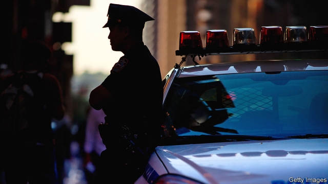

###### Riding shotgun

# Why American police departments are sending social workers to answer 911 calls 

##### Two studies suggest that one in four people shot dead by the police have psychiatric conditions 

 

> May 9th 2019 

WHEN HIS adult son began suffering an acute episode of mania in Queens, New York, Ralph called 911. Although he tried to explain over the phone that the problem was a mental-health crisis, “we had to watch as a small army of police took down my son like he was a terrorist,” he recalls. Ralph’s son panicked but was co-operative, so he averted a situation that “could very well have turned lethal.” Others are not so lucky. Since June 2015, 14 emotionally disturbed people have died at the hands of police in New York City. 

Robust numbers on what proportion of those shot dead by the police are suffering from a mental illness are hard to come by. The Department of Justice is supposed to collect the numbers, but police departments are not obliged to share them. Two studies suggest that in as many as one in four of all fatal police shootings nationwide the victim suffers from severe psychiatric problems. Yet most police officers are not trained to deal with mentally ill people. Few are even warned that a person is ill before they arrive on the scene. 

Police departments around the country are coming to recognise that this must change. One approach that is gaining ground involves getting police officers and social workers to respond to emergency calls together. Departments that use these “co-response” teams report that they detain fewer people and take fewer disturbed people to emergency rooms, thereby saving money. They may also shoot fewer of the citizens they are sworn to protect. 

Police in Boston, Denver, Houston, Minneapolis and Los Angeles have either launched or expanded such teams in recent years. New York started its own co-response programme in 2015, but only for non-emergencies. In light of stories like Ralph’s, the city’s department has said it may experiment with using co-response teams to handle 911 calls. 

Getting these programmes established is a challenge. Boston embedded its first social worker with a response team in 2011, but it took him a full year to gain the trust of the officers, says Jenna Savage, deputy director of the department’s Office of Research and Development. Police officers can be clubby and hostile to outsiders. Funding for the programme was also patchy, cobbled together from state and federal grants, which meant that Boston lost a clinician when a grant expired. But the programme’s benefits persuaded Boston’s City Council to set aside permanent funding in 2017. Now five social workers accompany officers on emergency calls, and Ms Savage would love to hire more. 

Although police departments speak highly of these teams, measuring their value is tricky. Rigorous research demands funds that cities rarely have, and many are experimenting with slightly different models, which makes it hard to compare programmes. Anecdotally, departments cite the value of reduced hospitalisation and jail time, and describe better community relations. Officials in Gainesville, Florida recently boasted that their new co-response programme has diverted over 90% of those who would have gone to jail elsewhere, thereby saving $220,000. 

In Boston, where a cost-benefit analysis is under way, Ms Savage says their programme saves the city money, but she concedes “it is hard to quantify services that have been avoided”. And these programmes are only as good as the mental-health services they offer. If a co-responder team cannot link people with regular case workers or supportive housing, “they’re going to see the same people over and over again,” says Amy Watson, an expert in criminal justice and mental-health systems at the University of Illinois. 

People who are experiencing a psychiatric crisis often call 911 because they lack alternatives. In New York City, emergency calls reporting emotional disturbances have nearly doubled over the past decade. They are particularly high in poorer, non-white districts where opportunities for psychological help are thin on the ground. Without more support before problems become emergencies, police officers are doomed to manage situations that are better left to therapists. 

