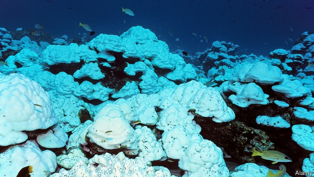

###### Heated debate

# Australian voters are increasingly concerned about climate change 

##### But the Liberal Party’s main policy on the subject is to bash Labor’s 

 

> May 16th 2019 

WHENEVER HE FLIES out of Melbourne, Steve Stefanopoulos gets a view of wilting grass. The reservoirs supplying the city’s water are low. It relies on a desalination plant to meet its needs. This worries Mr Stefanopoulos, the mayor of an affluent eastern suburb. In a federal election on May 18th, he wants someone “to stand up and do something about the environment”. 

The vast majority of voters in his constituency, Higgins, agree. It has always been held by the ruling Liberal Party, which is right-of-centre. But lots of youngsters have moved in, and frustration at the government’s failure to cut emissions of greenhouse gases is running high. The Liberals have spent a fortune boosting their candidate and plonking placards outside posh houses. Yet they might lose the seat to the Greens. 

Few rich countries are as severely affected by climate change as Australia. Storms and cyclones strike the tropical north with increasing ferocity, and droughts are hitting harder and for longer. Since the last federal vote, warming waters have killed much of the Great Barrier Reef. 

This summer seemed particularly apocalyptic. A million native fish washed up dead in the Darling river, part of Australia’s longest river system, which is drying out. Flooding in northern Queensland killed several people and half a million cattle. Fires ripped through the southern island of Tasmania, destroying ancient forests. 

Even conservative farmers are increasingly inclined to attribute these horrors to man-made climate change. Neil Westcott grows wheat and barley on a property of 25 square kilometres in New South Wales. Over the past 30 years, he has watched annual rainfall drop by four inches. “That’s a lot,” he says, “when you only had 20 inches to start with.” 

Mr Westcott might once have been laughed out of his local town for talking about climate change. These days he makes a habit of perusing scientific papers. He is struggling to bring himself to vote for the Liberals’ coalition partners, the Nationals, who are the main right-wing party in rural areas and who want to open new coal-fired power plants. “I’ve never had to think about my vote so long and hard,” he says. 

One recent poll found that over 60% of voters believe that climate change presents a “critical threat” to Australia. Yet it is the world’s biggest exporter of coal, the fuel that causes the most pollution. Most of the country’s power is still generated by the stuff. Relative to its population, Australia produces more emissions than almost any other rich economy. 

Politicians have been at war over what to do about this for a decade. Labor lost two prime ministers to the problem before the Liberals came to power in 2013. The quagmire has since deepened. Tony Abbott, who was then the Liberal leader, axed a carbon tax introduced by Labor. His government also pared back a renewable-energy target and cut funding for climate science. 

No other rich country has put a price on carbon only to scrap it again, says Kelly O’Shanassy of the Australian Conservation Foundation. Unsurprisingly, emissions have since been rising. In 2015 a more moderate Liberal, Malcolm Turnbull, replaced Mr Abbott as prime minister. He proposed a binding scheme to cut emissions from power plants, which prompted Mr Abbott’s right-wing acolytes to turf him out. 

Mr Turnbull’s successor, Scott Morrison, once declaimed an ode to a lump of coal in parliament. His main policy on climate change is to lambast the Labor Party for promising to funnel subsidies to renewables, which it wants to see producing half of Australia’s electricity by 2030, and to tighten vehicle-emissions standards, to speed the uptake of electric cars. This will hurt the economy, Mr Morrison says, and is a “war on the weekend” because it would disadvantage outdoorsy cars. 

Young voters, who tend to care more about climate change than their parents, are on the warpath. “We’ve not been listened to,” says Anthony James, an 18-year-old voting in the suburbs of Melbourne. Mr James was a member of the Liberals’ youth arm for two years, but recently left. He will vote for Labor, despite horrified remonstrations from his parents, “until the Liberals have a proper environmental policy.” 

Many environmentalists are frustrated by the limits even of Labor’s policy. It hopes to win seats in resource-dependent parts of Queensland, and so has not committed to phasing out coal-mining, they grumble. In particular, it has waffled about a vast new mine that Adani, an Indian conglomerate, wants to open in outback Queensland. 

Hence the appeal of independent candidates, who promise more action. A leafy tram-ride north of Higgins is the even wealthier seat of Kooyong. It is held by Josh Frydenberg, the treasurer (in effect, the finance minister), by what should be an unassailable margin of 13 percentage points. But the party is nervous. The seat is under attack from both the Greens and a prominent independent, Oliver Yates, who used to head a state-owned fund that invests in clean energy. “There’s no future for coal,” Mr Yates says, as he hands out flyers at an early-voting centre. 

Australia’s political system makes it tough for such candidates to get elected. Mr Frydenberg will probably cling to his seat. Other right-wing luminaries, including Mr Abbott and Peter Dutton, the home-affairs minister, may not. The real question is whether the Liberals’ reactionary stance on climate-change survives the election. 

