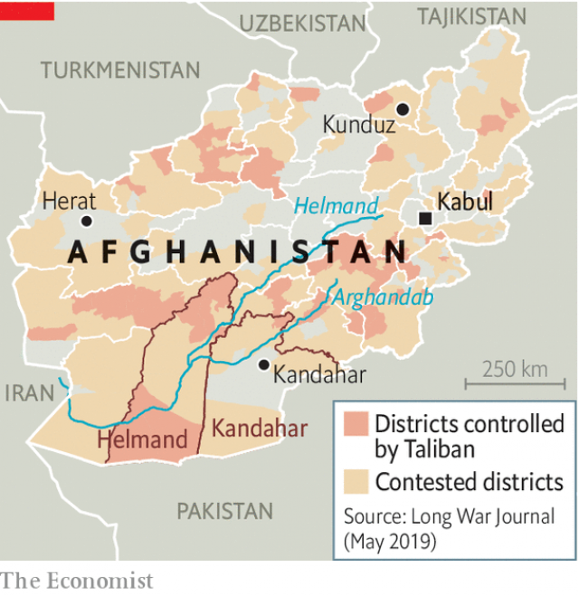

###### Making the desert bloom

# Cheap solar panels boost the Afghan poppy crop 

##### They allow groundwater to be pumped up to irrigate otherwise useless land 

 

> May 16th 2019 

IN HIS FIELD in Zhari district, about ten miles outside Kandahar city, Abdul Samad, a farmer of uncertain age, tends to his onion crop. Sitting on his haunches, a blanket on his shoulders to protect him from the dusty wind, he points to his latest investment: an array of solar panels at the end of the field. They are connected to a pump which pulls up groundwater, for use when the irrigation canals dry up. Before, he used to run the pump with a diesel generator, but the fuel was very expensive. Now he can pump all day. “When there is no water you cannot grow anything,” says Mr Samad. 

Solar panels are transforming the landscape of southern Afghanistan. Only 12% of the country is suitable for growing permanent crops, mostly in the valleys of the Arghandab and Helmand rivers (see map). Even there, most farming is dependent on irrigation systems that date back to the 1950s, when dams were built with American aid, if not earlier. The ability to drill wells and, more recently, to extract water from them cheaply with solar power has changed all that. Not only are farmers getting more out of their existing farms, according to a study by David Mansfield of the London School of Economics, they are also creating new ones. Between 2002 and 2018 some 3,600 square kilometres in south-western Afghanistan was reclaimed for cultivation from the desert. 

 

The trouble is that unlike Mr Samad, most farmers buying pumps are not growing onions. His neighbours’ fields are full of pink and white poppies. They are used to make heroin, which is sold to middlemen and shipped to Europe and elsewhere via Iran and Pakistan. According to the United Nations, poppy cultivation in Afghanistan is close to its highest level since monitoring began in 1994. Muhammad Salim, a poppy farmer in another part of the province, says that he cannot afford to grow any other crop. Mr Samad says that he too would grow poppies, but his land is fertile and near a road, so he is better off growing vegetables. “It is best to grow poppies in the desert,” he says. 

Entire new communities have grown up of late to do just that, according to Mr Mansfield. In a country where a typical woman has five children, and where land is fought over, the expansion of arable land is invaluable. As many as 2.5m people may now live in what used to be desert. The price of desert land has soared, from as little as $35 for a jereb (about 2,000 square metres) to over $1,000 now. That has made landowners rich, not to mention politicians and senior police officers. 

There are drawbacks, however, even locally. Opium helps to fund the Taliban, as well as pro-government warlords who are scarcely better. The reclaimed territory is mostly untouched by the government: indeed, many of the settlers are people who are rather hostile to state-building. Other Helmandis call them “the wildmen”, Mr Mansfield says. 

There is also a big cost to the environment. Though there are no hard data, excessive drilling is “100%” lowering the water table, says Muhammad Wali, a turban-clad elder in Panjwai district who serves as the local mirabu or water manager. “Groundwater is for drinking, not for farming,” he says. Drinking wells are increasingly contaminated with nitrates from cheap fertilisers, which have spread alongside pumps. Shallow wells have gone completely dry. If the groundwater is exhausted, millions will have to move again. 

Perhaps the best hope is that the appeal of planting poppies wilts before too many wells dry up. A huge harvest in 2017 pushed prices down 56% last year, according to the UN, to their lowest level in over a decade. For farmers like Mr Samad, that takes some of the buzz out of planting poppies. 

