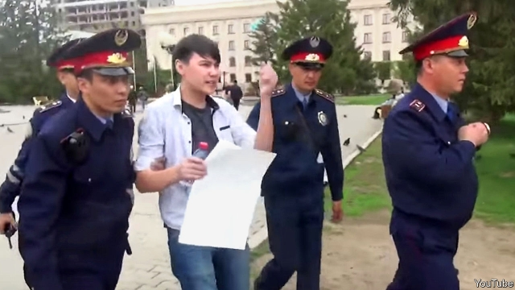

###### A dissident with nothing to say

# Police in Kazakhstan inadvertently become conceptual artists 

##### A man holding up a blank placard is arrested 

 

> May 16th 2019 

ASLAN SAGUTDINOV had a hunch. The authorities in Kazakhstan are so intolerant of dissent, he reasoned, that it does not really matter what protesters write on their placards. Simply holding up a sign of any sort is considered subversive enough to merit arrest. After all, two democracy activists, Asya Tulesova and Beybaris Tolymbekov, had been arrested in April for unfurling a banner at a marathon in Almaty, the financial capital, that read “You cannot run from the truth #forafairelection #Ihaveachoice”. They were jailed for ten days for breaching rules on public assembly, even though the authorities insist that the presidential election on June 9th will be fair, and that people will have a choice. 

To test the government’s paranoia, Mr Sagutdinov stood in the middle of the city of Uralsk and held up a big blank sheet of paper. Sure enough, the police took him into custody. They could not think of anything to charge him with, however, so they soon let him go. A police spokesperson later helpfully explained that Mr Sagutdinov had been detained not for holding up a piece of paper, but for the opinions he expressed as he did so. 

The protesters at the marathon and Mr Sagutdinov have spawned a series of imitations. A man who hung a banner quoting the constitution over a road in Almaty was briefly jailed, then fined. A schoolboy in Nur-Sultan—the capital, which was recently renamed in honour of Nursultan Nazarbayev, the septuagenarian former president—staged a blank-paper protest of his own. Activists have been posting photographs of themselves on social media holding up nothing at all. People frustrated with three decades of authoritarian rule have also held small street protests to demand democracy. Many have been arrested; some have been jailed for short spells. 

The authorities are especially touchy at the moment because Kazakhstan, an oil-rich former Soviet republic of 18m, is in the midst of a delicate transition. Mr Nazarbayev resigned in March after three decades in charge. The election is being held to affirm his chosen successor, Kassym-Zhomart Tokayev, the interim president. 

Mr Nazarbayev’s support in elections varied wildly, from a meagre 81% to a respectable 98%. It helps that he never had to face a credible opponent. One potential rival shot himself twice in the chest and once in the head, police say. Another was disqualified for taking part in an illegal protest, as it happens. Others boycotted the polls as stitch-ups. This time, however, the authorities have allowed a candidate with a record of political opposition to register. No one expects Amirzhan Kosanov to be allowed to win. Many fear he will simply legitimise the election, while toning down his criticism of the powers-that-be. It is not even clear whether his supporters will be allowed to hold up placards. 

