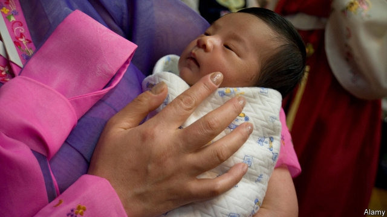

###### When a month is two years

# South Korea mulls a way to make everyone a bit younger 

##### Politicians may change the way age is counted 

 

> May 16th 2019 

WHEN KOREANS meet a new acquaintance, one of the first questions they ask is, “How old are you?” What may seem surprising or even rude to foreign visitors is necessary to comply with Korean standards of politeness. The language has a multi-tiered system of honorifics. How you address somebody depends on their status, which is determined first and foremost by age, though sex and professional standing also play a role. Getting it wrong can be awkward. 

Getting it wrong is also easy, given the country’s confusing mix of systems for calculating age. To start with, most Koreans consider babies one year old when they are born. What is more, everyone collectively turns a year older on January 1st. This used to happen on lunar New Year, which falls about a month later, when people still eat a bowl of beef soup with rice cakes in celebration. (Babies marking their second birthday despite having been born only weeks before have milk.) 

The “Korean age” calculated in this way has traditionally been more important than the Western-style age recorded on people’s passports. Many older Koreans do not even know their birthdays. To add to the mess, yet another method is used to determine whether someone is old enough to drink alcohol, or when they should perform military service: their birth year is subtracted from the current calendar year, so a person born on January 1st is considered the same age as someone born 364 days later. 

All this not only confuses visitors but also stymies bureaucrats, who are often uncertain which number to use for what purpose. Popular apps designed to convert one type of age into another help the numerically challenged, but hardly clarify the rules. Studies suggest that most Koreans would prefer a simpler system. 

Some politicians have decided that the way forward is rejuvenation. Earlier this year a group of lawmakers submitted a bill to abolish the Korean way of measuring age for administrative purposes. The National Assembly has yet to consider the proposal. If it is approved, the whole country could become a year or two younger at the stroke of a pen—a handy trick in a fast-ageing society. 

