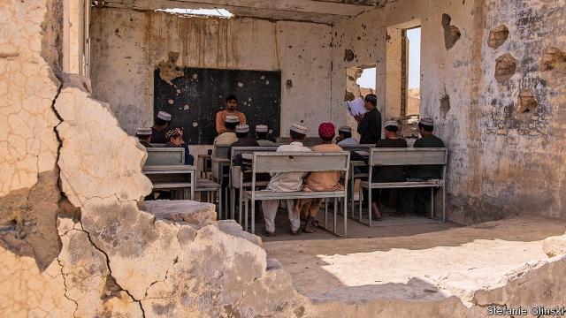
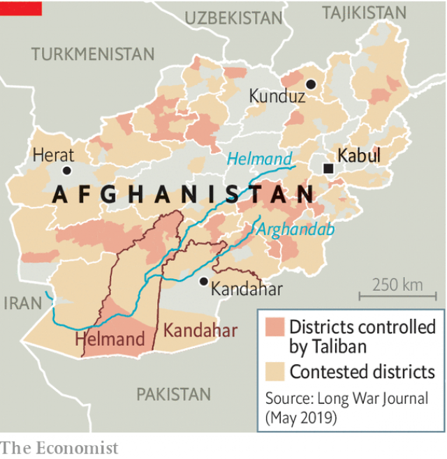

###### State departure

# Why Afghanistan’s government is losing the war with the Taliban 

##### The authorities make their presence felt mainly through corruption and nepotism 

 

> May 16th 2019 

SITTING ON A dusty rug beside their lorries at the edge of Kandahar, Afghanistan’s second city, a group of middle-aged drivers explain the difference between the Taliban and the government. Both groups take money from drivers on the road, says Muhammad Akram, leaning forward in a black kurta; both are violent. But when the Taliban stop him at a checkpoint, they write him a receipt. Waving a fistful of green papers, he explains how they ensure he won’t be charged twice: after he pays one group of Talibs, his receipt gets him through subsequent stops. Government soldiers, in contrast, rob him over and over. When he drives from Herat, a city near the Iranian border, to Kandahar, Mr Akram says, he will pay the Taliban once. Government soldiers he will pay at least 30 times. 

Afghanistan has been mired in conflict for some 40 years. It has been almost 18 years since America and other NATO members invaded to kick out the Taliban in the wake of the September 11th attacks. The two sides have been negotiating directly since October over an American withdrawal in exchange for a commitment from the Taliban not to harbour terrorists. The latest round of talks, in Qatar, where the Taliban maintain an embassy of sorts, concluded on May 9th, with what the militants described as “some progress”. 

As the two sides haggle, the war has intensified. Last year was the deadliest on record for civilians, according to the United Nations. America’s air force dropped more bombs in 2018 than at any other point in the war. Despite that support, the government is slowly losing ground. It now controls barely half the country’s territory, albeit two-thirds of its people. The Taliban regularly overrun police and army outposts, and occasionally whole cities. Nowhere is completely safe. At illicitly boozy parties in Kabul, the capital, rich Afghans make dark jokes about the impending arrival of the jihadists at their gates. 

That the Taliban are winning is in part the result of the complaints of people like Mr Akram, the truck-driver. Some 18 years after its creation, the Western-backed government in Kabul remains incapable of providing basic services. It has a huge security apparatus, a big bureaucracy and plenty of smart-suited, American-accented technocrats. But where it matters, the state is, in the words of the American Department of Justice, “largely lawless, weak and dysfunctional”. There are schools and clinics in some places, but teachers are not always paid and seldom turn up to work. Other public services are non-existent. The most visible branch of the government is the police, which does much of the thieving itself. 

The difficulty of building a functioning state is clear in Kandahar. It is, along with the neighbouring province, Helmand, the country’s breadbasket and was the centre of the precursor to modern Afghanistan, the Durrani empire of the 18th century. Whereas most of the country is mountainous and rugged, here irrigation canals feed a patchwork of small farms. Most of the population are Pushtun, Afghanistan’s dominant ethnicity. Kandahar province is where the Taliban movement was born in the 1990s. It was also where the Taliban regrouped and began fighting NATO’s occupation. As Hayatullah Hayat, the provincial governor, says, “If Kandahar is safe, Afghanistan is safe.” 

Today, Kandahar is far from safe. On the road towards Helmand, in Zhari district, a local police sergeant who goes by only one name, Shamsullah, explains that his job is “to kill Taliban”. Surrounded by guns, he says that things have calmed down since he and his team of 80 cops arrived. But the Taliban are in control just a few kilometres away. The last attack was just eight days ago, on one of the police checkpoints on the road. The Taliban also plant roadside bombs. Shamsullah insists he is capable of fighting them—he has been doing it for years. But he also says that they are often better equipped than his own troops, for example with night-vision goggles. 

 

The Taliban control only rural areas at the edge of the province. But their influence is far more widespread. When asked who the Taliban are, Shamsullah says that they are Pakistanis who employ “uneducated” locals with Gulf cash. That is not wholly wrong, but it is not the whole story. The Taliban also raise money themselves rather effectively, and not just from roadside extortion. In the village outside the police post, children play in fields of tall white and pink opium poppies. Faiz Mohammed, a farmer, says he sells his crop to men who come on motorbikes and take it to factories up the road in Taliban territory. They pay him in Pakistani rupees. 

The Taliban are certainly not the only drug dealers; plenty of people on the government side are involved in the trade too. But they are efficient operators. Not only do they run many of the factories and smuggling routes, they also manage farming. Taliban troops expect poppy-farmers to pay taxes on their crop, but they also provide seed capital and other support. In many areas, they help to police water use, managing disputes and limiting the over-exploitation of groundwater. Over the past few years the size of the opium crop has grown remarkably—especially in Taliban-controlled areas (see article). 

And in their fight against the government the Taliban find it easy to win support, because they attack institutions that are deeply unpopular. A few miles on the other side of Kandahar city, in Panjwai district, Faizal Muhammad Ishakzai, the district governor, says he is worried that fighting could start again soon. “The Afghan army keeps asking people for money,” he explains, “They mistreat us.” In particular, he argues, the Noorzai clan are exploited. Two influential Noorzai men were recently killed by police, he says, passing a phone with pictures of the bodies: “That creates anger.” In Kandahar, the security services are dominated by Achakzai, the clan of the provincial police commander, Tadeen Khan. Mr Khan was made commander after the assassination of his brother, General Abdul Raziq Achakzai, a famous anti-Taliban fighter who turned Kandahar into his own personal fief. 

That is where local problems connect to national ones. Afghanistan, despite its enormous diversity, has one of the most centralised systems of government in the world. The provincial commander, together with at least 3,000 other officials, is directly appointed by and answerable to the president, Ashraf Ghani. Most are chosen in Kabul on the basis of personal relations. When they use their power to settle scores or build empires, there are few ways for people to express their dissatisfaction. If petitioning appointed leaders does not work, siding with the Taliban is one of the few means of protest they have left. 

The Taliban are no more accountable than the government, stresses Ashley Jackson, a researcher at the Overseas Development Institute, a think-tank in London. Their attacks on civilians make them deeply unpopular, especially in cities. But in rural areas they are seen as efficient, at least, and willing to challenge arbitrary government power. For example, according to one UN study, land disputes may account for 70% of violent crimes. In government-controlled areas, well-connected figures often grab land with impunity. The Taliban, in contrast, have judges who deal with such cases brutally, but much less corruptly. 

Mr Ghani, the president, a former academic (and a former American citizen), has plenty of ideas about how to fix failed states; indeed, he wrote a book on the topic. In Kabul, diplomats rave about the work he has done introducing systems designed to reduce graft, such as using blind tests to recruit teachers. Tax revenues have gone up from around 8.5% of GDP to 11%, thanks to greater efficiency at border posts. 

But because people close to the president seem immune, Mr Ghani’s anti-corruption drive is seen by some as a power grab, with an ethnic tinge. “There have been some genuine efforts,” says one high-up official in Kabul. “But in terms of legitimacy, the president has created division. People say this administration is only from three provinces.” 

America’s negotiations with the Taliban reflect President Donald Trump’s insistence on reducing money spent and lives lost in Afghanistan before next year’s election. On April 2nd Mr Trump said America’s presence in the country was “ridiculous” and should be brought to an end. But Mr Ghani views the negotiations as a betrayal. In Washington in March, his national security adviser, Hamdullah Mohib, said America was giving legitimacy to the Taliban by talking to them. 

The government’s misgivings are far from absurd. America and the Taliban seem to be groping towards a deal in which America would withdraw most of its troops, bar a small force to hunt for terrorists, while the Taliban would call a ceasefire. The implications for the government, its army and its American-inspired constitution are unclear. Mr Ghani seems to assume that America will not actually let him fall. But Mr Trump may not care that much who runs the country. At the truck stop in Kandahar, the drivers certainly don’t—as long as they can work unthreatened by men with guns. 

