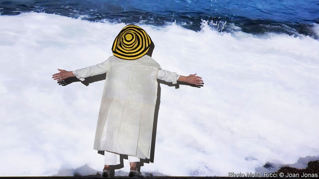

###### Beneath the waves

# Climate change strikes the Venice Biennale 

##### But why is much of the art it inspires so dull? 

 

> May 16th 2019 

ARTISTS HAVE long been inspired by the great issues of their day. Eugène Delacroix’s topless amazon, Liberty, celebrated the revolution that toppled the French king in 1830. Picasso’s “Guernica” mourned the horror of the Spanish civil war. Earlier this month a panel backed by the UN warned that 1m species were under threat because of human interference. So it is fitting that the Venice Biennale, which opened as those findings were released, should at last have discovered the theme of climate change. Alas, much of the resulting art is polemical rather than arresting. 

For instance, Christine and Margaret Wertheim’s hand-crocheted coral reefs look good on Instagram, but in “May You Live In Interesting Times”, an international exhibition curated by Ralph Rugoff of the Hayward Gallery in London, they fall flat. In the Biennale’s national pavilions, the Canadians are showing well-meaning videos about the impact of the changing climate on the Inuit people. Artists in the Nordic pavilion have strung leguminous loops of green tissue and red “seaweed” on a clothesline. Humanity has hung the planet out to dry, they seem to say: hardly an original metaphor. 

One of the most memorable previous examples of climate-change art was Olafur Eliasson’s “Weather Project”, in which the Icelandic artist rigged up a huge circular mirror and orange lights to suffuse Tate Modern’s Turbine Hall in a golden glow. It seemed to bring the sun into the lives of the more than 2m people who visited the show in 2003; it returns this July. Two artists who seem to be influenced by that installation are Joan Jonas (pictured) and Dane Mitchell. 

Both have brought powerful works to Venice (itself threatened by rising seas). In the New Zealand pavilion, Mr Mitchell has gathered a list of 3m things that no longer exist—extinct species but also ghost towns, discontinued perfumes, vanished borders. The list is being declaimed in what amounts to an epic poem of loss; the history of progress, it implies, is also a history of obsolescence. The roll-call is so long it can be read out for eight hours a day, seven days a week for the six months of the Biennale, and no item will ever be repeated. 

Ms Jonas combines film and performance in a piece created for Ocean Space, a new platform that brings together scientists and artists. On a stage in a Venetian church, she dances and mimes like a water wraith. Behind her is a video she shot of the ocean around Jamaica. At nearly 83, Ms Jonas slips into the blue. In a chiffon dress that discreetly masks her aged limbs, she glides through the water—a reminder that humans emerged from the sea and many still live by its bounty. With climate-change art, as with all kinds, it is the effect on the heart, as much as the head, that counts. 

