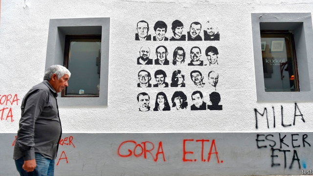

###### Neighbours from hell

# The definitive fictional account of the Basque troubles 

##### In “Homeland”, ETA’s extortion and terrorism shatter relationships in a Spanish town 

 

> May 16th 2019 

Homeland. By Fernando Aramburu. Translated by Alfred MacAdam. Pantheon; 608 pages; $29.95. Picador; £16.99 

ONLY A FEW miles from San Sebastián, Hernani is a prosperous Basque town with a medieval centre, several industrial estates and a sculpture museum. It hardly seems oppressed. Yet for decades it was under the thumb of ETA, the terrorist group which fought for an independent Basque state. Its town hall is still run by ETA’s sympathisers from the so-called abertzale (patriotic) left. Murals on the walls glorify convicted ETA prisoners. 

Hernani is the setting for “Homeland”, a powerful novel which has a strong claim to be the definitive fictional account of the Basque troubles. Its author, Fernando Aramburu, was born in San Sebastián but has lived in Germany since 1985. He has recreated ETA’s insidious violence and psychological intimidation, the threats and the terror that, amid the brooding mountains and tight valleys of the Spanish Basque country, set friends, neighbours and families against each other in asphyxiatingly claustrophobic towns like Hernani. 

The novel tells the story of two families who were neighbours and friends. Txato sets up a successful haulage company; he helps his pals Joxian and Miren, who is so close to Txato’s wife, Bittori, as to seem like a sister. Then Miren’s middle child, Joxe Mari, joins ETA, having become entangled in the abertzale world through his drinking buddies. Txato becomes a target of ETA’s extortion. The first time, he pays up. But when another demand is made, he refuses. After all, his father was wounded defending the Basque Country against Franco in the Spanish civil war. “I’m from here, I speak Basque, I don’t get involved in politics, I create jobs,” he reasons. “Don’t they say they’re defending the Basque people? Well, if I’m not the Basque people, who is?” 

Overnight Txato’s and Bittori’s lifelong friends ostracise them. Txato is murdered. The lives of Bittori and her two children are traumatised by grief, which each handles in their own way. Miren’s family is scarred too: Joxe Mari is captured, tortured and jailed. His sister, Arantxa, who rejects ETA, is disabled by a stroke; Gorka, his younger brother, escapes to Bilbao. “In a small town,” Gorka says, “you can’t be invisible.” 

Mr Aramburu skilfully spins their stories in short, punchy chapters that dart back and forth in time. He is careful not to caricature, portraying both police brutality and Joxe Mari’s belief—instantly adopted by Miren—that Spanish democracy is oppressive, misguided though that is. His prose has been rendered into propulsive American English by Alfred MacAdam (though it jars to translate this particular pueblo as “village” rather than “town”). 

In all, ETA murdered 850 people before disbanding last year. The vast majority of its victims were killed after Franco died in 1975 and Basques were offered an amnesty, as well as a democratic settlement that grants to one of Spain’s richest regions generous fiscal privileges. Basques run much of Spanish business. Indeed, of all the world’s terrorisms, ETA’s was one of the hardest to understand. It was fuelled by a toxic combination of racist anti-Spanish nationalism, Catholic mysticism and a dogmatic Marxist-Leninism. 

Basques and other Spaniards are now trying to come to terms with the legacies of the conflict. “Patria”, to give Mr Aramburu’s novel its more effective original title, has played a role in that; it has sold more than 1m copies in Spanish since its publication in 2016. Its message is ultimately redemptive. Forgiveness is extraordinarily hard, but it is not impossible. 

