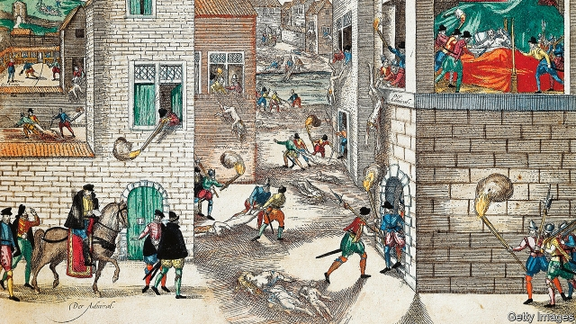

###### Live and let live

# The encouraging history—and ongoing puzzle—of tolerance 

##### For centuries it has proved a powerful ideal, and a fragile one 

 

> May 16th 2019 

The Limits of Tolerance. By Denis Lacorne. Translated by C. Jon Delogu and Robin Emlein. Columbia University Press; 296 pages; $35 and £27. 

TOLERANCE IS a strange but indispensable civic virtue. It requires people to accept and live calmly with individuals and practices of which they disapprove. Some take it for spineless laxity in the face of what ought to be fought or forbidden. Others see it as a demeaning fraud that spares prohibition but withholds approval. The tolerant themselves are not immune to its tricks and subtleties. It takes little for them to shout intolerantly at each other about how far toleration should go. 

Denis Lacorne, a French historian, is alive to those cross-currents. In “The Limits of Tolerance”, he describes how an enlightened ideal was championed by John Locke, Pierre Bayle and Voltaire, and how toleration was actually practised, using as examples the young United States, the Ottoman Empire and 16th-17th-century Venice. Then he turns to disputes over hate speech, public dress, and religious exemptions and frictions that vex present-day societies. His translators, C. Jon Delogu and Robin Emlein, use “tolerance” for both the civic virtue of forbearance and the state policy of upholding tolerant laws (often distinguished as “toleration”). 

He gives no pat answers, but an implicit lesson runs throughout. Defending toleration is not like protecting a jewel. It takes fixity of aim but also a feel for the changing context, persistence with a task that never ends and readiness to start again. Toleration does gradually spread. It can also suddenly vanish. 

In late medieval thought, against a backdrop of punitive intolerance, two powerful arguments emerged against enforcing orthodoxy of belief or manners: ignorance and perversity. Unaware of God’s deeper aims, church authorities could not for sure tell heresy from orthodoxy. Since God alone knew who was saved and who damned, secular authorities in turn had (like it or not) to protect both. That counsel was encapsulated in an early-15th-century catchphrase, “one faith, many rites”. Second, the widespread persecution was perverse and counter-productive. It made people suffer without changing their minds. Morally, persecution injured the Christian principles it claimed to uphold. 

Faced by decades of confessional warfare and the bald fact of religious disunity, later defenders of toleration built on those two ideas. This is where Mr Lacorne’s story begins. Locke argued that you could coerce only public assent, not private conviction; that suppression encouraged revolt; and—a new element—that religious persecution was bad for trade. Bayle stressed the pacifying effect of having many sects, none strong enough to dominate. Voltaire contended that a unique faith, if granted secular power, was bound to degenerate into cruelty and fanaticism. 

Toleration in action stretched from curtailing the burning or imprisoning of heretics, to lifting fines for practising an unorthodox faith and, later, to removing civic sanctions. That sequence from non-persecution and decriminalisation to civic equality included halts and reversals. A quarter of a century after the St Bartholomew’s Day massacre (pictured above), the Edict of Nantes (1598) gave French Protestants limited religious liberty. But the grant of civic rights was withdrawn 60 years before the revocation of the edict itself in 1685. The English Toleration Act (1689) put Anglicans and Nonconformists on a footing in specified areas of public life; but it excluded Catholics and Unitarians, accepted Quakers only conditionally, and barred all but Anglicans from many posts. Catholics and Nonconformists in England did not gain equal rights as citizens until 1829, Jews not until 1858. 

Enlightenment hopes for cohabitation in diversity thus rested heavily on the growth of religious indifference, the spread of faith-blind commerce and the multiplication of creeds. As faith withdrew from public orthodoxy into private choice, it was trusted that religious differences would no more excite or enrage than dress. Two, perhaps three, great faiths might do battle. With a wide choice of denominations, as Bayle had argued, there seemed little point. 

On the independence of the American colonies, religious variety underpinned the separation of church and state. For its part, commerce-minded Venice ignored the injunctions of Catholic preachers and accommodated Jewish traders, as well as Muslims, when not fighting the Ottomans. 

For five centuries, meanwhile, the Ottoman Empire was widely regarded as a model of confessional peace, its “millet” system serving a vast trading bloc in which Muslims were a minority until the mid-19th century. Millets were religious communities with their own courts and practices. The Ottomans recognised and protected Jews, Christian and Muslims alike, though they were not treated equally. For Islam, in Muslim eyes, was the only true religion. Its adherents enjoyed public privileges in what they could wear (including the colour of their turbans), ride (horses, not donkeys) or build (tall houses and places of worship). Each community collected state taxes, making faiths in effect tax farms. 

As Mr Lacorne tells it, the system’s breakdown was a lesson in how fast worldly forbearance can end. Ottoman toleration was finished off in the 19th century by nationalism and centralising reform. Balkan independence flooded Ottoman Turkey with 5m Muslims fleeing Christian persecution; everywhere national passions rose. By the early 20th century a proud record of toleration was blotted out by the genocide of Armenians. 

The book’s second part is a swift, pointed reminder of how well or badly present-day societies cope with the demands of religious toleration and free speech. It takes in the fatwa against Salman Rushdie, the Muhammad cartoons, French changes of mind on religious dress in public, arguments for and against laws criminalising hate speech and American court rulings on religious exemptions (yes for Amish non-schooling, no for Mormon polygamy and the ritual use of mescaline). 

This rich historical tour may leave liberal-minded readers disheartened. Evidently the intellectual and commercial characteristics of modernity on which the Enlightenment placed such hope have not, in the end, made the puzzles of toleration go away. But they can take heart from the weaknesses of toleration’s enemies. Noisy as they are, they are even less coherent than its defenders. 

To begin with, moral conservatives mistake toleration for permissiveness. But these are distinct. In a democracy, if everyone thinks certain conduct abhorrent, the case for prohibition becomes compelling. If nobody thinks it wrong, the case vanishes. Where opinion is split, as it often is, toleration enjoins the law to stand back. To recast those medieval arguments for toleration from ignorance and perversity in democratic terms: a public divided in its moral opinions cannot guide the state reliably; and, as experience suggests, policing morality tends to invite lawbreaking. 

The charge that liberals are too wet and feeble about intolerance is again misplaced. There are perfectly liberal weapons in the legal armoury for use against intolerance, if only liberal society will use them: laws protecting speech (including the offensive kind); personal protections against abuse or discrimination that the devout enjoy, not as privileged believers, but as citizens like everyone else; bans, as in Germany, against anti-constitutional politics; ruthlessness in the pursuit and punishment of ethnic or religious violence. 

Treating toleration itself as a patronising fraud likewise rests on a conceptual muddle. It confuses equality under the law with equal social prestige. Toleration, it is complained, demeans by holding back positive approval of belief or believer. But laws neither approve nor disapprove; only people do. The most citizens can ask of laws is not to be discriminated against. Laws cannot eradicate prejudices; for that, they must rely not on coercion but on free speech. 

“The Limits of Tolerance” ends with a reminder of a resource available in liberal societies but easy to forget: liberal opinion. It recalls the outpouring of support after the killing of journalists at Charlie Hebdo in Paris in 2015. The book appeared, originally in French, before the recent slaughter of Muslim worshippers in New Zealand. But there was a lesson there, too. A simple gesture—the wearing of a headscarf by the prime minister—was a reminder of politicians’ role in sustaining (or poisoning) a climate of forbearance. Leaders can always stoke up the few who want a fight. They can also mobilise the many who would rather live in calm, even with those they dislike. 

