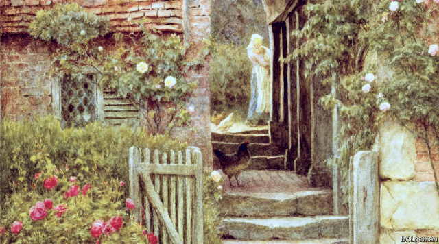

###### Portrait by a lady

# Why women’s art sells at a discount 

##### It has nothing to do with talent 

 

> May 16th 2019 

A ROSE PAINTED by another name would cost more. In a new paper*, four academics show that art made by women sells for lower prices at auction than men’s, and suggest that this discount has nothing to do with talent or thematic choices. It is solely because the artists are female. 

The authors used a sample of 1.9m transactions in art auctions across 49 countries in the period from 1970 to 2016. They found that art made by women sold at an average discount of 42% compared with works by men. However, auction prices can be distorted by a few famous artists whose output is perceived as extremely valuable. If transactions above $1m are excluded, then the discount falls to 19%. 

One explanation for this gap could be that women choose different subjects. This is partly true; for example, a higher proportion of women than men paint roses (including Helen Allingham, a British watercolourist: see picture), whereas a smaller share create landscapes. But it turns out that themes that are more associated with female artists sell at a premium, not a discount. Indeed, the researchers could not explain the female discount in terms of other factors such as the size, style or medium of the works, or the age of the artist. 

In theory, another possibility could be that women are just less talented than men. To test that proposition, the authors conducted a couple of experiments. In one, they showed 1,000 people a selection of ten lesser-known paintings and asked them to guess the gender of the artists. The respondents were right only 50.5% of the time, no better than tossing a coin. In short, the general public cannot discriminate between male and female art. 

In a second test, the researchers used a computer programme to generate paintings and randomly assign the results to artists with male or female names. They then asked participants to rate the paintings and ascribe a value. The experiment found that affluent individuals (those most likely to bid at auctions) attributed a lower value to works which the programme assigned to a woman. Clearly, this gap was unrelated to the artistic merit of the picture. 

It could be that these well-heeled observers were aware of the market discount for female artists, and applied it accordingly. But that does not solve the puzzle of why the gulf opened in the first place. 

Two more findings imply that the difference relates to culture rather than talent. First, the academics considered the relationship between the female discount and the level of gender inequality in the countries where the auctions took place. The inequality measure was derived from indices (such as those compiled by the UN and the World Economic Forum) which look at factors such as educational attainment and political empowerment. The average discount applied to the work of a given female artist was lowest in countries where women were more equal. (There are some exceptions to the rule, such as Brazil, where women’s art was highly rated.) 

The good news is that the female discount has fallen over time. For transactions under $1m, the study calculated, the discount has dropped from 33% in the 1970s to 8% after 2010. Again, though, that only confirms that ability never had anything to do with the disparity. But the reduction in the discount has another implication. As it has shrunk, so the returns on women’s art have grown; since the 1970s they have been higher than for their male peers. Collectors should put aside their prejudices. As the art world’s ingrained chauvinism abates, the female of the species has become a better investment than the male. 

* “Is gender in the eye of the beholder? Identifying cultural attitudes with art auction prices”, by Renée Adams, Roman Kräussl, Marco Navone and Patrick Verwijmeren 

