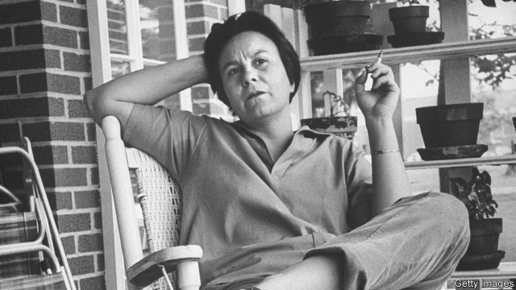

###### After cold blood

# “Furious Hours” is an ingenious double mystery 

##### One concerns an Alabama serial-killing, the other Harper Lee’s lost book 

 

> May 16th 2019 

Furious Hours: Murder, Fraud and the Last Trial of Harper Lee. By Casey Cep.Knopf; 336 pages; $26.95. William Heinemann; £20 

“FROM THE time there were murders in America,” Casey Cep observes in her intriguing book, “there were writers trying to write about them.” One work made the perennial true-crime genre “respectable”: “In Cold Blood”, Truman Capote’s “non-fiction novel” (as he put it) about the dreadful murder of a Kansas family. Ms Cep’s focus is on another crime, and another author’s attempts to write about it. What gives “Furious Hours” its frisson is that the author who hoped to follow in Capote’s footsteps was his old friend, Harper Lee (pictured). 

Lee’s fame rests on two pillars: the publication in 1960 of “To Kill a Mockingbird”, and the fact that, until the year before her death, she never published another book. It was while writing about the emergence in 2015 of “Go Set a Watchman”—in fact an early draft of “Mockingbird”—that Ms Cep learned of the existence of at least part of another Lee manuscript. In “The Reverend” she had planned to tell the story of Willie Maxwell, a charismatic African-American preacher from her native Alabama. 

In 1970 the body of Maxwell’s first wife was found in her car on an Alabama highway. At his trial for her murder, the prosecution’s star witness recanted and, after his acquittal, married the accused—before herself dying in similarly mysterious circumstances, as did Maxwell’s brother, nephew and stepdaughter. Then, for all his alleged proficiency in voodoo, Maxwell was fatally shot at the stepdaughter’s funeral. His killer, Robert Burns, would be defended by Tom Radney, a larger-than-life lawyer and politician somewhat in the vein of Atticus Finch. The third principal character in Ms Cep’s narrative, after the reverend and Lee, Radney had previously defended Maxwell himself—and pressed his voluminous life-insurance claims. 

“He might not have believed in what he preached,” Lee wrote of Maxwell, “he might not have believed in voodoo, but he had a profound and abiding belief in insurance.” Lee had worked closely with Capote in researching “In Cold Blood”; privately she objected to what she knew to be Capote’s fabrications. “The Reverend” would be her chance to play a straight hand. 

It is no spoiler to reveal that she never finished the book she planned to write about the Maxwell case. In the first part of “Furious Hours”, Ms Cep ably takes on the task that Lee may or may not have abandoned (there is no way of knowing how far she got, as her surviving literary assets remain “unpublished and unknown”). Ms Cep paints a portrait of a hermetic society still riven by prejudice, with its revival tents and sharecroppers. Then she pieces together Lee’s struggle not only with Maxwell’s tale but with the legacy of her overwhelming success. Mostly living anonymously in her apartment in Manhattan, she struggled with what Ms Cep calls the “seesaw of perfectionism and despair”. 

“Furious Hours” is a well-told, ingeniously structured double mystery—one an unsolved serial killing, the other an elusive book—rich in droll humour and deep but lightly worn research. If at the final page it seems curiously unsatisfying, that is because readers and writers both long for resolution—and Harper Lee’s story, like that of her proposed subject, stubbornly resists a neat ending. 

