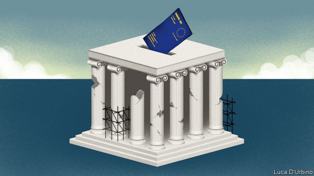
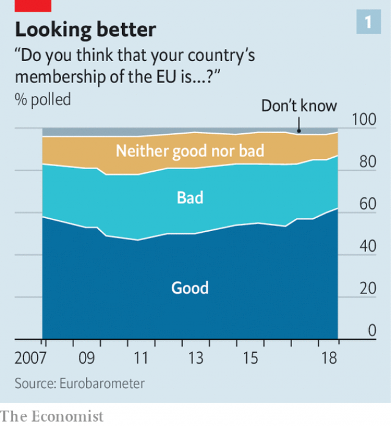
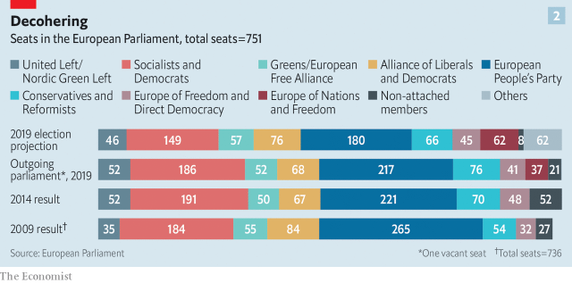
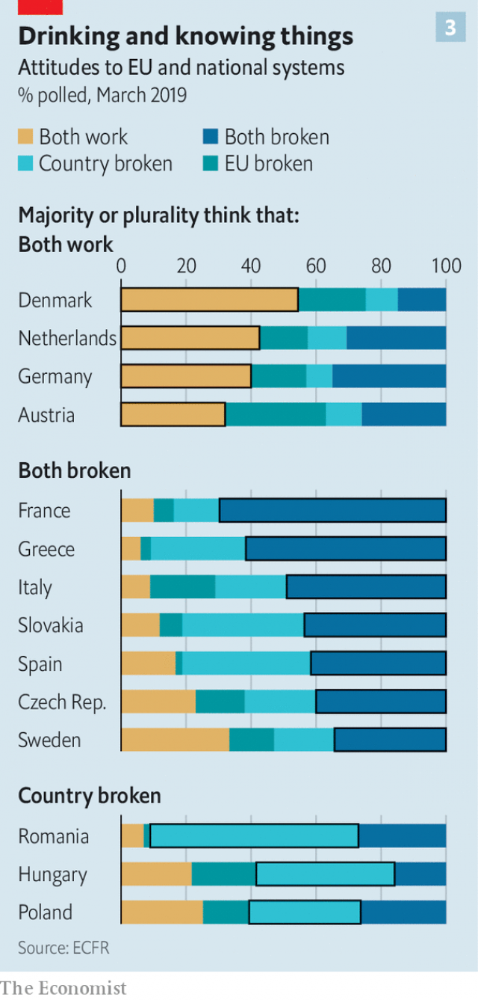

###### The second-biggest democratic show on Earth

# The European Parliament elections are responding to a changed world 

##### What does it mean to be the Europe that protects? 

 

> May 16th 2019 

UNDER POWDER-BLUE Peloponnesian skies, amid the olive groves and cypress trees where zealous athletes once competed for glory, Manfred Weber, a centre-right Bavarian politician, raises a hand to touch one of the ancient columns of Nemea, affecting contemplative wisdom. Kyriakos Mitsotakis, leader of the Greek centre-right, welcomes him to the “home of democracy”, a fitting place for him to launch the campaign which hopes to see him elected one of Europe’s most powerful leaders. Photographers diligently seek out angles that will make the opportunity offered them look vaguely interesting. 

Elections to the European Parliament, the EU’s legislature, will take place between May 23rd and 26th in the 27 countries committed to staying in the EU, as well as in one which is purportedly trying to leave (see article). Over 5,000 candidates are standing for around 400 parties, the vast majority of them national ones (there are some European Parliament-specific outfits and a few independents). Once in the parliament, these parties sort themselves into broad ideological groups. The European People’s Party (EPP), to which Mr Weber’s Christian Social Union and Mr Mitsotakis’s New Democracy party belong, has long been the largest such grouping. 

Once ensconced in Brussels—except for the 48 days a year when, in an absurd transhumance, they decamp to Strasbourg—the 751 MEPs discuss, amend and pass legislation proposed by the European Commission, the EU’s executive, and oversee its budget. In doing so, they have typically divided up along two axes; the universal left/right and the more parochial pro- and anti-Europe. The rise of populist parties in the wake of the euro crisis and the migration crisis of 2015 has prompted excitement and trepidation about the anti- side doing well this time round. 

The parliament also elects the commission’s president, a position with much more power than any in the parliament proper. The candidates for the job used to be selected by backstage deals between the member states. In 2014 the parliament, keen to matter more, decided that, instead, each parliamentary grouping should choose a preferred candidate (Spitzenkandidat) from within its ranks, and that the candidate of the largest grouping should get the job. The EPP’s Spitzenkandidat is Mr Weber. Hence his visit to a site of ancient wisdom and athletic competition. “You can’t fault our ambition,” one aide says with a suitably sporting smile. 

Nemea offers a wealth of resonance and metaphor for the state of Europe. There is work going on there which plays some unclear role between emergency preservation and eventual restoration. The shut-down factories seen when driving out from Athens, and the 30% of local youth without jobs, recall the crisis in the euro zone which pushed Greece to the brink of leaving. The same road was an artery for refugees leaving Turkey during the migration crisis. The distant cranes of the port of Piraeus across the Gulf of Elefsina have been, in part, sold off to China. 

A particularly telling symbol is an absence. There are no voters here, no supporters, no excitement. It will be as unprecedented for a Greek to be able to pick Mr Weber out of a line-up tomorrow as it was yesterday. And Greeks are far from unique in this inability. Surpassed only by polls in India, the European Parliament elections are the second-largest democratic exercise in the world. But that does not mean the electorate much cares about the personalities concerned, such as they are. Indeed, many hardly care about the elections’ actual results at all, seeing them more as a way of affirming likes and dislikes based squarely on their own national politics. In the previous elections, in 2014, eight countries saw turnouts of less than a third. 

Since then, though, there have been changes. The crises of the past decade have tested the union and found it wanting. They have also revealed its resilience. Whenever it came close to breaking up, its institutions and governments took painful and politically contentious decisions to hold it together. The European Central Bank, for example, prevented the euro’s collapse with a promise to do “whatever it takes” that horrified thrifty Germans—who nevertheless, because of the value they placed on the union’s survival, stuck with the strategy. Since the Brexit referendum in 2016 the EU’s response to the once-unthinkable shock of a large nation deciding to leave has both illustrated and strengthened its underlying cohesiveness. 

 

Possibly as a result of having peered over more than one brink, possibly as a result of an increasingly alarming world beyond their borders, Europeans are regaining some faith in the EU. In a survey of union-wide opinion taken last September, 62% of respondents said that membership was a good thing, the highest proportion since 1992. Only 11% said it was a bad thing, the lowest rate since the start of the financial crisis (see chart 1). The Brexit mess has doubtless put off other would-be leavers; the parties which once promised referendums on leaving in France and Italy have quietly dropped the idea. But the rise in support began in 2012, four years before Britain’s referendum. 

Which is not to say that the union is hunkydory. As well as being, in its way, the world’s second-largest democracy, the EU is also the world’s second-largest economy, but it has a range of dire problems on which action is needed: sluggish growth, carbon emissions, rising authoritarianism both in the rest of the world and within its own precincts, underperforming armies, a paucity of world-class technology companies and an inability to manage migration. 

A visitor from Mars—or, for that matter, Beijing or Washington—might see further integration as a prerequisite for sorting out such problems. But Europe is not America or China. It is a mosaic of nation states of wildly varying size and boasting different languages, cultures, histories and temperaments. Its aspiration to be as democratic as a whole as it is in its parts is profoundly hampered by the lack, to use a term familiar to the ancient Nemeans, of a “demos”—a people which feels itself a people. Few want a superstate with fully integrated fiscal and monetary policy, defence policy and rights of citizenship. For all that Mr Weber and other parliamentarians may want to make the elections pan-European and quasi-presidential, voters will continue to be primarily parochial. 

Nevertheless, the decade of living dangerously seems to have reshaped European politics into something a bit more cohesive, if not coherent. Europe is no longer in the business of expansion, or of integration come what may. It is in the business of protection. “A Europe which protects”, a phrase you cannot avoid in the corridors of Brussels, is increasingly heard on the campaign trail, too. Policy differences now play out within a broadly shared conviction that Europe’s citizens need, and want, defending from outside threats ranging from economic dislocation to climate change to Russia to migration. Some politicians offer integration as protection; others prefer simple co-ordination. But even parties once resolutely anti-EU, such as Austria’s hard-right FPO, now demand the EU do more, not less—at least in areas like border control and anti-terrorism. 

At the same time, a new divide has opened up, one that cuts across the old left/right and pro/anti battle lines. It is between gradualists unwilling to risk the status quo and those who seek rapid and fundamental change—in various different directions. 

To see a demos that demonstrates these changes, come to Linz, a working-class city in Upper Austria and a decent barometer for Europe’s mood. On May 1st, international workers’ day, a rally held on the baroque Hauptplatz by the pro-European, centre-left Social Democrat party (SPo) rang with brass bands and appeals to the “comrades”. In a stuffy beer tent less than a kilometre away an FPO gathering was getting into full swing. The customary left/right and pro/anti divides might have been expected to set the two apart as clearly as the waters of the Danube did. 

Look closer, though, and things are more complex. At both events the politicians are tellingly half-hearted when talking about the sort of things they might normally be expected to harp on about. The praise heaped on good public services by Klaus Lüger, Linz’s SPO mayor and the moaning about EU interference in the width of tractor seats by Manfred Haimbuchner, the FPO’s state leader, received scant applause. Where they fired up their audiences, it was on two more nuanced matters that are central to European, not just Upper Austrian, concerns. 

Both the SPO and the FPO argued that Europe should do more to protect the little guy. The SPO crowd clapped when told that “only as a Europe of co-operation can we solve common problems”; the FPO tent cheered Mr Haimbuchner as he said he wanted to do something about the fact that “people no longer feel at home in their own streets and towns”. And they also cheered his proposed solution to this purported problem—not a retreat from Europe, but a revolution within it. “We will position ourselves in the middle of Europe. We want to go to the heart of Europe.” The “Europe of nations” he imagines being at the heart of is not at all what the ralliers over the Danube want. But for a party which in the 2000s sought to leave the union completely to now want a central role in it is striking. 

Obviously, the means by which the parties are offering to create their more protective Europe differ. In Austria as elsewhere, the left offers more economic protectionism, the right more cultural protectionism, the centre a blend of the two. But the policy offerings start not from a liberal-versus-socialist divide on the role the market and private ownership should play in the economy, but from a shared feeling that Europeans want to be defended. The European election manifesto of Spain’s left-wing Podemos uses the word “protection” on every other page; when Germany’s centre-right Christian Democrats proclaim “Our Europe makes us strong”, the first-person plural applies to Germans and Europeans both. The FPO’s leaflets, somewhat sinisterly, show a European flag proudly flying from a barbed-wire fence. 

The level of upset imagined as necessary to bring about the promised protection differs, too. “The European election is a choice of direction,” intoned Mr Lüger. “If Europe falls to nationalism it will hurt a city like ours.” His message: steady as she goes. But in the FPO tent a crowd pumped up on high-tempo accordion music cheered the news that Europe’s transformation was on its way: “We haven’t even got started!” bellowed Heinz-Christian Strache, Austria’s hard-right vice-chancellor. Many wore colourful vests in support of the anti-establishment gilets jaunes protests that swept French cities during the winter and early spring. 

The question of how to protect cuts across the question of how much to change. This election pits parties that have long dominated the European Parliament—the EPP and its centre-left counterpart, the S&D—against those that would shake up the system. The shakers-up are both more interesting and more diverse, ranging from leftists like Jean-Luc Mélenchon in France to outfits like the FPO and the hard-right Lega, an Italian group of leavers-turned-overturners-from-within. 

But this is not a doughnut, composed entirely of the peripheral. Some centrists, too, such as the German Green Party, seek radical change. Most strikingly of their number is Emmanuel Macron and his La République en Marche party. Like Matteo Salvini of the Lega, Mr Macron has published a continent-wide manifesto. Mr Salvini’s calls for tougher borders and protections for “European culture”; Mr Macron’s for overhauling the borderless Schengen area, introducing a European minimum wage, investing more in artificial intelligence and creating a European Security Council. Both leaders want to create new groups in the next European Parliament after the election to further the realignments they seek. 

The old-school incrementalists are likely to lose seats (see chart 2); the shakers expect to gain them. The fragmentation that has visited many of Europe’s national parliaments in recent years will thus come to its international one. And in doing so it will reflect new divisions in the electorate. 

 

A recent study by the European Council on Foreign Relations, a think-tank, divides Europe’s voters into four groups named catchily, if not entirely convincingly, for factions from “Game of Thrones”, a television series about failures in governance. People confident in both their national governments and the EU sit in the stalwart House of Stark; those who think that their country is broken but that Europe works are Daeneryses. Both will tend towards incrementalism. Those confident in their national government but not the EU are the Free Folk; those who think both are broken are the millenarian Sparrows. Both those factions tend towards radical reform. 

All four factions exist in different proportions in different countries (see chart 3). Countries with a Stark plurality cluster in the continent’s core, those dominated by Sparrows are scattered all around, Daeneryses have a stronghold in the east. Tellingly, there is no country where the electorate is dominated by the Free Folk who believe the nation is fine but Europe is broken. 

 

A fractious parliament reassembling its power blocs to take some account of all this will make it harder for Mr Weber—whose EPP will probably come first again—to stake his claim to the commission presidency. The idea has no constitutional foundation, and came into its own only with the election of Jean-Claude Juncker to the presidency in 2014. A number of national leaders disliked either the idea of a Spitzenkandidat, Mr Juncker, or both, and some still object to giving the parliament control.Mr Weber’s persistent defences of, and excuses for, Viktor Orbán, Hungary’s authoritarian leader, could queer his pitch. It may be that Michel Barnier, also of the EPP and the commission’s Brexit negotiator, ends up as president. Margarethe Vestager, who has had an impressive run as competition commissioner, is a credible liberal candidate. There is some enthusiasm for Christine Lagarde, currently head of the IMF. 

And then what? The new commission, which will come into being in November, looks likely, like the new parliament, to be a lively and possibly quite dysfunctional body. The 28 commissioners are appointed by the member states, and several of the populists who have won power since 2014 will want to put a torch under the EU by sending arsonists to Brussels. 

An early sally may be over the outgoing commission’s proposals for the next five years, including focuses on defence, research, social rights, climate change and Europe’s neighbourhood, agreed on by EU leaders at a summit in Romania last week. There will be a running competition between establishment types and insurgents in the parliament, the council—which is made up of national governments—and perhaps the commission, too. 

New crises are brewing. But these could yet be the making of the EU. Jan Techau of the German Marshall Fund of the United States, a think-tank, imagines a war with Russia, a new euro crisis and a surge of migrants forcing Europe to integrate properly and, by 2040, to be a power to be reckoned with. That is outlandish, but his underlying point is right. Europe is struggling. But it has survived a very tough decade. Its voters have learned that economic battles are reliant on European debates, and that European co-operation is not in itself a bad thing. The club has developed a new sense of its own self-interest and learned in the process that it can move forward through crises still to come. Probably. 

