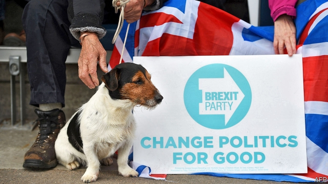
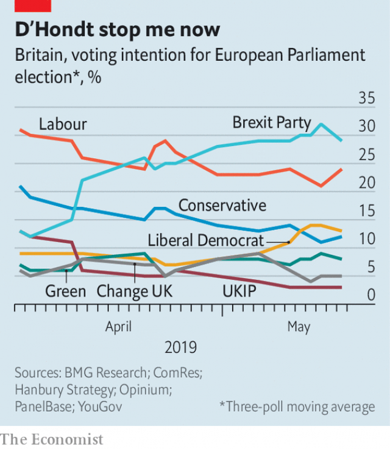

###### When the centre cannot hold

# Britain’s bizarre, unwanted European election 

##### Both main parties look like taking a drubbing, as pro- and anti-Brexit outfits surge 

 

> May 16th 2019 

FEATHERSTONE Working Men’s Club, near Pontefract, has never seen anything like it. On a sunny May morning, a mass of Brexit Party supporters, armed with placards and warmed up by a tub-thumping speech from Ann Widdecombe, a former Tory minister, chant “Nig-el, Nig-el” as their hero clambers on to the platform. This month’s European election, Nigel Farage shouts, is about democracy and the betrayal of voters. Mentions of Theresa May, the Conservative prime minister, or Yvette Cooper, the local Labour MP, are greeted with howls of “Traitor!” Outside, a kindly soul from the Communist Party of Great Britain (Marxist-Leninist) distributes leaflets pointing out that his party also backs Brexit. 

Mr Farage’s new party thrives on protest. Its supporters enjoy nothing more than being told their vote to leave the European Union in June 2016 has been betrayed by the establishment, the London elite, a useless prime minister, the civil service, treacherous MPs and the BBC. Mr Farage, who went from private school to a career in the City, is himself a prime elite specimen. Yet he manages to pose as an anti-establishment rebel (see Bagehot). In a Labour stronghold he raises cheers from the Yorkshire audience by denouncing Jeremy Corbyn as an Islington leftie. He offers no policies—they are promised only after the election—and does not even explain why Brexit is a good idea. His message is simple: we must walk out in October with no deal. 

By any standards, the European election taking place in Britain on May 23rd is bizarre. Nobody wanted it, as Brexit was meant to have happened on March 29th. But Parliament’s repeated refusal to pass the government’s Brexit deal was followed by a European Council decision to extend the deadline until October 31st. So Britain is having to join the rest of the EU in voting for a fresh set of MEPs next week. 

On the face of it the result should not matter much. If a Brexit deal is passed before the summer recess, as the government still hopes, British MEPs will barely have time to take their seats. Both main parties play down the ballot’s importance. The Tories are invisible on the campaign trail, failing even to produce a manifesto. Labour is little better, as its leadership is divided over whether to support another referendum. Yet the smaller parties are enjoying themselves—and doing well. 

 

The outcome will depend heavily on turnout. In European elections it is usually small (last time, in 2014, it was 35%). Yet this one may see turnout rise, as both pro- and anti-Brexit forces have been energised. Pollsters find that voters now identify more strongly with Remain or Leave than with their usual parties. The result is that support is bleeding from the Tories to the Brexit Party and, to a lesser extent, from Labour to the Liberal Democrats, Greens and Change UK (see chart). 

The focus is on Mr Farage’s Brexit Party, as it has a good chance of coming first. Yet, given the Tories’ calamitous meltdown over Brexit, this would not be so extraordinary. In 2014, after all, Mr Farage led the UK Independence Party into pole position. The bigger surprise is the fall-off in Labour support. Mr Corbyn’s ambivalence on Brexit seems to be driving many Remain voters to the smaller parties. 

These three, especially the new Change UK, have come under justified attack for splitting the Remain vote. Change UK’s leaders claim this is less damaging than it seems, as they appeal to voters disillusioned by the Lib Dems or hostile to the Greens. If the three together score in the high 20s, they will do almost as well as the Brexit Party in vote share, though probably not in terms of seats. Yet Change UK is having a tough time, not least over its poor organisation and branding. This week its lead candidate in Scotland pulled out, asking voters to back the Lib Dems. The party has no candidate in the Peterborough by-election on June 6th. 

The biggest question is what impact next week’s election might have on Brexit and British politics. The Brexit deal still seems stuck. Brussels has switched off; no further negotiations are taking place. But Mrs May has announced that in early June she will bring the withdrawal agreement bill before the House of Commons. Her hope is that the Brexit Party’s success may shock Tory and Labour MPs into voting for the deal after all. She will also argue that, if the bill fails, the only alternative is a no-deal Brexit. Yet she is on weak ground. Labour still looks unlikely to back the bill. So do the Northern Irish Democratic Unionists and the hardline Tory Brexiteers. And no-deal is not the only alternative, as Brussels seems prepared to grant yet another extension of the deadline to avert it. 

The effect of the election on Mrs May’s own position may be more dramatic. As The Economist went to press she was trying to fend off another attempt by the 1922 committee of Tory backbench MPs to change its rules to allow a leadership challenge. Even if she avoids such a contest, most ministers and MPs expect her to go soon. If her attempt to pass the Brexit bill fails, she will be under intense pressure to accelerate the timetable for her departure. 

What might her successor do? This is where the Brexit Party’s influence will count. It is not going away after the European election. Indeed, Mr Farage claims to be ready to run candidates, including himself, in any general election, too. And for many Tories, the prospect of the Brexit Party eating away at their vote means their party must back a no-deal Brexit to survive. 

Yet if it does, it risks losing its more moderate supporters. Thus, however the Tories respond to the Brexit Party’s success, a Labour victory in a future election seems more likely. Here is the ultimate irony for those vociferous Farage supporters. Their actions could yet mean that a Labour-led government overturns Brexit altogether. 

