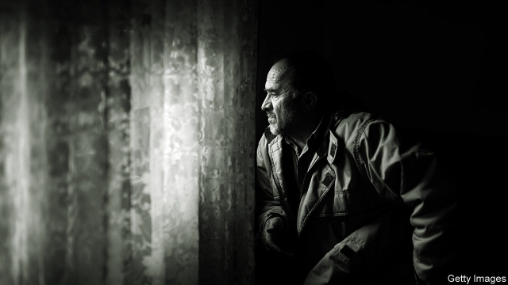
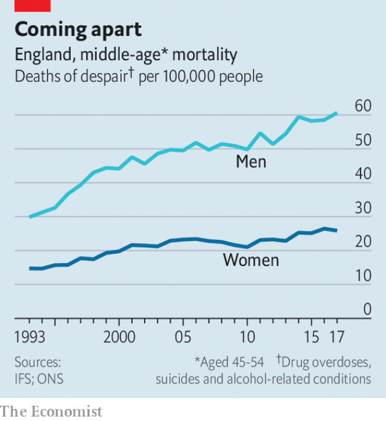

###### The economics of death

# Deaths of despair, once an American phenomenon, now haunt Britain 

##### More middle-aged men are dying of drugs, alcohol and suicide. Why? 

 

> May 16th 2019 

IN RECENT YEARS America has witnessed a troubling trend: a rise in what have become known as “deaths of despair”. Sir Angus Deaton and Anne Case, an academic couple both of Princeton University, have tracked an increase in the number of middle-aged whites dying from drug overdoses, suicides and alcohol-related conditions. A report by the Institute for Fiscal Studies (IFS), a British think-tank, published on May 14th, suggests that something similar is taking place on the other side of the Atlantic. 

This is one initial finding of a five-year review of inequality begun by the IFS, which will look at everything from income to political participation. In its scale and scope, the exercise will be on a par with the Mirrlees Review, a gargantuan assessment of the tax system undertaken by the same think-tank, which issued its final report in 2011. Sir Angus, who won the Nobel prize for economics in 2015, is overseeing the new project. Its first report points out that Britain has one of the highest levels of income inequality among big, rich countries. Sir Angus worries that the British economy is “enriching the few at the expense of the many”, which in turn “is making a mockery of democracy”. 

 

Yet perhaps its most striking finding concerns death. After steadying during the 2000s, deaths of despair among middle-aged British men have in the past eight years or so been moving in the wrong direction (see chart). In 2017 they drew level with deaths from heart disease. In part because deaths from cancer have stopped falling, overall mortality among middle-aged men is on its way up for the first time in decades. Deaths of despair among women are also rising, but less quickly. 

Economists argue over what has caused the rise in deaths of despair in America. The ready availability of guns and opioid painkillers may play a part. So might economic misfortune. Those with no education beyond high school, among whom the rise in mortality has been particularly rapid, have seen their income stagnate. Others put more emphasis on the impact of the erosion of traditional social structures, including the church and marriage. 

So far there is no comparable research on Britain. As in America, poor prescription practices may have contributed to a rise in opioid abuse (though not nearly to the same extent). Deaths related to the use of opioids have risen from 800 a year in the mid-1990s to 2,000 a year now. Economic factors may play a role, too. Deaths of despair jumped in the mid-1980s, when industries such as coalmining were fading. The decline of manufacturing and the rise of services has probably favoured women. In 2004 the female employment rate was lower than the male rate in every one of Britain’s 400-odd local authorities. Now it is higher in 12. Men who no longer feel they hold a privileged position in society may think they have less to live for. 

Yet the fact that deaths of despair began rising again in around 2010 points to another possible factor: fiscal austerity. Tighter welfare policy, including harsher sanctions against those who fail to meet job-searching requirements, has made the experience of looking for work more uncomfortable—though why that should affect men more than women is not clear. Finding out what is really going on should be a priority for Sir Angus and his team. 

