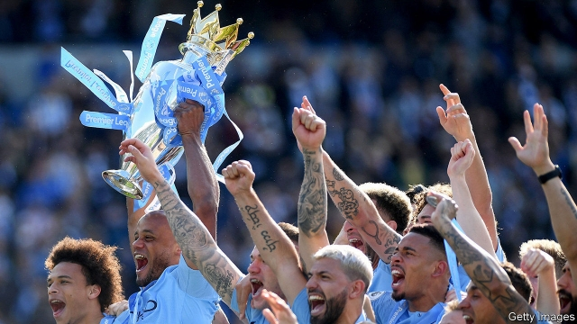
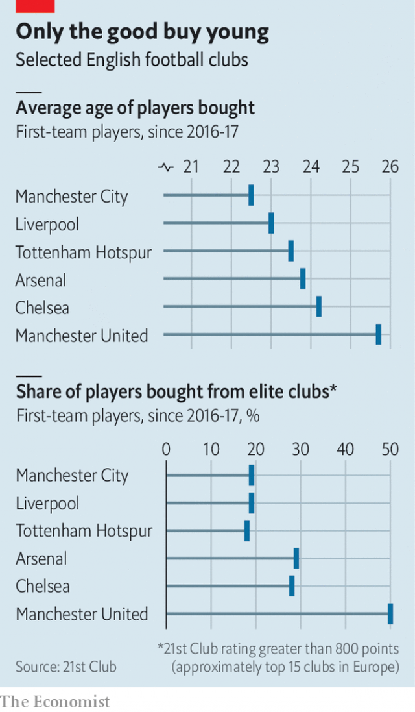

###### Scouts’ honour

# How Manchester City came to dominate the Premier League 

##### Along with Liverpool and Spurs, City have used clever hiring to eclipse Manchester United, Arsenal and Chelsea 

 

> May 16th 2019 

IF YOU HAD told football fans in a pub 15 years ago that Manchester City, Liverpool and Tottenham Hotspur would one day dominate the Premier League, they might have told you to make it your last pint of the day. In 2004 City finished 16th, Spurs 14th and Liverpool a distant fourth. The ruling triumvirate of Arsenal, Chelsea and Manchester United were the only clubs to win the competition in 1996-2011. 

Yet today the league tables are turned. The Premiership’s new sultans are Manchester City, who on May 12th sealed their fourth title in eight seasons, to the delight of Abu Dhabi’s royal family, who bought the club in 2008. One point behind were Liverpool, whose tally of 97 made them the best runners-up ever. On June 1st the Merseyside team will face Tottenham in the final of the Champions League, Europe’s most prestigious tournament. What has allowed this new trio to dominate? 

Money is part of the answer. In 2008-12 Manchester City splurged £520m ($675m) on transfers. Fenway Sports Group, an American firm that bought a near-bankrupt Liverpool in 2010 for £300m, now spends that much a season on players’ wages and transfer fees. But lots of English clubs are wealthy: nine of the world’s 20 highest-earning clubs are English. City spend only 8% more per year on players than United, and Spurs pay 20% less than Arsenal. 

In the past, Premier League clubs squandered their wealth. When 21st Club, a consultancy, plotted European teams’ spending against their results, 16 of the 20 English sides sat below the trend line. Continental clubs charge higher transfer fees to affluent Premier League sides, who spend 80% more than their rivals for the same level of talent. What’s more, English clubs have a habit of buying ageing stars rather than nurturing talented youngsters. 

Manchester City, Liverpool and Tottenham have learned from these mistakes. Since 2016 the players they have signed have been younger and from less flashy clubs than those bought by their rivals (see charts). City paid £55m for Kevin de Bruyne, a midfielder for Wolfsburg, a mediocre German team. Liverpool bought Mohamed Salah, an attacker for Roma, for £37m. Now in their peak years, each has become his team’s best player. This season Spurs became the first club in Premier League history not to sign a single player, after years of recruiting young talents from lesser clubs. Many have matured into stars, such as Son Heung-min (from Leverkusen) and Dele Alli (from Milton Keynes). 

 

Meanwhile Manchester United, Chelsea and Arsenal have made costly errors. United made 30-year-old Alexis Sánchez the league’s highest earner, on £25m a year. But the striker scored just five goals in 45 games. Chelsea got rid of Álvaro Morata, a £60m striker from Real Madrid, after just a year. Arsenal have purchased several woeful defenders. 

Challenges remain for the new trio at the top—not least an investigation by UEFA, Europe’s football authority, into claims of financial irregularities at City, which could mean a season-long ban (City deny it). Either way, on June 1st an English side will win the Champions League for the first time in seven years. 

