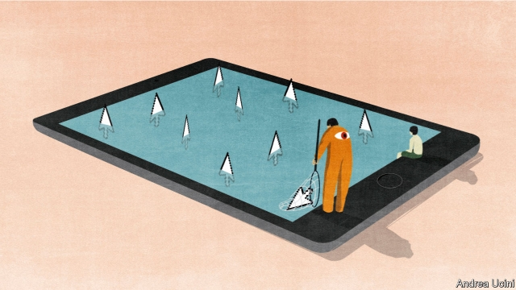

###### Atonement

# Inside the Internet Watch Foundation, the charity cleaning up the web 

##### In 1996 Britain hosted about a fifth of the world’s child sexual-abuse websites. Last year it was less than 1% 

 

> May 16th 2019 

IN THE DAYS when people talked about the “information superhighway”, Peter Dawe had his foot on the gas. The ex-accountant spotted the potential of the internet before many telecoms giants, and soon cashed in. In the early 1990s Pipex, the internet service provider (ISP) he founded, was so popular that it struggled to meet demand. But Mr Dawe was also quick to spot the downsides of the connections he was hooking up. “I was one of the pioneers of the internet,” he said at a recent technology conference. “And I should probably apologise.” 

Mr Dawe’s atonement began early. In 1996 he founded the Internet Watch Foundation (IWF) to tackle online wrongdoing. It was (and is) a charity largely funded by tech firms that wanted to remove indecent material and avoid liability for it. “Because we were saving the ISPs money and getting them out of jail, they were relatively happy to pay,” Mr Dawe says. 

His most prescient concern was child sexual-abuse images. In 1990 the Home Office estimated that there were 7,000 indecent images of children in circulation in Britain, in print and on video. Today anyone with an internet connection can access millions of such pictures. Yet, thanks in part to the work of the IWF, Britain hosts only a tiny fraction of it. In 1996 a little under a fifth of child sexual-abuse websites reported to the IWF were hosted in Britain. Last year the share was less than 1%. 

The IWF’s 13 analysts can take much of the credit. At an office in Cambridge, they manually review images reported by the public before flagging them to ISPs to take down. Their work takes a heavy psychological toll: they might trawl through 100 images in an hour. Would-be analysts are interviewed by a psychologist to weed out those with an unhealthy interest in the job. Once they start work, they must take part in monthly counselling sessions and are encouraged to take regular breaks around the picnic tables in the airy kitchen or in a “chill-out room” with primary-coloured bunting and a ping-pong table. 

They face a daunting task. On May 14th Lynne Owens, head of the National Crime Agency (NCA), said the problem was greater than previously thought, after investigators found 144,000 accounts linked to British people on dark-web paedophile sites. Some accounts could belong to the same person; the police estimate about 100,000 Britons have viewed such images. 

Some who create and post the images are as technically sophisticated as terrorists, says Fred Langford, the IWF’s deputy chief executive. To keep pace, in 2014 the IWF started proactively searching for images as well as responding to reports. It developed “crawlers”, programs that scour the internet for indecent images, and a “hashing” system, a one-way encryption technique that allows analysts to match images without storing the original. Mr Langford hopes to exploit artificial intelligence to save analysts from viewing the images. The efforts seem to be paying off. Last year the IWF identified over three times more offending websites than in 2014. 

If the website is hosted abroad, the IWF informs a similar local charity, if one exists, or the country’s police. In Britain the charity works closely with the authorities. They were “ahead of the game in focusing on this”, says Rick Muir of the Police Foundation, a think-tank. Sophisticated offenders are handled by the NCA and GCHQ, the only signals-intelligence agency in the world to work in the field. 

Mr Dawe, a restless entrepreneur who left the IWF’s board within a year to work on other projects, is proud of his creation. But he is not surprised that the government last month published a white paper mooting a regulator to deal with other “online harms” such as trolling and pro-suicide websites, which he had originally hoped the IWF could tackle too. He remembers giving a speech to politicians after installing the first internet connection at a library in Cambridge in the early 1990s. “I recall saying the internet gives total freedom of speech,” he says. “I’m not certain that society is ready for it.” 

