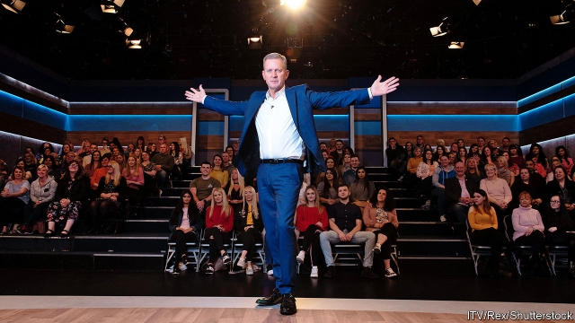

###### Reality bites

# Jeremy Kyle and the media’s treatment of mental health 

##### A death calls into question the ethics of television’s human bear-pits 

 

> May 16th 2019 

THE FIRST episode of “Expedition Robinson”, a Swedish television programme, aired in September 1997. A precursor to “Survivor”, a hit American show, it was one of the first examples of so-called reality television, and the first exhibit in a debate on the effects of such shows on those who take part. Two months before the series aired, one of its cast, Sinisa Savija, had committed suicide after becoming the first person to be voted off. The producers responded by mostly editing him out of the broadcast. 

Two decades later, attitudes have changed. On May 15th, in the middle of “mental-health awareness week”, ITV announced that it would cancel “The Jeremy Kyle Show”, a popular daytime programme that featured real people arguing furiously about infidelity, alcoholism, drug use and the like. A week earlier a participant, Steven Dymond, had been found dead, shortly after failing a lie-detector test on camera. 

Worry about the welfare of reality-TV subjects is not new. Two former contestants on “Love Island”, another ITV show, have killed themselves in the past year. In 2016 the New York Post counted 21 suicides by American reality-TV participants since 2004. Yet the Jeremy Kyle episode may be a “watershed moment”, as one MP put it. Parliament this week launched an inquiry into reality TV. 

One reason may be the programme’s vulnerable subjects. The families berating each other in episodes such as “My transgender love rival is trying to steal my husband!” are softer targets than the young wannabes who go on “Love Island”. Ten years of austerity have made poor-bashing less fashionable than elite-bashing. Viewers with an appetite for public shaming can nowadays get it on Twitter. And canning “Kyle” costs ITV less than ending “Love Island”. 

But there may be a more optimistic explanation. There has been a “sea change” in attitudes to mental health, says Paul Farmer, the boss of Mind, a charity. Public figures, from MPs to royals, have opened up about their mental battles. “What starts off invisible, moves towards taboo, becomes acceptable. We’ve seen it in cancer, race, sexuality, disability and we see it in mental health,” says David Crepaz-Keay of the Mental Health Foundation, another charity. 

The number of people saying they were willing to live with someone who suffered from mental illness increased from 57% in 2009 to 72% in 2016. Those willing to work with them rose from 69% to 80%. And the media’s framing of mental-health issues shifted to being mainly non-stigmatising in 2016, according to Time to Change, a campaign. The end of “The Jeremy Kyle Show” will presumably do this balance no harm. 

