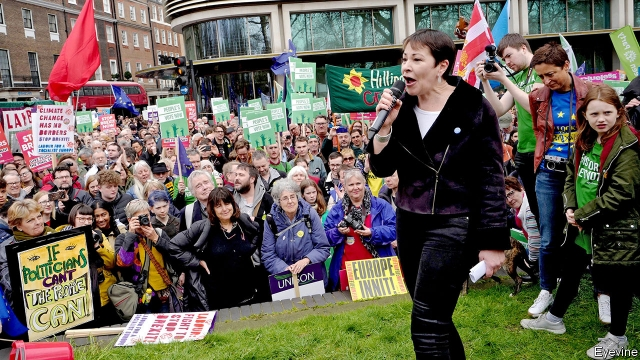

###### Environmentalism

# The green ripple in British politics 

##### The Green Party, once a fringe outfit, finds itself in the mainstream 

 

> May 16th 2019 

A GROUP OF giddy Green Party activists gathered in a market square in Cambridge on May 13th. The reason for their delight: a poll for the upcoming European election released that weekend had put them ahead of the Conservatives for the first time. “The Green Party is now up there punching with and above the big boys and girls!” declared Rupert Read, a Green candidate, to whoops from the crowd. 

For a party more used to polling within the margin for error, the dizzy heights of 11% are a novelty. The number of Green councillors in England and Wales almost doubled, to 362, at the local elections on May 2nd. Now the party thinks it can double its number of MEPs, if it picks up a seat in the eastern region, where Cambridge sits, as well as in Yorkshire and the north-west. In Scotland, its sister party hopes to win one. Activists call it a green wave, although with the party aiming to grow from three to six or seven of Britain’s 73 MEPs, a green ripple might be more accurate. 

The promising outlook for what has historically been a fringe party comes as the Greens find themselves at one with the liberal zeitgeist. Their pitch is simple: “Yes to Europe…no to climate chaos.” In recent weeks, when Brexit has not topped the headlines the environment often has instead, with protests by Extinction Rebellion closing down parts of central London in April and an official review demanding bigger cuts in carbon emissions. It is close to a perfect backdrop for an election, agrees Caroline Lucas, the party’s sole MP. “It feels like our time has come now,” she says. 

Have the Greens moved to the mainstream, or has the mainstream moved to them? In the 1990s the party offered far-left economic policies and deep scepticism of the EU, points out James Dennison of the European University Institute. In 2015 its Brexit policy was almost identical to that of the Tories: it wanted an in-out referendum and reluctantly backed staying in the bloc. Now, the party’s economic policy is bog-standard anti-austerity and its leaders have learned to stop worrying and love the EU. The Greens have bent themselves to the norms of progressive British politics. 

When it comes to the environment, however, the mainstream has come to them. Labour pushed Parliament to declare a “climate emergency” this month. The Liberal Democrats noisily boast about their green credentials. Even Michael Gove, the environment secretary, has pushed environmentalism onto the Tories’ agenda. During such a scramble, single-issue parties tend to benefit, points out Patrick English, a psephologist at Exeter University. 

False dawns have broken before. In 2015 the party won 1m votes in a general election, four times its previous tally. But at the next election, two years later, it lost half of them, mostly to Labour. Anti-Brexit parties, which include the Lib Dems and Change UK, as well as the Greens, may win nearly a third of the vote in the European election, which will be fought under a form of proportional representation. But a repeat performance in a general election, under the unforgiving first-past-the-post system, is by no means guaranteed. 

Voters such as Alex Lyons, a 54-year-old software developer watching the rally in Cambridge, explain why. Normally a Labour voter, Mr Lyons will back the Greens in the European election and has even gone leafleting for them. But he won’t vote for them in a general election. “There’s not much point, really,” he says. The green wave may soon break on the rocks of Britain’s electoral system. 

