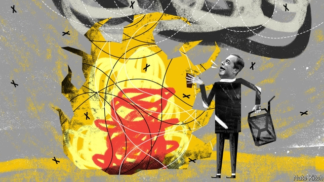

###### Bagehot

# The return of Mr Brexit, Nigel Farage 

##### The pinstriped populist is once again at the heart of British politics 

 

> May 18th 2019 

HE HAS NEVER held a seat in the House of Commons, let alone a seat around the cabinet table. Yet Nigel Farage is one of the most important British politicians of the past few decades. History will have little to say about many members of Theresa May’s under-achieving government. But it will have a great deal to say, whether good or bad, about this former commodities trader turned champion of the populist revolution. 

Mr Farage has changed the course of British history once and may be about to change it again. He persuaded David Cameron to call a referendum on membership of the EU, by turning the obscure UK Independence Party into a powerful electoral machine that hoovered up discontented Tory voters. Now he is trying to force Mrs May to “deliver on” that referendum by demanding that Britain leave with no deal. His brand-new Brexit Party is likely to win more votes than any other in next week’s European election and send an electric shock through the political establishment. 

As you might expect, the leader of the Brexit Party is a very British—or perhaps it would be more accurate to say a very English—figure. He is part city-slicker and part pub-philosopher, usually wearing pinstripe suits and a tie but also fond of propping up the bar with a pint of ale in front of him. (It is a measure of how seriously he is taking the current election that he is currently off the beer.) He litters his conversation with Basil Fawlty-style references to the second world war, and has said his greatest regret is not having taken part in D-Day. 

But this English figure is drawing on powerful global forces, which are eroding the foundations of the liberal order that was founded after the war and rejuvenated by free-marketeers in the 1980s. Mr Farage is much more aware of the global dimension of what he is doing than many of the supposed “citizens of nowhere” whom he is tormenting. During his almost 20 years as an MEP he has cultivated deep connections with right-wing populists across Europe. He was the first British politician to visit Donald Trump after the 2016 presidential election and he is greeted at CPAC, a gathering of American conservatives, as a conquering hero. “The Brink”, a new film about Steve Bannon, Mr Trump’s former campaign manager, shows Mr Farage taking part in a meeting with Mr Bannon and various European populists, some of them distinctly unsavoury, to discuss forming a sort of anti-Davos popular front. 

The most powerful of these global forces is, somewhat paradoxically, nationalism. The past decade has seen a revolt against the world-is-flat globalism that was all the rage at the turn of the century, a revolt that has swept overtly nationalist governments to power in America, Brazil, Hungary and Poland, to name only the most obvious. The second force is resentment against the remote elites who have exploited the upside of globalisation while cunningly protecting themselves against the downside. They include borderless bankers who suddenly rediscover the importance of nation-states when it comes to bailing out their banks, and international networkers who, in the words of Thierry Baudet, a hot new populist in the Netherlands, are forever “failing upwards”. 

Britain is particularly exposed to these global forces. It is one of the few European countries whose national pride was burnished rather than tarnished by the second world war. As such it was always going to be a misfit in a European club designed by France and Germany. A distinctive sense of Englishness has been gathering strength for years, partly in response to Scottish nationalism. Britain’s liberal economic model has also generated mounting resentment, both because it left swathes of the country behind and because the financial crisis produced a decade of stagnant wages. 

Mr Farage has woven this combination of pride and resentment into a compelling anti-establishment narrative. Brussels bureaucrats are intent on turning an enterprising nation into a vassal of the European super-state, he says, and the British establishment is too craven and corrupt to see what is happening. Those very Brussels bureaucrats have unwittingly followed Mr Farage’s script. “Brexit: Behind Closed Doors”, a recent BBC documentary that is compulsory viewing in Brexit Party circles, shows Guy Verhofstadt, the European Parliament’s Brexit co-ordinator, and his minions joking about turning Britain into a colony and comparing it to a clapped-out old car. 

The pinstriped populist has also made use of a third global force: a technological revolution that is making it easier to create just-in-time political parties out of thin air and keep in constant contact with their supporters. One of the many ironies of the European election is that the supposedly backward-looking Brexit Party has exploited social media much more astutely than the self-consciously with-it Change UK. Mr Farage’s public events have been perfectly choreographed and his online campaign first-rate. The Brexit Party has a cadre of battle-hardened young Brexiteers who understand the digital world and who sharpened their campaigning skills in the referendum. 

The party’s barnstorming performance so far has ignited a lively debate about what this means for the future of politics. Will the Brexit Party be able to break the mould of British politics? Or is it just a protest outfit driven by a single man and a single issue? Mr Farage’s former vehicle, UKIP, won 12.6% of the vote in the general election of 2015, which translated into just one seat. But psephological calculations miss the bigger questions. Mr Farage’s success signals the rise of a new sort of politics, which puts the will of the people before the judgment of MPs, and which emphasises questions of identity rather than technocratic problem-solving. Mr Farage may never succeed in his lifelong ambition of winning a seat in Parliament. But by keeping questions of identity at the centre of politics, he will succeed in his bigger aim of consuming the age of bland compromise with an age of fiery populism. 

