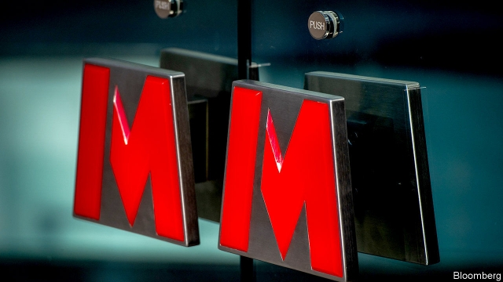
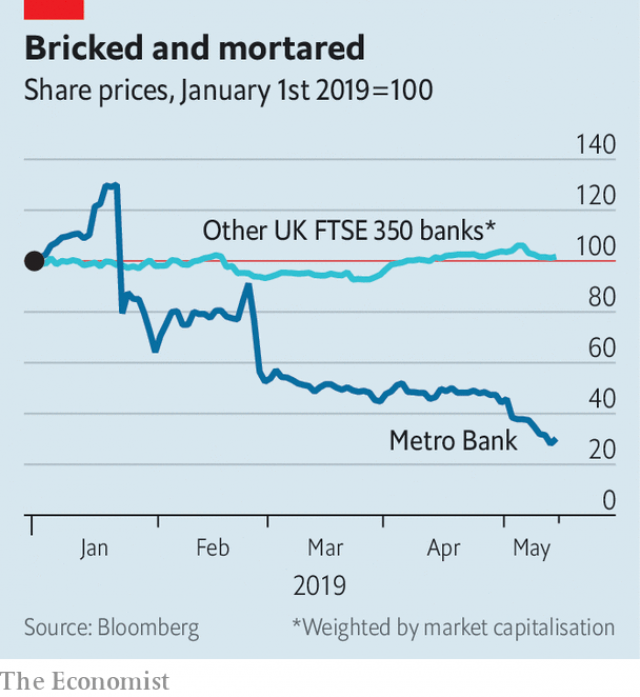

###### Open season

# The troubles of Britain’s Metro Bank 

##### The young upstart suffers a plunging share-price and a social-media scare 

 

> May 16th 2019 

SOME WOULD-BE usurpers of Britain’s dominant banks think branches are old hat. Not Metro Bank. The nine-year-old lender has 66 so far, which it opens from 8am to 8pm, six days a week, and for six hours even on Sunday. So when a false rumour circulated on WhatsApp on May 11th that the bank was failing, no one who was inclined to panic had to wait until Monday. People queued at a branch in Harrow, west London, to empty their safe-deposit boxes—another Metro selling point—or just to find out what was going on. 

Metro isn’t collapsing. (Even if it were, the boxes’ contents would be unaffected and the government guarantees deposits of up to £85,000, or $108,000.) But it is having a miserable time. A little more than a year ago Metro’s shares were giddily priced, at over three times their book value. Most European banks do not even make par. They slid last year as markets made a more sober assessment of Metro’s growth prospects. Since late January they have plummeted by three-quarters and are now worth about two-fifths of book value. 

The jitters began on January 23rd, when Metro said it was raising the risk weights on loans secured on commercial property and some mortgages to professional landlords. (The riskier a loan is, the more equity regulators require on the other side of a bank’s balance-sheet.) Correcting the errors added £900m, or over 10%, to Metro’s risk-weighted assets (RWAs) and cropped its ratio of equity to RWAs, a key gauge of capital strength, by about 1.5 percentage points, to 13%. That was still well above the bank’s regulatory minimum, and its own target of 12%, but the episode was cringeworthy all the same. Craig Donaldson, the chief executive, gave up his annual bonus and offered to resign. Supervisors are looking into the blunder. 

After first-quarter earnings were revealed on May 1st the shares took another tumble. Underlying profit fell by 30%. Interest payments on debt issued last year took a toll; so did a new accounting standard for leases, thanks to all those new branches. But interest margins narrowed and deposits, which had been growing fast, fell by 3.6% in the quarter because some large customers withdrew cash after the risk-weighting foul-up. 

 

Metro said deposits rose again in April. Still, the raising of £350m in new equity, announced in February but awaited as The Economist went to press, will be needed to steady investors’ nerves. The shares rallied in anticipation. Mr Donaldson has said that the bank is also pondering a sale of the reclassified loans, which would help bash out the dent in its capital position. 

Metro has hitherto had a decent tale to tell. Its chairman and co-founder, Vernon Hill, established a similar, branch-based, customer-friendly bank in America (though he left after regulators raised eyebrows at its dealings with firms owned by his family). Expansion has been quick: Metro expects deposit growth to slow—yes, slow—to 20% a year. Its loans, mainly mortgages, are funded by deposits rather than flightier wholesale borrowing. It is pushing into small-business banking. In February it won £120m from a government-run fund to boost competition in that market. The extra equity was intended to support this growth. 

But profits are still thin, and Metro’s woes will retard their ripening. Some analysts doubt whether £350m of new equity will be enough. Like other European banks, Metro must issue more debt to absorb losses in a crisis, but that is looking pricey: the yield on last year’s bond has jumped from 5.5% in June to around 8.5%. A small, young bank in a land of giants has little margin for error. 

