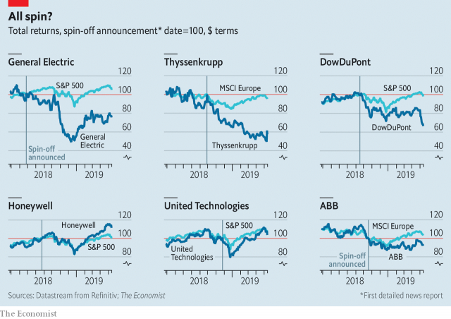

###### Deconglomerating

# Do corporate spin-offs create shareholder value? 

##### Breaking up is hard to do profitably 

 

> May 16th 2019 

CORPORATE FASHIONS come and go, and this season’s is industrial break-ups. In America and Europe, once-sprawling conglomerates are being carved up into focused companies that investors hope will fare better on their own. Those banking on quick returns have mostly been disappointed. 

Conglomerates thrived in the 1970s, and made a comeback after the merger frenzy of the late 1990s. They are beloved of megalomaniac bosses keen to prove they can run empires peddling anything from train carriages to CT scanners (as Siemens currently does, albeit not, as it announced last week, for much longer). But the argument that diversity lets a firm’s healthy arms prop up temporarily frail ones is, once again, losing ground in the rich world. 

 

Private-equity funds have pots of money to buy unwanted divisions. Listing companies—or spinning them off to existing investors—is easier than it once was. Plenty of activist hedge funds are pressing firms to restructure, hoping to cash in when the sum of conglomerates’ parts fetches more than the whole (studies show this can be true in the long run). 

Gauging the impact of a break-up announcement is hard. Investors price in its likelihood before a company owns up to “exploring strategic options”. Splits often follow bad results that enfeeble the management, which may in turn mean worse news down the line. 

Our chart, which takes the first detailed news reports of a spin-off as its starting-point, shows that of recent break-ups, only Honeywell, which filed listing documents for its car-parts and home-security arms last August, has subsequently outperformed the broader market. United Technologies has kept pace with it. General Electric, Thyssenkrupp, DowDuPont and ABB have not. If their share prices fall any more, they will be ripe for a takeover. 

