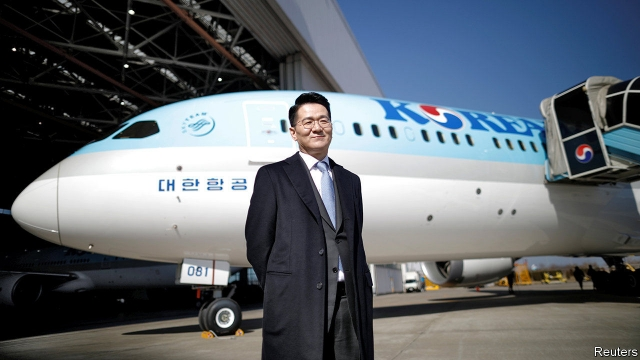

###### Korean heir

# Generational change atop chaebol does not equal renewal 

##### A messy succession at the parent company of Korean Air shows why 

 

> May 16th 2019 

PILOTS AND flight attendants in Korean Air uniforms lined the streets as Cho Yang-ho, the company’s late chairman, made his final journey to the family tomb last month. The pomp of the send-off, which followed a five-day wake in a lily-covered room at a hospital in Seoul attended by thousands of people, belied the mess which the patriarch left behind. 

Weeks earlier investors had ousted Cho, who was being investigated for tax evasion, embezzlement and breach of trust at the time of his death, from the board of Korean Air amid a string of scandals involving his family. Starting with an incident in 2014, when his eldest daughter forced a Korean Air flight to turn around after she had been served macadamia nuts in a packet rather than a bowl, the Chos have personified the entitlement which many South Koreans detect in the conduct of those who control the chaebol (conglomerates). 

Cho Won-tae, the late chairman’s son and heir-apparent, said at the funeral service that his father’s last wish was for the family to run the company together “in peace”. Good luck with that. Hanjin KAL, the airline’s parent company, missed a deadline to tell the Fair Trade Commission (FTC), which regulates the conglomerates, who would take over as the company’s legal representative. This hinted at internal disunity and delayed the publication of the FTC’s annual report on the biggest chaebol. When the report was released on May 15th, the FTC unilaterally designated Cho fils as representative. But he holds only 2.34% of Hanjin KAL’s shares, roughly as much as each of his two sisters, who are rumoured to be unhappy with the FTC’s decision. The company denies this. Either way, divvying up the father’s 17.84% stake among family members will take months. 

The chaebol continue to dominate the South Korean economy, despite repeated pledges by successive governments to rein them in. The Hanjin squabble is a reminder of how far they have to go to meet modern standards of corporate governance. In 2018 the Asian Corporate Governance Association ranked South Korea ninth out of 12 regional markets, lambasting poor disclosure practices and the failure to respect the rights of minority shareholders. 

Regulators and activist investors are making a greater effort to peer through the opacity of chaebol shareholdings and, in a few cases, have managed to improve accountability. But owner-families and the management remain hard to tell apart. In late March Elliott, an American activist hedge fund, failed to get the dividend raised or an external director elected at Hyundai, the second-biggest chaebol. The conglomerates “are still run for the benefit of the families who own them”, says Park Ju-gun of CEOScore, a corporate watchdog. 

In the longer term, though, the Hanjin succession presents an opportunity for renewal, not just generational change. Outsiders could use the opening to push for better governance. KCGI, a local activist fund, has been increasing its stake in the company and covets board seats. Shares in both Hanjin KAL and Korean Air surged on the news of Cho père’s death. As the government of Moon Jae-in, the president—preoccupied with the North Korean detente, uncertain economic outlook and no clear majority in the National Assembly—drags its heels on corporate reform, shareholders look keener to take the lead. 

