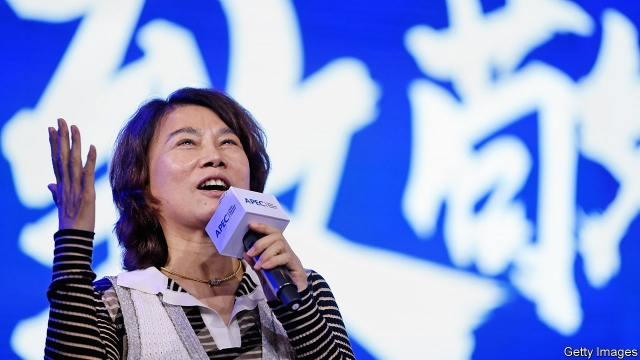

###### The daughter rose in the east

# How China forged self-made female billionaires 

##### Socialist egalitarianism isn’t the whole story 

 

> May 16th 2019 

DONG MINGZHU is the most visible face of female enterprise in China. The 64-year-old boss of Gree, the world’s biggest maker of air-conditioners, is everywhere: in television ads, on billboards and, last year, in two places at once—jaywalking in the city of Ningbo while at Gree’s headquarters in Zhuhai (police cameras mistakenly captured her visage plastered on a bus). 

Ms Dong joined Gree as a door-to-door saleswoman in 1990, as a widow with an eight-year-old son. In 2012 she became its chairwoman. Although Gree has state roots, Ms Dong acts like a high-profile entrepreneur. Her life was the subject of a TV drama, and she has written two popular memoirs. Her steely, unglamorous image (a confessed penchant for skirts notwithstanding) inspires young women. Matters of gender bore her. Asked about her rise in a country run by men, she responds: “Men or women, few are up to the challenge.” 

That may be so. But Ms Dong represents a generation of Chinese women who have climbed higher than their sisters in South Korea or Japan. Fully 51 of the 89 self-made female billionaires on this year’s Hurun Rich List, a Who’s Who of the ultra-wealthy, are Chinese—well above China’s 20% share of the world’s women. Relative to population (one for every 13.4m Chinese females), that is not far off America’s tally of 18 (one for every 9.1m). South Korea has one, Yoo Jung-hyun of Nexon, a gaming giant. Japan has none (Forbes reckons that Yoshiko Shinohara, who founded a temporary-staffing agency, became the first in 2017, aged 82). China’s include Wu Yajun, a property mogul with a $10bn fortune; Cheng Xue of Foshan Haitian Flavouring & Food Company, known as “the soy-sauce queen”; and Li Haiyan and Shu Ping, co-founders of Haidilao, a chain of hotpot restaurants. Ms Dong, with a net worth of 3bn yuan ($440m), does not make Hurun’s list. 

Why have they done so well? If socialist egalitarianism—which encouraged, even required, women to work—were the whole story, you would expect many of them in the upper echelons of the Communist Party. In fact, just one sits on the 25-member Politburo. None has ever joined the inner sanctum of the Standing Committee. 

A likelier explanation is China’s manufacturing boom, which afforded women unprecedented opportunities. In 1968 Mao Zedong enjoined female labourers to hold up “half the sky”; by the 1980s their labour-force participation hovered around 80%. Britain’s then stood at 60%, and America’s lower still. India, with a similar GDP per person to China at the time, barely managed 30%. Many successful Chinese businesswomen rose from the factory floor. In 2015 Zhou Qunfei, an erstwhile migrant worker who went on to found Lens Technology, maker of screens for Apple, took the title of the world’s wealthiest self-made woman. 

After the government expanded college attendance in 1999, women began to prop up more than half the educational firmament: they make up 56% of graduates, though only 87 girls are born for every 100 boys (the world’s most unbalanced sex ratio). According to the Global Entrepreneurship Monitor, an index of startup activity, for ten men starting a business in China, eight women launch theirs. 

All that ought to guarantee a steady supply of talent to follow in Ms Dong’s footsteps. But it may be stymied by a general slowdown in the pace of female progress, plus specific hurdles women face in the most promising avenue for today’s aspiring entrepreneurs: China’s internet sector. 

Between 2010 and 2018 China dropped from 61st (among 134 countries) to 103rd (out of 149) in the World Economic Forum’s Gender Gap Report. Economic disparities between the sexes tend to narrow as countries grow richer. China’s have widened, as privatisations in the 1990s prompted a sharper decline in the number of women than of men in the urban workforce and as women moved into lower-paying service jobs. Relative to that of men, female participation has been flat or falling every year since 2009, to 69%, similar to Japan and below Vietnam, Cambodia and Laos. Female wages, which were 17% below male wages in the early 1990s, are now 36% lower. 

Chinese tech, meanwhile, has displayed a misogynistic streak. New female hires can be asked to pick a “husband”, “lover” and “brother” among male colleagues. China’s globalising giants cast themselves as progressive. Yet of 29 board members at the four biggest—Alibaba, Baidu, Tencent and JD.com—one is a woman. Last year Human Rights Watch, an NGO, reported that Alibaba produced a video of female employees who “love tech guys”, including one pole-dancing in hotpants. (Alibaba said it would conduct “stricter reviews” of recruitment ads.) 

Investors, still predominantly male, openly admit that they are reluctant to fund female entrepreneurs who, they say, bow to pressure more easily than men do, observes Zhao Hejuan, creator of two news sites about the tech industry. In private, she says, male entrepreneurs speculate that pretty founders who got funded must have slept with the moneymen. 

Ms Dong faced her share of misogyny early on. In her first book she recounts how saleswomen back then were expected to be young, pretty and hard-drinking. At first male clients turned her down. Compared with those days, she says, today’s youngsters grow up “in a honeypot”. Maybe. But future Ms Dongs have the right to feel bittersweet. A new Hurun list of 46 self-made billionaires under the age of 40 includes 16 Chinese founders, but just two—both of them wives in couples that launched internet platforms—are women. 

