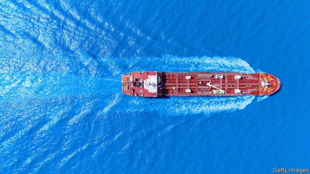
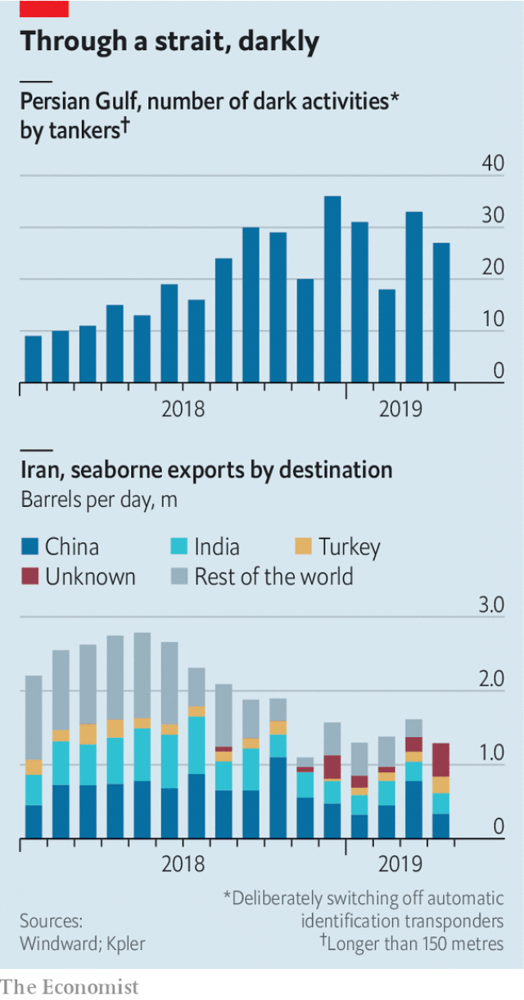

###### Sanctions Inc

# Sanctions create business risks—and opportunities 

##### Nowhere more so than in the energy trade 

 

> May 16th 2019 

AN OIL TANKER entered the Persian Gulf in early February, supposedly heading to the Basra terminal, off the coast of Iraq. Then it turned off its transponders and went dark. Ten days later it resumed transmissions, sailed back through the Strait of Hormuz to Fujairah, in the United Arab Emirates, and emptied its tank. It then reversed towards Basra, went dark again, reappeared and delivered oil to Fujairah once more. In the past eight months, vessels followed this pattern more than 60 times. 

Such manoeuvres near Iran are of interest to officials in America, which on May 2nd barred all exports of Iranian oil. In this instance, though, the information was gathered not by intelligence agencies but by a company, Windward. With headquarters in Israel and backed by investors including David Petraeus, a former director of the CIA, and John Browne, a former boss of BP, Windward is helping companies navigate a maze of sanctions. 

It is not alone. Proliferating sanctions are creating problems for some companies and potential profits for others, as an industry emerges to help firms comply with them and understand their effects. Nowhere is this more evident than in the energy trade, encompassing oil companies, banks, asset managers and traders, as well as shipbrokers, maritime insurers, bunkering firms and vessel owners. Even if America and Iran avoid military conflict in the Gulf, companies will still have to grapple with the sanctions which to date have been President Donald Trump’s weapon of choice. For one big energy trader, says its compliance officer, the consequences of being in breach of sanctions are “terminal”. 

The risk to businesses is rising, for two reasons. First, the use of sanctions has grown more complex since Marc Rich, the founder of Glencore, a huge trader, was indicted in 1983 for working with Iran, which was then holding Americans hostage (he was infamously pardoned in 2001 by Bill Clinton). Last year America imposed sanctions on about 1,500 people, firms, vessels and other entities, nearly triple the number in 2016. The past six months have been particularly eventful. America began imposing sanctions on Iran in November, and in January on Venezuela, another big oil exporter. On May 9th, for the first time, it seized a ship accused of transporting banned North Korean coal. 

Second, blackballed countries and unscrupulous middlemen are getting better at evasion. In March advisers to the UN, relying in part on Windward data, and American Treasury officials published separate reports that described common ways of doing it. Boats turn off their transmissions systems to avoid detection. Oil is transferred from one ship to another in the middle of the ocean—ships trading on behalf of North Korea find each other in the East China Sea using WeChat, a popular Chinese messaging service. Captains disguise a ship’s identity by manipulating transponder data to transmit false locations and identity numbers of different vessels. 

Such methods have helped Iran and Russia transport oil to Syria, American officials say. In 2018 North Korea managed to import refined petroleum far in excess of the level allowed by multilateral sanctions. The situation in Venezuela is different—technically, America’s sanctions still allow foreigners to do business with the country. But fear that sanctions will expand mean that traditional trading partners are scarce. Nicolás Maduro’s regime this month found a shipowner to transport crude to India, according to a shipbroker familiar with the deal, but Venezuela had to pay twice the going rate. 

Businesses keen to understand such shenanigans can be roughly divided into two categories. The first includes those who can profit from grasping sanctions’ impact on energy markets, such as hedge funds, analysts and traders. A squadron of firms is ready to assist them, combing through ship transmission data, commercial satellite imagery and other public and semi-public information. They do not specialise in sanctions, but sanctions are boosting demand for their tracking and data-crunching expertise. 

 

A main determinant of Venezuela’s output, for instance, is access to the diluent it needs to blend with its heavy crude. A firm called Clipper Data has noted Russian ships delivering diluent to vessels near Malta, which then transport it to Venezuela. Kpler, a French rival, uses satellite images of shadows on lids of storage tanks to help estimate the volume of oil inside. Using transmissions data, images, port records and more, Kpler produces estimates of Iran’s exports for customers such as the International Energy Agency and Bernstein, a research firm—including a recent uptick in Iranian exports without a specific destination (see chart). 

The second category of companies are wary of violating sanctions themselves. They need assistance of a different sort. Latham & Watkins, a firm that advised the chairman of EN+, which controls a Russian aluminium giant, as he successfully removed the company from America’s sanctions list this year, has seen a surge in sanctions-related business. Refinitiv, a data company, offers software which permits clients to screen partners and customers against lists of embargoed entities. Windward uses machine learning to pore over data such as ships’ travel patterns, transmissions gaps (some of which may be legitimate) and name changes to help firms identify suspicious activity. Kharon, founded last year by former United States Treasury officials, offers detailed analysis of anyone or anything on sanctions lists. 

Companies are reinforcing in-house compliance programmes, too. Trafigura, a large energy trader, now contractually bars buyers in north Asia from turning off their ships’ transponders, so that vessels can be tracked. It also requires them to disclose when and where cargo is unloaded. 

But progress is uneven. “There is growing awareness of why this is a problem, but people have been pretty slow to act,” says Hugh Griffiths, who has led a UN panel of experts on North Korea. He was surprised that, as of last year, few maritime insurers screened the transmissions data for the vessels they cover. The International Group of P&I Clubs, a consortium of marine insurers, did not respond to The Economist’s request for comment. In March the Treasury, echoing the UN panel’s recommendations on North Korea, urged businesses to adopt more robust methods to clamp down on sanctions violations. On May 2nd it published new guidelines for compliance. That will create more business for law firms and others. 

Their gain may, however, be the Treasury’s loss. The burgeoning industry is keen to poach Treasury officials. As Kharon shows, bureaucrats may be ready for new ventures. A volatile boss also makes public service less appealing. In March the department announced new restrictions on two shipping companies based in China, for breaching North Korean sanctions, only to have Mr Trump tweet that he was scrapping them. In the words of a former top official, “it’s more lucrative and rewarding to help companies navigate the sanctions era.” 

