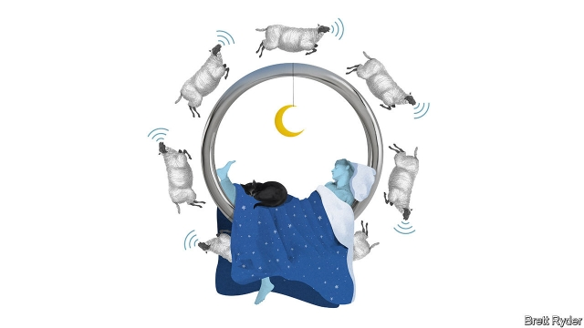

###### Schumpeter

# Sleepless in Silicon Valley 

##### Why the techie obsession with sleep technology makes perfect sense 

 

> May 16th 2019 

FIRST, CLOSE the blackout blinds in your bedroom. Eat dinner at 4pm, and do not eat or drink anything after 6pm. Put on your blue-light blocking glasses at 8pm. Set your bedroom temperature to 67ºF (19.4ºC) and your electric blanket to 69.8ºF (21ºC). At 8.45pm, meditate for five to ten minutes. Switch on your deep-wave sound machine. Put on your Oura sleep-tracking ring. You are now, finally, ready for slumber. This may all sound a bit over the top. But this is the “sleep hygiene” routine described in a recent blog post by Bryan Johnson, who sold his previous company to eBay for $800m and is now chief executive of Kernel, a startup developing brain-computer interfaces. He admits that his sleep routine has “decimated my social life”, and that his partner sleeps in a different room, but says all this trouble is worth it, because it has boosted his level of “deep sleep” by as much as 157%. He has bought Oura rings for all his employees. 

Mr Johnson does not expect other people to copy his routine, but made it public to encourage the sharing of sleep habits and tips. Like many other techies, he regards sleep hygiene as an effective way to maintain mental health, boost cognition and enhance productivity. In its most recent funding round, backers of Oura, the Finnish maker of the high-tech ring, included the co-founders of YouTube and Twitch, along with alumni of Facebook, Skype and Box.com. The ring’s most famous user is Jack Dorsey, the boss of Twitter, whose unusual wellness regime—which also incorporates near-infrared saunas, radiation-blocking Faraday tents, fasting and cryotherapy—prompted the New York Times this month to dub him “Gwyneth Paltrow for Silicon Valley”. For tech tycoons, it seems, sleep is the new fitness. 

Those who want to monitor and improve their sleep have no shortage of gadgets to choose from. As well as electric blankets and mattress-chillers, sound machines and smart rings, there are also smart pillows, sleep-tracking watches and bracelets, intelligent sleep masks, brain-stimulating headbands, bedside sleep sensors and countless sleep-monitoring apps. The market for sleep technology was worth $58bn in 2014 and is expected to grow to $81bn by 2020, according to Persistence, a market-research firm. Big companies in the field include household names such as Apple, Bose, Nokia and Philips. After Mr Dorsey’s enthusiastic endorsement, the Oura rings are back-ordered by four to six weeks. 

The mania for sleep technology makes perfect sense for the tech industry, combining as it does several existing trends. For a start, it fits with the industry’s metrics-driven worldview. Techies obsess about OKRs (objectives and key results), KPIs (key performance indicators) and digital-analytics dashboards showing the performance of specific products and features. Applying similar techniques to sleep and other aspects of their personal lives—an approach known as the “quantified self”—seems a logical step. As those in the startup world like to say, channelling Peter Drucker, a management guru, “what’s measured improves.” 

Sleep-tracking also aligns neatly with Silicon Valley’s cult of productivity, and the constant search for “life hacks” that will make entrepreneurs more effective, efficient and successful. This ranges from wearing the same clothes every day, Steve Jobs-style (thus avoiding wasting time deciding what to put on), to fastidious fitness routines and complicated diets. Elaborate sleep regimes slot right in, because they promise clarity of thought and improved cognitive performance. They also let people extend their quantified-self and life-hacking efforts into the one part of the day that was previously untouched: shut-eye. Relentlessly pursuing productivity only while you are awake is for wimps. Sleep-tracking means you can do it round the clock. Oura describes its sensor-packed ring as a “secret weapon for personal improvement”—another way to get ahead. 

Never mind that a study published in 2015, by researchers at Massachusetts General Hospital and Harvard Medical School, found that sleep-tracking devices could not accurately measure sleep, and that claims made about them were long on hype and short on solid evidence. Ignore the fact that another study, published in 2017 by researchers at two medical schools in Chicago, warned of the dangers of “orthosomnia”, defined as a “perfectionistic quest for the ideal sleep in order to optimise daytime function”, as obsessive users of sleep-tech devices self-diagnose sleep disturbances based on dodgy data, or stay awake all night worrying that they are falling behind by not sleeping as efficiently as rivals. 

It is hardly surprising that techies are not getting enough sleep, given the industry’s culture of long hours, and the widespread notion that for a true entrepreneur, everything else in life is secondary to succeeding at work. The enthusiasm for sleep-tech also fits a larger pattern of using technology to fix problems that the industry itself has created. Is your smartphone too addictive? Here’s an app to help you monitor and track your usage. Are the streets of your city clogged with Ubers? Try an electric scooter instead. Seen this way, the embrace of sleep-tracking is an indictment of the whole culture: it tackles the symptoms of sleep deprivation, but not the disease. 

But resist the temptation to dismiss all this as batty. Sleep-tracking is at exactly the stage that fitness-tracking technology was at a decade ago. Now fitness trackers (including the Apple Watch) are mainstream and nobody bats an eyelid when people share details of their morning runs on Facebook. The same could easily happen with sleep-tech. A series of previous examples—including the use of email, the embrace of online shopping, hailing a car with an app, or renting a room in an unfamiliar city from a complete stranger—are a reminder that the seemingly crazy things that Silicon Valley types do today, everyone else may end up doing in a decade’s time. In this case, in their sleep. 

