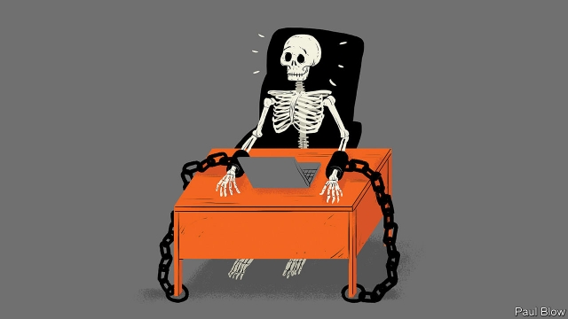

###### Bartleby

# The joy of absence 

##### How some companies fight the curse of presenteeism 

 

> May 16th 2019 

RONALD REAGAN famously quipped that “it’s true hard work never killed anybody, but I figure, why take the chance?” Beyond a certain level, extra effort seems to be self-defeating. Studies suggest that, after 50 hours a week, employee productivity falls sharply. 

But that doesn’t stop some managers from demanding that workers stay chained to their desk for long periods. At the blood-testing firm Theranos, Sunny Balwani, then boyfriend of the founder, Elizabeth Holmes, had an obsession with employee hours, and would tour the engineering department at 7.30pm to check people were at their desks. All those hours were wasted when the company eventually collapsed (prosecutors have charged Ms Holmes and Mr Balwani with fraud). 

Jack Ma, the founder of Alibaba, a Chinese e-commerce group, recently praised the “996” model, where employees work from 9am to 9pm, six days a week, as a “huge blessing”. To be fair, Mr Ma said employers should not mandate such hours. Still, presenteeism is the curse of the modern office worker. 

There will be days when you do not have much to do, perhaps because you are waiting for someone else in a different department, or a different company, to respond to a request. As the clock ticks past 5pm, there may be no purpose in staying at your desk. But you can see your boss hard at work and, more important, they can see you. So you make an effort to look busy. 

Some of this may be a self-perpetuating cycle. If bosses do not like to go home before their underlings, and underlings fear leaving before their bosses, everyone is trapped. Staff may feel that they will not get a pay rise, or a promotion, if they are not seen to be putting in maximum effort. This is easily confused with long hours. Managers, who are often no good at judging employees’ performance, use time in the office as a proxy. 

The consequence is often wasted effort. To adjust the old joke about the Soviet Union: “We pretend to work and managers pretend to believe us.” Rather than work hard, you toil to make bosses think that you are. Leaving a jacket on your office chair, walking around purposefully with a notebook or clipboard and sending out emails at odd hours are three of the best-known tricks. After a while this can result in collective self-delusion that this pretence is actual work. 

But presenteeism has more serious consequences. It is perhaps most prevalent in Japan, where people attend the office even when they are in discomfort. In doing so, they are doing neither themselves nor their employers any favours. 

As well as reducing productivity, this can increase medical expenses for the employer. According to a study in the Journal of Occupation and Environmental Medicine, these costs can be six times higher for employers than the costs of absenteeism among workers. To take one example, research published in the British Medical Journal found that Japanese employees with lower-back pain were three times more likely to turn up for work than in Britain. As a result, those workers were more likely to experience greater pain and to suffer from depression. What could be more dispiriting than being in pain while feeling trapped at work? 

None of this is to say that employers are not entitled to expect workers to be in the office for a decent proportion of time. Inevitably there will be a need for some (preferably short) meetings. Dealing with colleagues face-to-face creates a feeling of camaraderie, allows for a useful exchange of ideas and enables workers to have a better sense of their mutual needs. 

In the grand sweep of humanity, presenteeism is a recent phenomenon. Before the industrial era, most people worked in their own farm or workshop and were paid for the amount they produced. Factories emerged because new machines were much more efficient than cottage-industry methods, and only a large employer with capital could afford them. Suddenly, workers were paid not for their output but for their time, and were required to clock in and out. 

But modern machinery like smartphones and laptops is portable. It can be used as easily at home as in the office. Turning an office into a prison, with inmates allowed home for the evenings, does nothing for the creativity that is increasingly demanded of office workers as routine tasks are automated. To be productive you need presence of mind, not being present in the flesh. 

