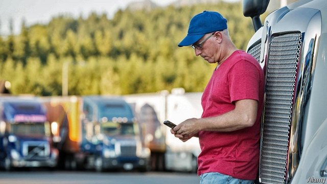
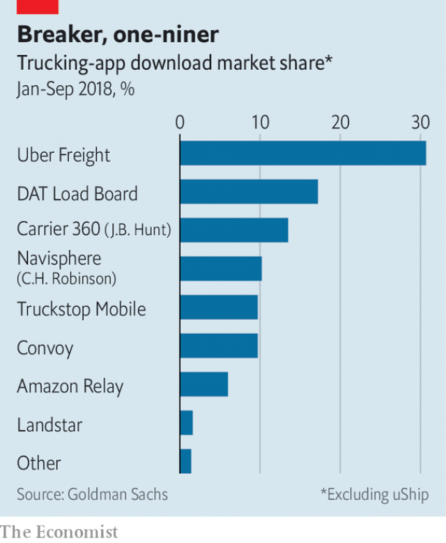

###### Moving with the times

# Uber is trying to disrupt the road-freight business 

##### But trucking will be tougher to crack than ride-hailing 

 

> May 16th 2019 

FLORIDA 595 is unappealing, even by truck-stop standards. Odour from a landfill next door permeates the humid air. Planes from a nearby airport buzz overhead. The average American trucker spends two-thirds of working time either in places like this or loadless on the road. So the wheelmen propping up the bar at 595 are giddy about a new breed of smartphone app. For a few years startups like Cargomatic and Convoy have been helping drivers maximise their gainful time behind the wheel by digitising the matching of shipments with lorries. Convoy called itself “Uber for freight”—until 2017, when Uber launched exactly that. 

If Uber had presented itself as just a ride-hailing firm, analysts reckon, it would not have fetched an $82bn valuation when it listed in New York on May 10th. That was predicated on the platform’s potential to disrupt all road transport. Investors are having second thoughts: Uber’s share price fell sharply in its first two days as a public company (before regaining ground), perhaps on the realisation that the firm may struggle to make money anytime soon. Uber Freight is a case in point. 

On paper, the market the app could disrupt looks huge. Global spending on road freight reached $3.8trn in 2017, says Armstrong & Associates, a consultancy. Companies in America spent over $700bn; freight rates grew by 30% last year owing to a surfeit of cargo and a shortage of drivers. 

In practice, only $72bn of American shipments is managed by brokers; most of the rest travels on company lorries. Digital brokers’ slice is wafer-thin. Zion Market Research predicts that their global turnover will increase from around $1bn to $21bn between 2017 and 2026. Uber would need to dominate this market to rival its $9bn in revenue from ride-hailing in 2018. 

 

Uber touts freight as its third-mostimportant business after ride-hailing and food delivery. It made up nearly 3% of the firm’s revenues in 2018, but bookings grew by almost 450% that year—faster than any other division. Bill Driegert, boss of Uber Freight, thinks that it can grab most of the brokers’ $72bn, not just the digital bit. No rival can match its software or traffic data—both applicable to lorry logistics, Mr Driegert boasts. Brand recognition, he believes, should help win over drivers reluctant to take jobs from apps no one has heard of. 

But unlike ride-hailing, which Uber more or less invented, it is a late arrival to freight. Its earlier efforts to disrupt haulage with the purchase of Otto, a startup developing self-driving lorries, came to naught. Grand plans to expand abroad—in March it presented a European app—run up against home-grown incumbents: Timocom of Germany and Teleroute of Belgium in Europe, and Rivigo, a hit Indian app, in Asia. 

At home, conventional brokers have shown digital savvy. Goldman Sachs, a bank, estimates that from January to September last year Uber Freight accounted for 30% of haulage-app downloads. That is impressive, but shy of the combined 40% for the three apps from big brokers: C.H. Robinson’s Navisphere, J.B. Hunt’s Carrier 360 and DAT’s Load Board. The boom in road freight provides these companies with cash to plough into apps and algorithms. Landstar, another big broker, claims that a recent software upgrade cut the time needed to process a delivery by nearly a third. 

Chris O’Brien, C.H. Robinson’s chief salesman, disputes the idea that the startups’ data on traffic are better. Lorry routes differ from taxi rides. Brokers can bolt on services—warehousing, last-mile delivery, assistance with customs or unforeseen problems—onto basic haulage. Here, Uber is miles behind. 

The brokers see their main threat coming not from Uber’s headquarters in San Francisco but from Seattle, home to Amazon. The e-commerce juggernaut launched an app in 2017 to help lorry drivers deliver merchandise to its warehouses. It is rumoured to be working on its own service. Unlike Uber, it has plenty of experience delivering cargo. It sits on more cash than Uber or the brokers. It may not take long to appear in their rear-view mirrors. 

