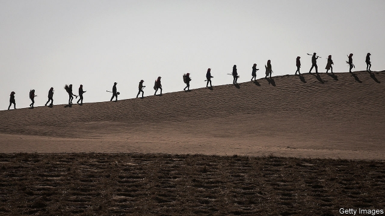
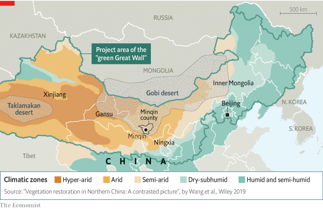
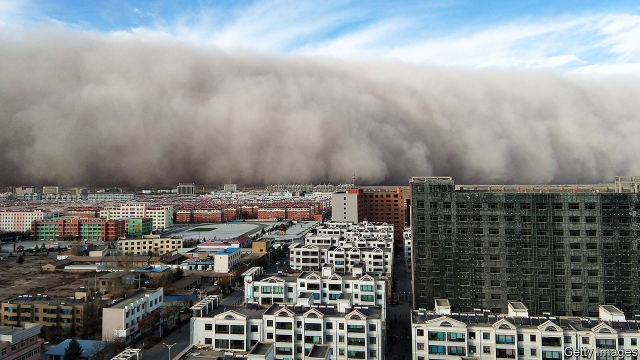

###### Dust to dust

# China’s desert-taming “green Great Wall” is not as great as it sounds 

##### Planting lots of trees is not always wise 

 

> May 16th 2019 

AN EX-ARMY LORRY chugs across the desert outside Minqin, a town in the north-western province of Gansu. It is delivering water to a team of about 20 people planting saxaul—a squat, spiky tree native to the area—on the banks of towering dunes. The hope is that the vegetation will anchor the ground and help prevent sand from sweeping through Minqin during wind storms in spring. Without these efforts, says one of the planters, the oasis town could be “eaten by the sand”. 

Minqin is the seat of a county of the same name which is half the size of Belgium. It is surrounded on three sides by the Gobi desert (see map). On a warm evening the town’s neat central plaza is thronged with locals practising dance routines for exercise and entertainment. But their livelihoods are threatened by the desert, which in recent decades has been advancing on the town at an average rate of several metres a year. To help hold it at bay, officials plan to have shrubs and trees planted in the county. These will eventually form a belt more than 400km long, say reports in the state-controlled media. 

 

The planting in Minqin is one small part of a huge afforestation project that has been under way for four decades. It aims to form a belt of trees and shrubs along the edge of the Gobi, which covers a vast area of northern China, and of the Taklamakan desert in the far western region of Xinjiang. The scheme involves about one-quarter of China’s provinces. Officials call it the Three North Shelterbelt Programme (“three north” refers to the country’s north, north-east and north-west). They liken it to building a “green Great Wall”. China wants to promote its desert-taming expertise around the world. But there is little evidence that the green wall is working as well as the government claims. Some scientists believe that it may be making the desertification problem worse. 

The Communist Party began battling deserts not long after it seized power in 1949. Mao believed they could be beaten back with grand engineering projects, and that arable land thus created would boost harvests and create space for ethnic-Han settlers in border areas (who, officials hoped, would help fend off the Soviet Union and keep restless minorities under control). In fact, China’s deserts slowly expanded. Fragile environments on their fringes have been damaged both by climate change and human mismanagement. Government-sponsored research found that between the 1950s and the 1970s China lost about 1,500 square kilometres of land to deserts each year, an area the size of Houston. By 2000 the rate had more than doubled. 

Work on the green wall began in 1978, the year Deng Xiaoping became China’s paramount leader (a decade later Deng showed support for its progress by writing the characters for green Great Wall in calligraphic brush strokes—a gesture still recalled with pride by forestry officials). By the time the project is completed in 2050, tree cover in areas near the Gobi and Taklamakan is supposed to increase from 5%, as it was 40 years ago, to 15%. The government says the target has nearly been reached. Officials hope that the forest belts (the one around Minqin is planned to be 1km wide) will prevent dust-storms, control the spread of deserts and help turn desertified areas back into farmland. Officials say more than 300m people have helped with green-wall building by planting trees across an area the size of Italy. Spending on the project this decade is expected to exceed 90bn yuan ($14bn). 

The work around Minqin is funded by the government and donors. Much of it is outsourced to the private sector. The workers planting trees there have been hired by a local businessman who says he has been in this kind of business for about six years. They start by creating a grid in the sand of straw-lined cells, each about one metre square. Saxaul saplings are planted in some of them. The grid helps stabilise the surface long enough for the trees, which are watered with a hose, to take root. The government provides the land and pays one-third of an agreed fee upfront. The final two instalments follow later, as long as enough of the saxauls survive. 

The government says China’s total desert-covered area began shrinking in 2004 and that it continues to do so at a rate of 2,400 square kilometres a year. It says the greatest improvements have been in the Three North zone. Officials say China is the first country to have reduced the size of its deserts, and that foreigners could learn from its experience. 

Most experts agree that parts of the north are indeed growing greener, but they disagree why. In 2010 academics from Beijing Normal University and the Chinese Academy of Sciences said the green wall’s impact was being “exaggerated for propaganda purposes”. They noted that sandstorms in several regions had become less frequent even before the green-wall scheme began (one such storm is pictured in Zhangye, a city in Gansu, in November). There was “no firm evidence” that the project was working, they said. In 2015 Chinese scientists examined satellite photos taken since 1983 and concluded that afforestation had contributed less than 3% to changes in vegetation cover seen in Three North provinces with the biggest desert areas. The experts said fluctuation in rainfall accounted for about one-third. Others factors include controls on grazing and agriculture. 

Researchers looking for the green wall tend to find far fewer trees than local governments report. Corruption may be one reason. Officials may have been overstating the planted area in order to impress their superiors or pocket funds allocated for tree planting. Another reason is high rates of failure. Only about 15% of the trees planted in the Three North Zone since 1949 have survived. Errors made throughout this period have included planting the wrong types of tree, planting the right types in excessive concentrations and planting in places without enough water. Poorly sited forest-belts have often killed off grasses and other naturally occurring vegetation. Once they have used up the remaining water they have died themselves, leaving the land even more barren than before. In some areas they may have encouraged desertification. 

Elsewhere in the world, governments that once backed the green-wall approach are now having second thoughts. Scientists have largely succeeded in persuading leaders in the Sahel, an African region abutting the Sahara desert, that a proposal by the African Union in the early 2000s to plant a forest belt would not deliver hoped-for benefits. Instead officials there are experimenting with more sophisticated agricultural and water-use policies. Some of these aim to increase existing vegetation. 

 

Cao Shixiong of Minzu University of China says that limited and careful tree-planting can help to defend small settlements, roads and railways from sandy winds. But he says that reversing desertification on a larger scale requires methods tailored to the ecology of each location, and that in some places it might be wiser to let land heal on its own. Experts note that the green-wall project still uses tree-cover targets set when scientific understanding of desertification was far less advanced. 

Planting trees often does little to remedy the underlying causes of desertification. Minqin’s fortunes are closely tied to how much water is used by more populous places nearby. Wen Jiabao, China’s prime minister from 2003-13, who had spent his early career in the region, drew attention to this problem. As a result, better co-ordination between cities close to Minqin helped to increase groundwater levels. But local bosses may be returning to bad habits now that pressure from the central government has subsided, warns a Chinese scientist familiar with the area. 

China’s planning documents now tend to acknowledge a need for more diverse methods of desert control, notes a paper by Hong Jiang of the University of Hawaii. Foresters are being instructed more clearly how to plant trees at the right densities. But boosting tree-cover in order to hit national targets remains the priority. Tree-planting programmes support many jobs in the forestry administration (since the 1970s the organisation has taken to planting trees with the same reckless abandon with which it once chopped them down). Sticking saplings in the sand is easier than carrying out agricultural reforms or enforcing change in water use. It also makes for better photo opportunities for officials. The party likes to argue that its autocratic system helps it carry out mega-projects taking several generations to complete. It does not want to encourage people to think that it is also capable of doggedly making the same mistakes for decades. 

Recent bureaucratic changes could help. During a government shake-up last year the forestry administration took over environmental responsibilities from other parts of the government. This may encourage officials to take a broader view of the project’s ecological impact. They may eventually become less fixated on planting trees: officials say they are running ahead of their targets and that the green wall will soon be “basically built”. But at a press conference in December they promised to keep working hard on the wall until the project’s mid-century end-date. The leader of a study-group reviewing its first 40 years said it had passed its “mid-term exam”. 

