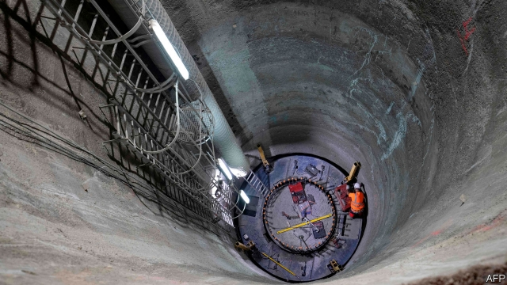
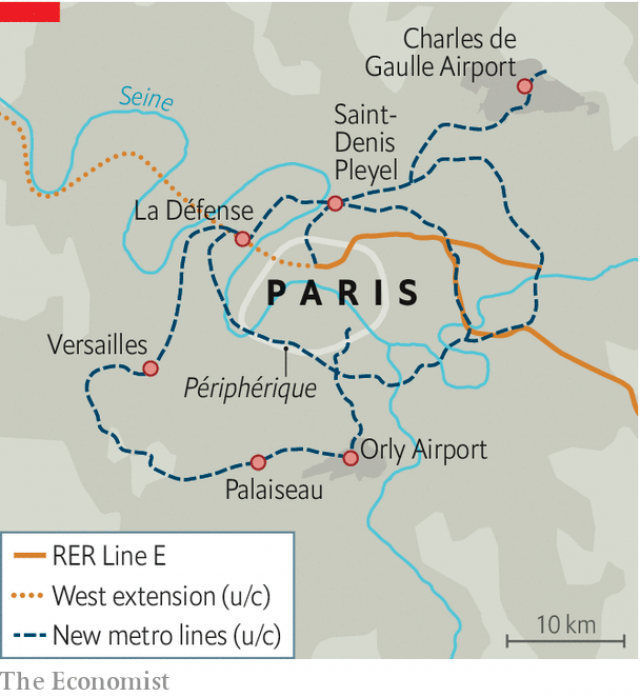

###### Mighty new metro

# A 200km loop around Paris 

##### With 68 new stations, it will cost nearly €40bn 

 

> May 16th 2019 

DEEP IN THE ground beneath the western Paris business district, the din is bone-jangling. With compact mechanical diggers, workers are excavating rubble from 22-metre (72-feet) shafts. These will take 60 supporting pillars for a vast new train station, to be buried 35 metres underground. Welcome to one of Europe’s biggest infrastructure projects: an ambitious scheme to encircle Paris with a new metro loop, and shift the way people think and move about the capital. 

The new station at La Défense, built as part of the westward extension of the E line, will link up to a huge looping network known as the “Grand Paris Express”. Most of the French capital’s existing rail and metro lines are there to carry people in and out of the city centre. The new underground loops, by contrast, focus on moving them around the suburbs. 

One loop will run from Charles de Gaulle airport in the north, via the banlieue of Seine-Saint-Denis, westward to the skyscrapers of La Défense, and on in a ring around southern and eastern Paris, outside the capital’s périphérique ring road. A second loop will link the first to Orly airport in the southern suburbs, and then west via the Saclay university cluster at Palaiseau to Versailles. When complete, the new driverless underground network will feature 68 new stations and cover 200km, nearly twice the length of London’s new Crossrail. 

 

Like Crossrail, the new Paris express has been beset by delays and cost increases. A damning report by the French national auditor, in December 2017, pointed then to an estimated total cost of €38.5bn ($43bn), up from €19bn in 2010, when the publicly financed project began. Last year, the government finally conceded that only part of the network would be finished by 2024, when Paris hosts the Olympic games. A new fast link to Charles de Gaulle airport may also not be ready by then. Part of the southern loop will not open until 2030, or later still. 

Naturally, everyone blames everyone else, easy to do in a city with baffling and overlapping layers of local and regional government. Yet, in time, the effect could be radical. The new network should help to defy the mighty centralising force of Paris, which obliges commuters who live in one suburb and work in another to pass through the centre. This will relieve pressure on city-centre lines, and could give a boost to suburban business hubs. Parisians tend to hold a mental map of their city that stops at the périphérique. The new network, says Jean-Louis Missika, deputy mayor for planning at the capital’s town hall, marks the end of a model that “assumes Paris is the centre of the world”. 

