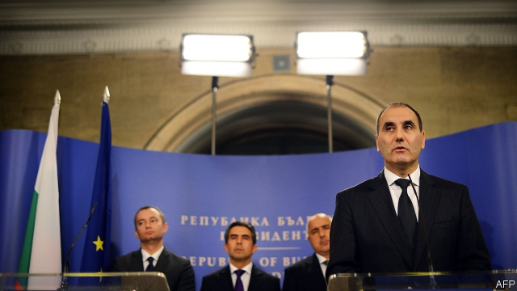

###### Secrets and lies

# A political scandal in Bulgaria involving penthouses 

##### Splendid apartments require explanation 

 

> May 16th 2019 

FEW BULGARIANS who walk by the Letera, a new luxury apartment building in Sofia, can read the texts inscribed on its façade. They are written in the Glagolitic alphabet, a medieval ecclesiastic script. This is part of the building’s aesthetic, a sort of religious-nationalist elitism. The advertising video on its website is a tribute to early Slavic Christianity, featuring cowled monks in the mist. Over the entrance, the 91st Psalm offers protection for the righteous from their enemies: “He who dwells in the secret place of the Most High, abideth in the shadow of the Almighty.” 

Tsvetan Tsvetanov (pictured), the owner of the Letera’s penthouse, may wish he dwelt in a somewhat more secret place. In late March Mr Tsvetanov, the second most powerful figure in the ruling GERB party, was revealed to have obtained his apartment in a complicated exchange that valued it at about €250,000 ($280,000), perhaps a quarter of the going rate. He denies any wrongdoing, but has resigned as GERB’s parliamentary leader. 

Since then nearly a dozen other highly placed officials have been found to have received cut-price apartments in various buildings around Sofia. Many have stepped down, including the then justice minister. Even the chairman of the anti-corruption commission is under investigation, for failing to declare that his top-floor loft included his building’s entire 186-square-metre roof terrace. (He claimed it was shared by all the residents, though it can be reached only from his apartment.) 

The “apartments scandal” has infuriated Bulgarian citizens, even though the sums involved are far smaller than in other corruption affairs, such as the billion-dollar collapse of the politically connected Corporate Commercial Bank in 2014. “The thing about this story is that you can touch it,” explains Polina Paunova of Svobodna Evropa, the Bulgarian branch of Radio Free Europe, which first reported the scandal. 

The media have become obsessed by details of unlisted balconies and private elevators, but the real implications go much deeper. The most difficult problem for corrupt politicians is justifying cash holdings that vastly exceed their salaries, explains Nikolay Staykov of the Anti-Corruption Fund, a watchdog that worked with Svobodna Evropa. Property transactions provide ways to launder such money, such as declaring a purchase at the lowest plausible value, and then reselling it to a friendly party at the highest plausible price. 

The scandal involves powerful commercial interests as well. The Letera was built by Arteks, a developer that is also building a 34-storey apartment tower that would be the tallest in Sofia. That project, the “Golden Century” building, is opposed by neighbourhood groups. More important, it may not be legal: its construction permit, granted in 2007, expired in November 2017. The company contends that amendments to the construction code passed by parliament in January 2017, when Mr Tsvetanov was leader of the GERB faction, retroactively granted it an extra three years. Mr Tsvetanov says that when he was negotiating to buy his apartment from Arteks, he was not aware of the problem with the Golden Century’s permit, and that in any case the amendments do not apply. Arteks’s lawyers say they do. 

Since they joined the European Union in 2007, Bulgaria and Romania have been subjected to special monitoring by the European Commission to check that they are making progress against corruption. Romania established an independent prosecutor’s office that convicted thousands of officials, but has since backtracked and last year fired the prosecutor. Bulgaria, meanwhile, has been evasive from the start. The current anti-corruption commission, formed in early 2018, is the third iteration: earlier versions accomplished little and were dissolved under EU pressure for reform. With its commissioner now under investigation, the new version is just as compromised. 

Boyko Borisov, Bulgaria’s prime minister for most of the past ten years, is a canny operator who has his party entirely in his grip. His position is not under threat. But the apartments scandal has pushed GERB’s popularity below that of the rival Socialist Party in some polls, and it may have wrecked Mr Borisov’s ability to fulfil one of his campaign promises: ending the EU special monitoring programme. 

Meanwhile, Mr Tsvetanov is defending himself by trumpeting his role as an advocate for Bulgaria’s planned purchase of F-16 fighter jets from America. Like the others accused in the apartment scandal, he hopes the words of the psalm hold true: “No evil shall befall you, nor shall any plague come near your dwelling.” 

