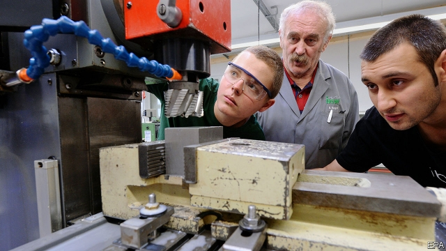
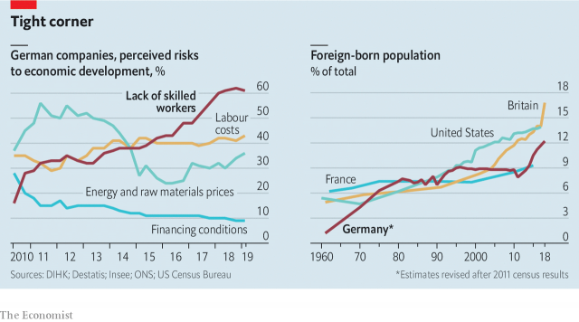

###### Opening up a crack

# Germany is cautiously recruiting more workers from outside the EU 

##### The Fachkräfteeinwanderungsgesetz is a small but overdue step 

 

> May 16th 2019 

THINK GERMANY and migration, and you probably think refugees. But German employers desperate for workers have their eye on a different sort of immigrant. After a decade of economic growth, unemployment is at its lowest and job vacancies their highest since reunification in 1990. Almost two-thirds of firms complain about a lack of skilled labour (see chart). So Germany is starting to look outward. 

Germany’s modest wage growth suggests there is no widespread labour shortage. But a tour through the manufacturing heartland of Baden-Württemberg (unemployment rate: 3.1%) finds few doubts among employers. “If you advertise in the newspaper, you get zero!” cries Peter Kaufmann, who runs a house-building firm in Oberstadion, a village near Ulm. He reckons he could raise his headcount from 100 to 150 if he could find more bricklayers and carpenters. Services like elderly care and tourism are crying out for workers. Nicole Hoffmeister-Kraut, Baden-Württemberg’s economy minister, says labour shortages hurt growth. And Germany’s greying workforce makes this a problem for the ages. 

 

As a result, German parliamentarians are discussing the country’s first attempt to regulate the immigration of semi-skilled workers from outside the European Union. If passed, the Fachkräfteeinwanderungsgesetz (“Skilled workers immigration law”) will from 2020 extend the rules covering foreign graduates to vocationally trained workers. Firms will no longer have to favour EU citizens for such jobs, meaning they can hire non-EU immigrants so long as they speak decent German and have been trained to German standards. The restriction of immigration to “bottleneck” occupations is to be scrapped. Some foreigners will be able to come to Germany and spend six months seeking work or a training contract, albeit with conditions. 

The law is a hard-fought compromise between Germany’s “grand coalition” of centre-right and centre-left. Hubertus Heil, the labour minister, calls it a “milestone” in German history. Yet as written, it will do little to alleviate employers’ woes. It is extremely hard for foreigners to prove they have picked up skills equivalent to those taught in Germany. Under Germany’s “dual education” system about half of school-leavers are trained on the job in one of around 330 regulated professions, from bookbinding to thermometer-making. This system, deeply rooted in German history, is not comparable to anything outside Europe, as Syrian refugees who arrived in Germany with experience as bakers or lorry drivers have learned to their cost. 

The government therefore estimates that the law will bring only around 25,000 people a year to Germany, at least to begin with. Rainer Dulger of Gesamtmetall, an engineering employers’ group, reckons it will help fill one-tenth of his members’ vacancies at best. “As long as we don’t address the question of recognising foreign qualifications, we won’t have substantial change,” says Rüdiger Wapler of the Institute for Employment Research in Stuttgart. 

Filiz Polat, of the opposition Greens, detects a whiff of hostility to foreigners in the resistance to establishing a more generous regime. Some in the ruling Christian Democratic Union (CDU) indeed cling to the old canard that Germany is not a “migration country”, even though one-quarter of the population has a migrant background and over 100,000 people are naturalised each year. It was less than 20 years ago that a CDU politician could campaign against a scheme to recruit foreign IT workers under the slogan Kinder statt Inder! (“Children instead of Indians!”). Lingering fears among conservatives of immigrants swelling welfare rolls are reflected in the bill’s many restrictive provisions. 

The law has also been caught up in the political slipstream of 2015-16, when over a million asylum-seekers entered Germany. Between 10,000 and 15,000 still arrive every month, and few of those ordered to leave do so. The compromise hashed out by the coalition partners rules out migrants “changing lanes” from asylum to work—although some who have found jobs or training will be able to stay—and the skilled-worker law is accompanied by a controversial bill to toughen deportation rules. 

“The mingling [of asylum and immigration] produces problems,” says Lars Castellucci, a Social Democrat MP who backs the law. He says the skilled-worker law could be amended one day if it proves ineffectual. Thomas Bauer, chair of the Expert Council of German Foundations on Integration and Migration, proposes expanding the pathways for potential immigrants to include language fluency or previous work experience in Germany. But until the asylum numbers are cut it may be hard to further relax the rules for immigrant workers. 

In the meantime, firms will have to manage the new law, employers’ groups must get to grips with a potpourri of foreign training systems and embassies will need more resources. Workers from the Western Balkans, who already enjoy special access to Germany, can wait up to a year to have applications processed. Oliver Maassen, head of HR at Trumpf, a machine-tools and laser-manufacturing outfit based near Stuttgart, says the firm once spent 11 months and tens of thousands of euros trying to secure a visa for a qualified Indian colleague who wanted to move to Germany. 

Despite employers’ pleas, the new law may ultimately be off-target. Mr Wapler notes that job growth in the semi-skilled professions it covers has been slower than in the low- and high-skilled sectors, and that such roles are anyway at risk of automation. Yet the law also carries a symbolic value that may have been overlooked. Mr Bauer says it creates a presumption that immigrants have a right to seek work in Germany, whatever the caveats. What has long been clear in fact will at last be enshrined in law: that Germany is a country of immigration. “Employers may not think this is a huge thing,” he says, “but I do.” 

