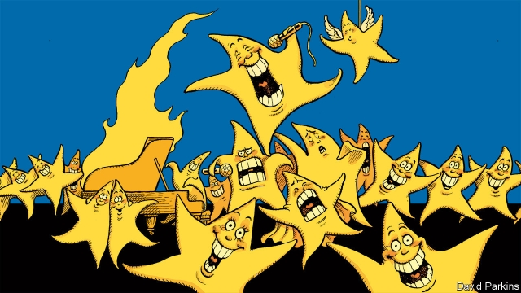

###### Charlemagne

# How to win the Eurovision Song Contest 

##### And why Brussels should be more like Europe’s festival of cheesy pop 

 

> May 16th 2019 

“I COULD BE the sun that lights your dark/And maybe I would lit [sic] your world with just one spark.” The traits are all there: the key change, the dodgy English, the endorsement of peace and being nice. Such is the Eurovision Song Contest. “Too late for love” is the Swedish entry and one of the favourites to win this year’s competition on May 18th. 

Eurovision was founded in 1956 to promote peace in post-war Europe. But some of its traits can turn the keenest Europhile into a Brexiteer, a Frexiteer or a Swexiteer. Since 1997 viewers across Europe have been able to vote by phone. Hence the shamelessly political results. Cyprus votes for Greece, for example, and Finland votes for Estonia. Songs that make sense in a national context sometimes prove baffling to foreigners, and flop. Successful contestants often offer a vague, generic Euro-music, a living metaphor for the EU’s homogeneous mush. 

To some extent, the metaphor works. Just as European states struggle to reconcile different economic and geopolitical instincts—most Eurovision participants are members of the EU—so different musical tastes sunder Europe. Irving Wolther, an expert on European music known as “Dr Eurovision”, explains the national differences. Finnish emphasises the first syllables of words and so has its own rhythm. Italian depends on vowels. Dutch depends on consonants. Such nuances make it hard to write a song that will naturally appeal to all tastes. Even assessments of the contest differ between different national broadcasters. Dean Vuletic, a historian specialising in Eurovision, identifies three different styles of commentary: campy (Italian), sarcastic (Austrian or British) and matter of fact (German and eastern European). 

Yet under the surface there is a different, more positive story. For one thing, there are common, distinct trends that unite European music styles. Eurovision’s early years were dominated by ballads and other gentle songs. Then in the late 1960s and early 1970s came Europop. Defined by Simon Frith, a musicologist, as “a bouncy beat, just one chorus hook and elementary lyrics”, this was epitomised by ABBA, a Swedish group. Such Eurovision songs were often the soundtrack to summer holidays in Mediterranean resorts with pan-European audiences. In the 1990s, partly thanks to its expansion to post-communist countries but also as Europop faded from fashion, Eurovision embraced world music. Around the same time media markets were liberalised and Eurovision became more commercial. Even today—in a musical age defined by Spotify and YouTube—its songs have distinctive traits. American chart hits are often influenced by rap and country songs. Europe’s hits, by contrast, tend to be rooted in pop and dance-music traditions. 

Europe’s musical giant is Sweden. Universal music education, a culture of egalitarian consumerism (think H&M and IKEA) and the ability to enunciate English lyrics more clearly than any native speaker help to explain why this small nation is the world’s third largest music exporter, after Britain and America. Sweden’s pre-selection for Eurovision is one of the country’s biggest annual television events. Even unsuccessful contestants often end up as stars. A cottage industry has emerged: Swedish composers write songs for their own country and also for others. 

One such mercenary is Thomas G:son, a Swede who has written 14 Eurovision songs, including the winning song, “Euphoria”, for his native Sweden in 2012. (Sample lyrics: “Euphoria!/ An everlasting piece of art/ A beating love within my heart ...”) 

“A good Eurovision song has to connect with all the different people of Europe,” says Mr G:son; the key is not a particular style but something distinctive and attention-grabbing. Eurovision artists only have three minutes, shorter than the average chart song, and most viewers are hearing the song for the first time and alongside almost 30 other ditties. It has to “gel” with the artist, says Mr G:son. It cannot be bland. 

One trick, says Mr Wolther, is to combine the different with the familiar. Some hooks are purely musical. Composers who apply the lessons of Spotify, whose big data Eurovision artists use to work out what sort of songs appeal across cultural divides, tend to include plenty of drama in the first 30 seconds of a song to prevent attention wandering. A key change can raise the excitement. Hints at current chart hits also help. 

But other hooks are cultural. Politics is one way of one doing that. Recent winning entries in Eurovision by Austria, Portugal, Ukraine and Israel all had an ideological dimension. And then there is the performance. Flaming pianos, ridiculous costumes, holograms and digital graphics in the background at least make a song memorable. To win Eurovision is to find the sweet spot between camp and sincerity: just enough politics, just enough eccentricity, just enough pan-European appeal. 

All of which contains lessons for the EU, which suffers from many of the flaws often ascribed to Eurovision. It is too bent on homogeneity, too artificial and too deracinated. However, Eurovision shows that it is possible to unite the continent by pushing against those things. In recent years Eurovision has rewarded eccentric entries that refuse to follow the rules. Austria won with a bearded drag queen, Portugal with a ballad sung in Portuguese, Ukraine with a lament for the historical expulsion of the Tartars. Last year Israel won with chicken moves, a wacky outfit, a feminist message and typical Israeli humour. 

Eurovision has many sins but also displays virtues: an absence of pomposity, a nod to national cultures, a tolerance of the artificial, an openness both to the new and the familiar and a sense of what people want. All these are traits that Europe’s stuffy political institutions sadly lack. Eurocrats who sneer at Eurovision should learn from it instead. 

