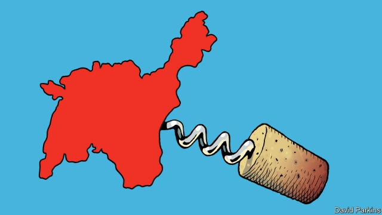

###### Wine and punishment

# The woes of vintners in occupied Crimea 

##### Wine grown on stolen land is hard to sell 

 

> May 16th 2019 

VINES LINE the hills south of Sevastopol. Oleg Repin, a local vintner, surveys the land and recalls his days harvesting grapes as a schoolboy. “Living here, sooner or later you come in touch with wine,” he says. One of a handful of boutique Crimean winemakers hoping to revive fine wine on the peninsula, his brand, launched in 2010, now produces a punchy riesling and a subtle pinot noir. 

When Russia seized Crimea from Ukraine in 2014, it coveted many things, from strategically located ports to sandy beaches. So too its bounty of grapes. During the Soviet era, central planners used the region to mass-produce wine, often of dubious quality, for the whole Union. After the annexation, among the first assets that the new Russian authorities seized and nationalised were two tsarist-era wineries, Noviy Svet and Massandra. The Russian government has showered its new alcoholic acquisitions with subsidies. 

Yet for many producers, the challenges of post-annexation life have been harder to swallow than a bottle of Soviet sauvignon. Though the Russian market is much larger than the Ukrainian one, drinking there still revolves around spirits and beer. Credit can be hard to come by, with just two banks serving the region. The transition to de facto Russian rule has made acquiring and holding property tricky; small producers have struggled to adjust to Russian regulations. Western sanctions mean that supplies often have to be acquired through roundabout means. Mr Repin reckons the sanctions add 15-20% to costs; they make exporting “impossible”. 

The latest hiccup has been a shortage of bottles. After the annexation, two Russian factories became the main sources of glassware for Crimean wineries. Recently, one cut off its contracts with Crimea; local winemakers suspect that a new director, loyal to Western shareholders, discovered that the company had been supplying Crimea. 

