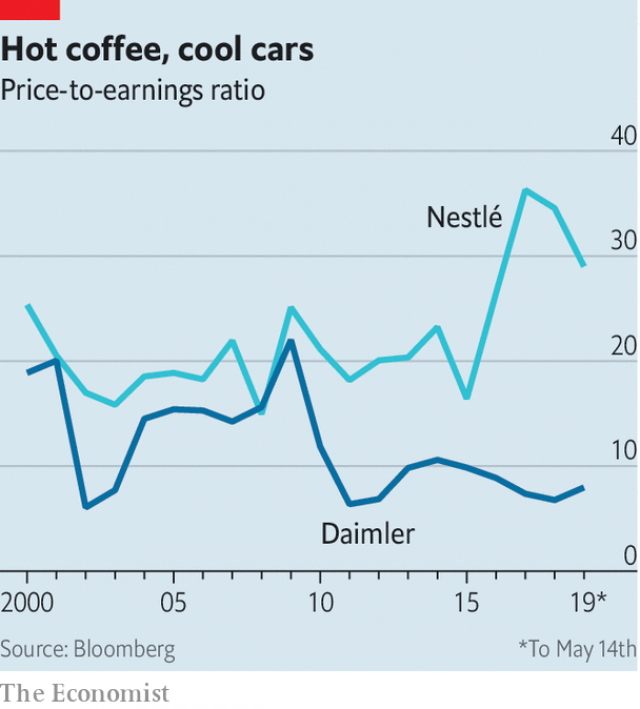

###### Buttonwood

# Beneath the dull surface, Europe’s stockmarket is a place of extremes 

##### The gap between value and quality stocks has widened into a chasm 

 

> May 18th 2019 

IT WOULD BE hard to tell a story about America’s stockmarket without mention of at least one company that listed this century—Google or Facebook, say. Europe is rather different. Its bourses are heavy with giants from the age of industry but light on the digital champions of tomorrow. It is telling, perhaps, that its character can be captured in the contrasting fortunes of two companies, Nestlé and Daimler, with roots not even in the 20th century, but in the 19th. 

Nestlé began in 1867 when Henri Nestlé, a German pharmacist, developed a powdered milk for babies. The firm, based in Switzerland, is now the world’s largest food company. It owns a broad stable of well-known brands, including Nescafé and KitKat. Its coffee, cereals and stock cubes are sold everywhere, from air-conditioned supermarkets in rich countries to sun-scorched stalls in poor ones. Daimler was founded a bit later, in 1890. Its Mercedes-Benz brand of saloon cars and SUVs is favoured by the rich world’s professionals and the developing world’s politicians. 

 

Though the two companies have lots in common, their stockmarket fortunes could scarcely be more different. Nestlé is the sort of “quality” stock that is increasingly prized in Europe for its steadiness. It is expensive: its price-to-earnings, or PE, ratio is 29. In contrast Daimler is a “value” stock, with a PE of eight. The disparity has steadily grown in recent years (see chart). Indeed the gap between the dearest stocks and the cheapest across the continent is at its widest in almost two decades, says Graham Secker of Morgan Stanley. 

The valuation gap in Europe is related to a similar divide in America. For much of stockmarket history, buying value stocks—with a low price relative to earnings or to the book value of tangible assets, such as equipment and buildings—has been a winning strategy for stockpickers. But the past decade has been miserable for value stocks in America. The rapid rise of a handful of tech firms—the Googles and Facebooks—and other “growth” stocks has left them in the shade. 

Value stocks are, by definition, cheap. In the past they might have been cyclical stocks, those that do well when the world economy is picking up steam, but which suffer in downturns. These days the cheap stocks are in industries, such as carmaking and branch-based banking, that are ripe for disruption. But in Europe, they are especially cheap. 

It is hard for banks to make money when yields on the safest of government bonds, the benchmark for lending rates, are negative, as they are in Europe. Banks face an additional threat from financial-technology firms, which do not share their burden of costly branches or surplus staff. Carmakers need pots of capital to equip them to make electric and self-driving cars. The returns are far from certain. It is easy to imagine a future in which status is less entwined with car ownership. People may not care whether the robo-taxi they fleetingly occupy is a luxury car or a bog-standard saloon. Before then, the prospect of punitive American tariffs on European-made cars is looming. 

The value-growth axis is different in Europe, because there are no home-grown tech giants. The big stockmarket winners have been quality stocks. This is a category that combines stable profits and high return on capital with sensible debts and low staff turnover. Many are consumer firms with strong brands, such as Nestlé, Diageo (a British drinks giant) and LVMH (a French luxury-goods firm). 

Value investors, however chastened, believe there is an opportunity here. For them, the Daimler-type stock is the one to buy. True, carmakers (and banks) have their troubles. But value stocks usually do. The trick is to buy them when everyone shuns them, because that is when they are cheap. The Nestlé-type stock is the sort of fad that the giddier sort of investor piles into, only to rue overpaying as it falls back to earth. Well, perhaps. But why be a hero? An investor in a low-cost index fund can own both types of stock without worrying too much about relative value. 

A lot of stockpicking Americans stay away altogether. The cheap stocks look hopeless; the dear stocks look expensive. So they don’t buy at all, says Robert Buckland of Citigroup. The Nestlé-Daimler breach mirrors the divide within property markets in cities such as London. You could try to make a killing on a fixer-upper in a down-at-heel suburb. That bet requires patience and luck. Or you could buy a nice house in a ritzy neighbourhood. It will not be cheap. But it may never get much cheaper. 

