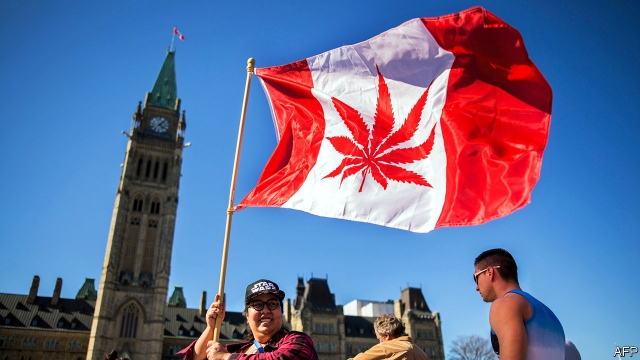

###### Dank stats, bro

# Canada’s statisticians survey potheads 

##### More over-45s are getting high, but teenagers are keeping off the grass 

 

> May 16th 2019 

“MADE IN CANADA”, not “made in Colorado”: that is how a Canadian senator described the country’s approach to legalising the recreational use of cannabis in a debate last summer. As lawmakers sought to frame rules that would have the best possible chance of squeezing the illicit market and keeping teenagers off the grass, they looked around the world for evidence. Disappointed by how little they found, they decided to blaze a trail. 

That meant establishing a baseline for comparison. Before the new law came into force in October 2018, Statistics Canada started to estimate prices and the size of the illicit market, and to carry out quarterly surveys of Canadians’ cannabis usage. Earlier this month it released the fifth of these—the first before-and-after comparison of the same part of a year. 

The main finding was a rise in the number of Canadians who had used cannabis in the three months before the survey, of 27% compared with a year earlier. People are probably more willing to admit to getting lit once weed has been legalised. However, half of new cannabis users are aged over 45, which suggests that some of the increase is genuine, says Rosalie Wyonch of the C.D. Howe Institute, a think-tank in Toronto. Middle-aged squares may have decided to try getting high for the first time. 

Use by under-25s, by contrast, did not rise significantly. Nor was there a significant increase in the number of Canadians who said they used daily or near-daily. Both findings are reassuring, since younger people and committed stoners are most likely to suffer cannabis-induced psychosis. 

Legal cannabis sold for C$9.99 ($7.42) per gram on average, compared with C$6.37 for the illegal stuff. That may understate the gap, however, because cannabis on the illicit market is probably more potent. Nevertheless, legalisation does seem to be taking the buzz out of the illicit market. Statistics Canada reckoned it was worth C$1.2bn in the final quarter of 2018, down from C$1.3bn before legalisation, with the legal recreational market worth C$152m. Nearly two-fifths of users said that they had bought cannabis from an illegal dealer, down from a little over half a year earlier. 

More figures are to come. National data on pot-related tax revenues are due in June, and on cannabis-related offences such as driving while high in July. The health ministry is surveying health outcomes, and researchers hope to use hospital records to see if there has been a rise in cannabis-related illnesses. Whatever the effects of legalising weed, it is in Canada that they will be least hazy. 

