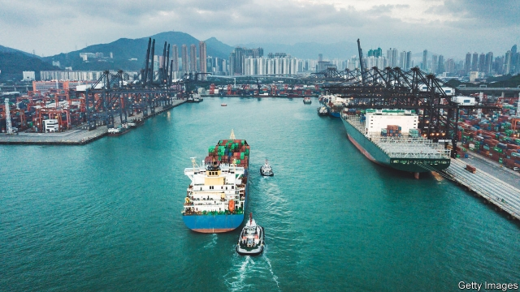

###### US-China trade

# China vows a “fight to the end” in trade feud with America 

##### A war of words could escalate into something more serious 

 

> May 16th 2019 

THOUGH CHINA runs a massive trade surplus with America, over the past year it has run a massive rhetoric deficit. During that period President Donald Trump has tweeted about China at least 130 times; Chinese leaders, by contrast, have mostly kept mum about the trade dispute with America. But in the past few days that has begun to change. A sudden barrage of commentaries about the trade war in state media has struck a note of defiant nationalism. “If you want to talk, our door is wide open,” said an anchor on China’s most-watched news programme on May 13th, in a clip that went viral. “If you want to fight, we’ll fight you to the end.” 

The aggressive language comes as the two countries’ trade war heats up. Last week American negotiators alleged that China had reneged on a draft deal that was nearly complete. Chinese officials said it was the Americans who were making unreasonable demands. The breakdown in talks led to America’s decision on May 10th to raise tariffs on $200bn-worth of Chinese imports from 10% to 25%, covering products such as car parts and circuit boards. 

On May 13th Mr Trump tweeted, warning China not to retaliate. It will only get worse, he said. Barely an hour later China ratcheted up tariffs on $60bn-worth of imports from America, including natural gas. And it did indeed get worse, with the United States Trade Representative shortly thereafter beginning the process of implementing tariffs on “essentially all” Chinese imports not currently covered by duties. When all is said and done, China’s nearly $560bn-worth of annual exports to America could face tariffs of 25%. Much of America’s $180bn of annual exports to China could also be subject to similar levies. 

Those already in place will hurt. Many economists estimate that China’s growth this year could be dragged down by about half a percentage point, to 6%. In America consumers will start to see higher prices: inflation could rise by half a percentage point, according to economists at Société Générale, a French bank. If Mr Trump follows through on the threat to hit all Chinese imports with duties—and few doubt his love of tariffs—the damage could be far greater. Chad Bown and Eva Zhang of the Peterson Institute for International Economics in Washington, DC, reckon that the scale of American tariffs on China would resemble the Smoot-Hawley tariff of 1930, levied just before the Great Depression. 

At that point China might well start making life difficult for American businesses in China. One possibility would be consumer boycotts, fanned by state media. Forecasting models scarcely capture the alarm that would spread through markets if the world’s two biggest economies engage in a full-blown trade war. 

There is still hope that they will step back. A recovery in global share prices after a big sell-off on May 13th, when the tit-for-tat tariffs were announced, reflects optimism that cooler heads will prevail. Most of the latest measures are not yet in force. America’s new 25% tariffs apply only to goods that left China after they were announced. Because it takes about three weeks for ocean freighters to make the journey, it will be June before the pain is truly felt. China’s new tariffs take effect only on June 1st. So there is time to talk. 

In its official statements China’s consistent message has been that, though it will not be bullied, it wants to work towards a deal with America. Mr Trump has also shown a willingness to resume talks, saying that he will hold meetings with Xi Jinping, China’s president, at a G20 summit in Japan at the end of June. The last time the two leaders met at a G20 summit, in November in Argentina, they agreed to a truce in the trade war. That might be a reason for optimism. Then again, given where the two countries are now, it could just as well be a reason for despair. 

