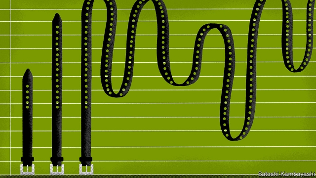
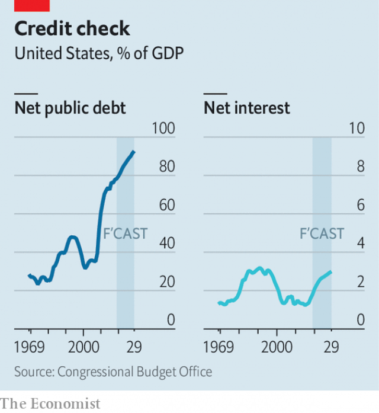

###### Consolidation programme

# Economists are rethinking fiscal policy 

##### But not as radically as is sometimes claimed 

 

> May 16th 2019 

EVERY SO OFTEN a right-leaning economist raises the alarm about the apparently parlous state of America’s public finances. The subject gripped Washington in the early 2010s but has since been mostly disregarded. At 78% of GDP, America’s net public debt is high, if not yet huge. Thanks to President Donald Trump’s tax cuts, the federal deficit will exceed 4% of GDP this year, a level that is more typical after economic slumps than in the benign conditions seen today, with unemployment at 3.6%. What is more, unless taxes go up or spending on pensions and health care for the elderly is contained, public debt will rise to 92% of GDP in 2029, the highest since 1947, and go on rising for decades more, according to official projections. 

Such warnings have fallen on deaf ears not just in Washington, but on Wall Street too. Financial markets, hungry for dollar-denominated safe assets, betray no concern about America’s debts. The risk of a crisis is not the only theoretical downside to public borrowing, but the others are looking unconvincing. For example, the argument that debt is crowding out private investment is hard to sustain when firms are awash with cash and can borrow at extremely low rates. 

In January Olivier Blanchard, a former chief economist of the IMF, told the annual meeting of the American Economic Association that there were many reasons to doubt the supposed costs of public debt. Since then Jason Furman and Larry Summers of Harvard University, both of whom advised Barack Obama on economics, have written in Foreign Affairs, a journal, that it is time to kill off the “debt obsession”. A flurry of commentators have since declared that economists are fundamentally rethinking their ideas about fiscal policy. 

 

That is an overstatement. The central observation of fiscal doves is that interest rates are very low by historical standards, and are not expected to rebound any time soon. As a result, though debt has grown as a share of GDP, interest payments are near their historical average (see chart). Most important, rates are lower than the nominal growth rate of the economy (that is, before adjusting for inflation). In such circumstances a debt will shrink as a share of GDP over time. If the economy grows faster than interest builds up, the government could run a small deficit for ever. 

Economists find that weird. Their theories say that budgets must balance in the long term. But Mr Blanchard gave his lecture after realising that in America nominal growth outpacing the interest rate is the historical norm. He thinks that will continue. He also gave a reason not to worry about crowding-out. Low rates could be signalling that the risk-adjusted return to capital—loosely speaking, what the economy eventually gains from additional private investment—is also low. As a result, even if government debt does displace investment, society may not lose much. 

According to Mr Furman and Mr Summers, the fear that government debt is discouraging private investment is based on an “absurd diagnosis of today’s economic problems”. The real issue, they say, is that America’s interest rates might again fall to near-zero, at which point the Federal Reserve could not lower them any further. Any attempt to cut debt and deficits today might weaken the economy and bring that constraint into view. In a recent paper with Lukasz Rachel of the Bank of England, Mr Summers argues that deficits have been propping up interest rates since the 1970s, slowing what would otherwise have been a more marked decline. 

Not all of this is as new as it seems. In 1998 Laurence Ball of Johns Hopkins University and Douglas Elmendorf and Gregory Mankiw of Harvard University observed that America’s nominal growth tends to exceed its interest rates. (They argued that exploiting this condition could pay off most of the time, but came with a small risk of provoking a crisis.) In 2017 Mr Elmendorf and Louise Sheiner of the Brookings Institution, a think-tank, argued in the Journal of Economic Perspectivesthat a glut of saving and falling returns to capital were making government debt less harmful. Mr Summers has been calling for bigger deficits to fund spending on investment for years, fearing “secular stagnation”—permanently weak private-sector demand. Nonetheless, his essay with Mr Furman recommends that most new spending is paid for—an impeccably conventional idea that was written into congressional rules in 1990. 

Today’s rethink is gaining attention for several reasons. One is Mr Blanchard’s stature and past job—the IMF has long been associated with austere fiscal policy. Another is growing curiosity about “Modern Monetary Theory” (MMT), a fringe economic doctrine which holds that debt-to-GDP ratios are irrelevant in countries that issue their own currency—and that the only constraint on spending is inflation. Left-wing Democrats who want to spend hell-for-leather on a “Green New Deal” to fight climate change and cut inequality sometimes appeal to MMT, as inflation is low today. 

But the theory has scant support among mainstream economists. Mr Furman and Mr Summers both recently signed a letter recommending that climate change be fought with a carbon tax, an approach that most Green New Dealers pooh-poohed. 

It may be harder to find economists who back harsh austerity to shrink debts, rather than merely to contain them. But few of today’s politicians display much of an appetite for belt-tightening. In an age of populism, unfunded tax cuts and the Green New Deal, even economists’ increasingly nuanced views on the balance between tax and spending will probably land them on the hawkish side. 

